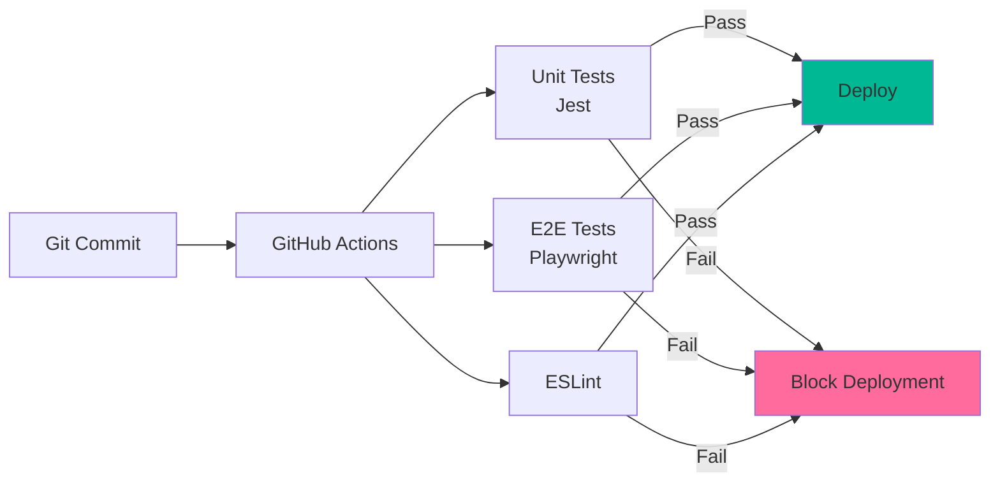

# Phase 34: Architecture Diagrams

**Project:** ADHDLearn.com
**Phase:** 34 of 36
**Last Updated:** October 22, 2025

---

## CI/CD Pipeline

```mermaid
graph LR
    Commit[Git Commit] --> CI[GitHub Actions]
    CI --> UnitTests[Unit Tests<br/>Jest]
    CI --> E2ETests[E2E Tests<br/>Playwright]
    CI --> Lint[ESLint]
    
    UnitTests -->|Pass| Deploy[Deploy]
    E2ETests -->|Pass| Deploy
    Lint -->|Pass| Deploy
    
    UnitTests -->|Fail| Block[Block Deployment]
    E2ETests -->|Fail| Block
    Lint -->|Fail| Block
    
    style Deploy fill:#00B894
    style Block fill:#FF6B9D
```

---

