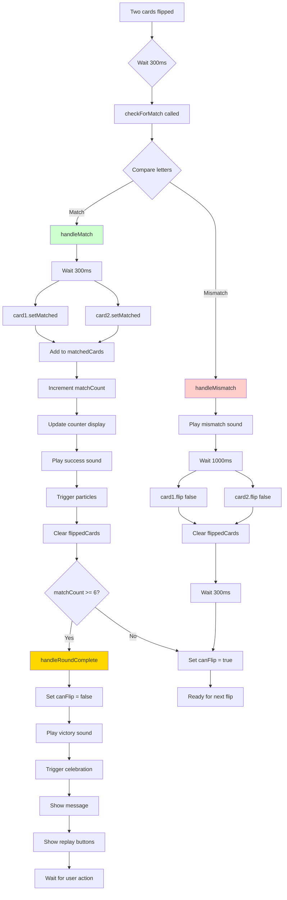
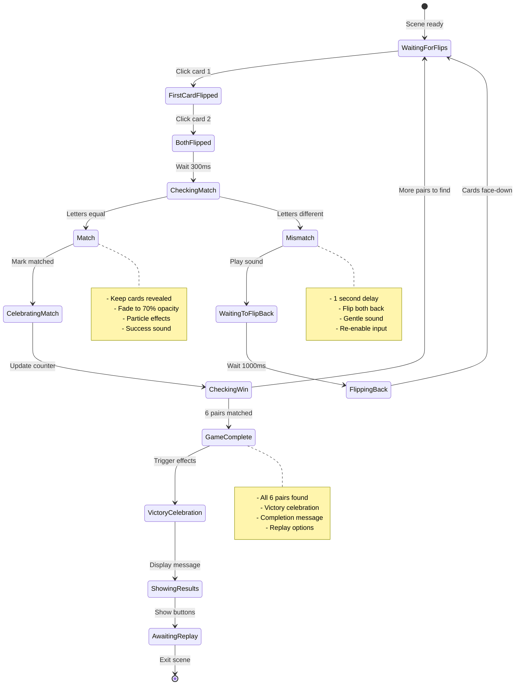
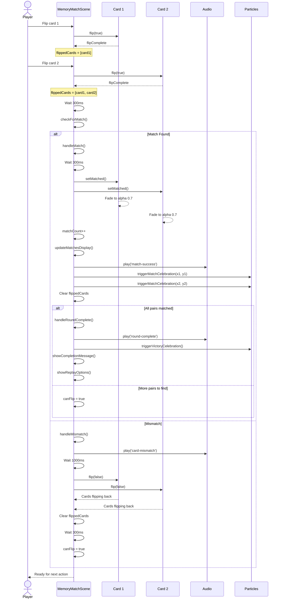
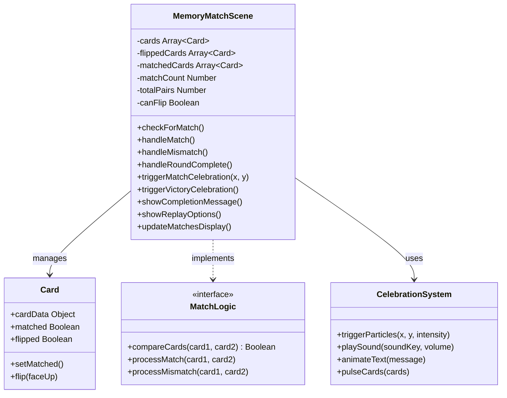
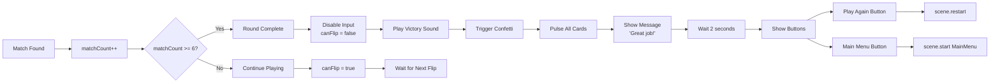
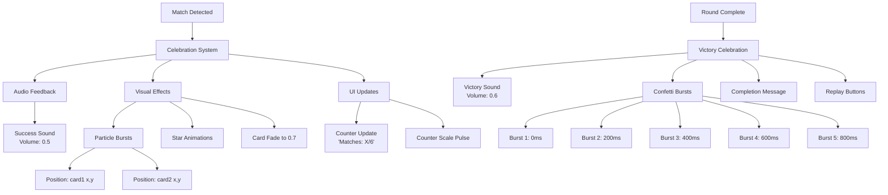
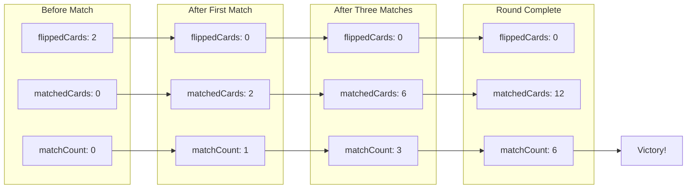
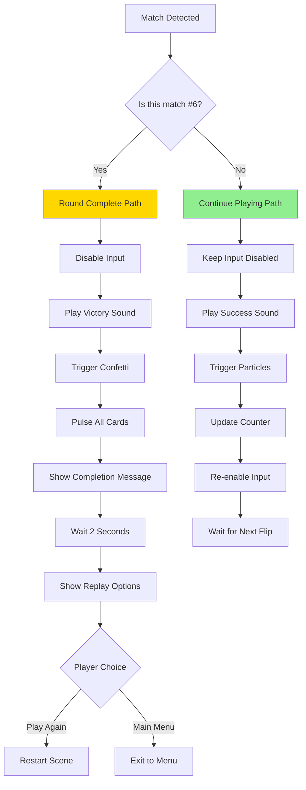

# Phase 35: Memory Match - Matching Logic - UML

## Match Detection Flow



## State Machine: Match Logic



## Sequence Diagram: Match Flow



## Class Diagram: Match Logic Components



## Timing Diagram: Match vs Mismatch

```mermaid
gantt
    title Match Detection Timing
    dateFormat SSS
    axisFormat %L ms

    section Match Flow
    Card 2 flip complete :milestone, 000, 0ms
    Wait to check :a1, 000, 300ms
    Check match :milestone, 300, 0ms
    Wait before marking :a2, 300, 300ms
    Mark as matched :milestone, 600, 0ms
    Play success sound :a3, 600, 500ms
    Trigger particles :a4, 600, 600ms
    Update counter :a5, 600, 200ms
    Re-enable input :milestone, 800, 0ms

    section Mismatch Flow
    Card 2 flip complete :milestone, 000, 0ms
    Wait to check :b1, 000, 300ms
    Check match :milestone, 300, 0ms
    Play mismatch sound :b2, 300, 200ms
    Wait for memorization :b3, 300, 1000ms
    Flip back animation :b4, 1300, 300ms
    Re-enable input :milestone, 1600, 0ms
```



## Data Flow: Round Completion



## Component Interaction: Celebration System



## Memory State Tracking



## Decision Tree: Post-Match Actions



## Notes

### Match Detection Algorithm

**Simple Comparison**:
```javascript
const isMatch = card1.cardData.letter === card2.cardData.letter;
```

**Why This Works**:
- Each pair has identical letter values
- JavaScript string equality is reliable
- Case doesn't matter (both uppercase)
- Direct comparison is fast (O(1))

### Timing Strategy

**Match Delay: 300ms**
- Brief pause to let player see both cards
- Not so long that it feels laggy
- Allows visual confirmation before marking

**Mismatch Delay: 1000ms**
- Critical for memory game strategy
- Players need time to memorize positions
- Too short: no time to learn
- Too long: frustrating wait
- 1 second is well-tested standard

**Re-enable Delay: 300ms**
- Wait for flip-back animation to complete
- Prevents clicking during animation
- Smooth transition back to playable state

### Celebration Intensity

**Single Match**:
- Moderate celebration
- Focus on cards that matched
- Don't overwhelm or distract
- Success sound + small particles

**Round Complete**:
- Big celebration
- Multiple confetti bursts
- Victory sound
- Completion message
- Pulse all cards
- Player should feel accomplished

### State Management

**Critical States**:
- `flippedCards`: Which cards currently face-up
- `matchedCards`: Which cards already matched
- `matchCount`: How many pairs found
- `canFlip`: Whether input is enabled

**State Transitions**:
1. Start: Empty arrays, count = 0, can flip
2. One flip: 1 card in flippedCards
3. Two flips: 2 cards, input disabled
4. Match: Cards moved to matchedCards, count++, clear flipped, enable input
5. Mismatch: Clear flipped after delay, enable input
6. Complete: count = 6, disable input, show UI

### Design Decisions

**Why 300ms before check?**
- Ensures second flip animation completes
- Player sees both cards clearly
- Creates satisfying rhythm

**Why 1000ms mismatch delay?**
- Standard for memory games
- Proven effective for learning
- ADHD-friendly (not too long)
- Time to process and remember

**Why immediate match feedback?**
- Rewards player instantly
- Maintains engagement
- Feels responsive and fair

**Why pulse animation on complete?**
- Draws attention to success
- Creates sense of accomplishment
- Shows all cards "celebrating"
- Visual reward for completion

### What This Phase Proves

1. **Match Detection**: Algorithm correctly identifies matches
2. **State Management**: Game tracks progress accurately
3. **Timing**: Delays feel appropriate and fair
4. **Celebration**: Feedback is rewarding and motivating
5. **Round Completion**: Win condition properly detected
6. **Replay Flow**: Player can easily play again

This completes the core game loop. Phase 36 will add polish, content variety, and difficulty options.
