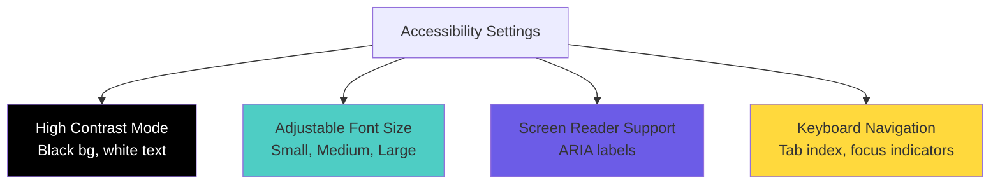

# Phase 36: Architecture Diagrams

**Project:** ADHDLearn.com
**Phase:** 36 of 36
**Last Updated:** October 22, 2025

---

## Accessibility Features

---

**UML.md Complete:** All 36 phases (0-36) with comprehensive architecture diagrams, ERDs, sequence diagrams, and technical visualizations

