# Phase 36: Memory Match - Polish - UML

## Enhanced Card Architecture

```mermaid
classDiagram
    class EnhancedCard {
        -scene Scene
        -cardData Object
        -shadow Ellipse
        -backSprite Sprite
        -frontSprite Sprite
        -objectImage Image
        -letterText Text
        -objectNameText Text
        -glowEffect Circle
        +constructor(scene, x, y, cardData, index)
        +createCardSprites()
        +createShadow()
        +setupInteraction()
        +enhancedHover()
        +enhancedFlip()
        +addGlowEffect()
        +playLetterSound()
        +setMatched()
    }

    class CardData {
        +letter String
        +name String
        +image String
        +color String
    }

    class LETTER_OBJECT_PAIRS {
        <<static>>
        +A {name, image, color}
        +B {name, image, color}
        +...
        +Z {name, image, color}
    }

    EnhancedCard --> CardData : contains
    EnhancedCard ..> LETTER_OBJECT_PAIRS : uses
```

## Difficulty System Architecture

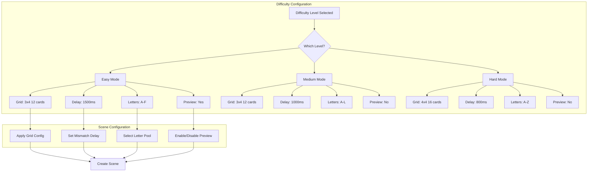

## Letter-Object Content System

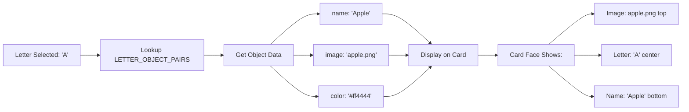

## Enhanced Animation Flow

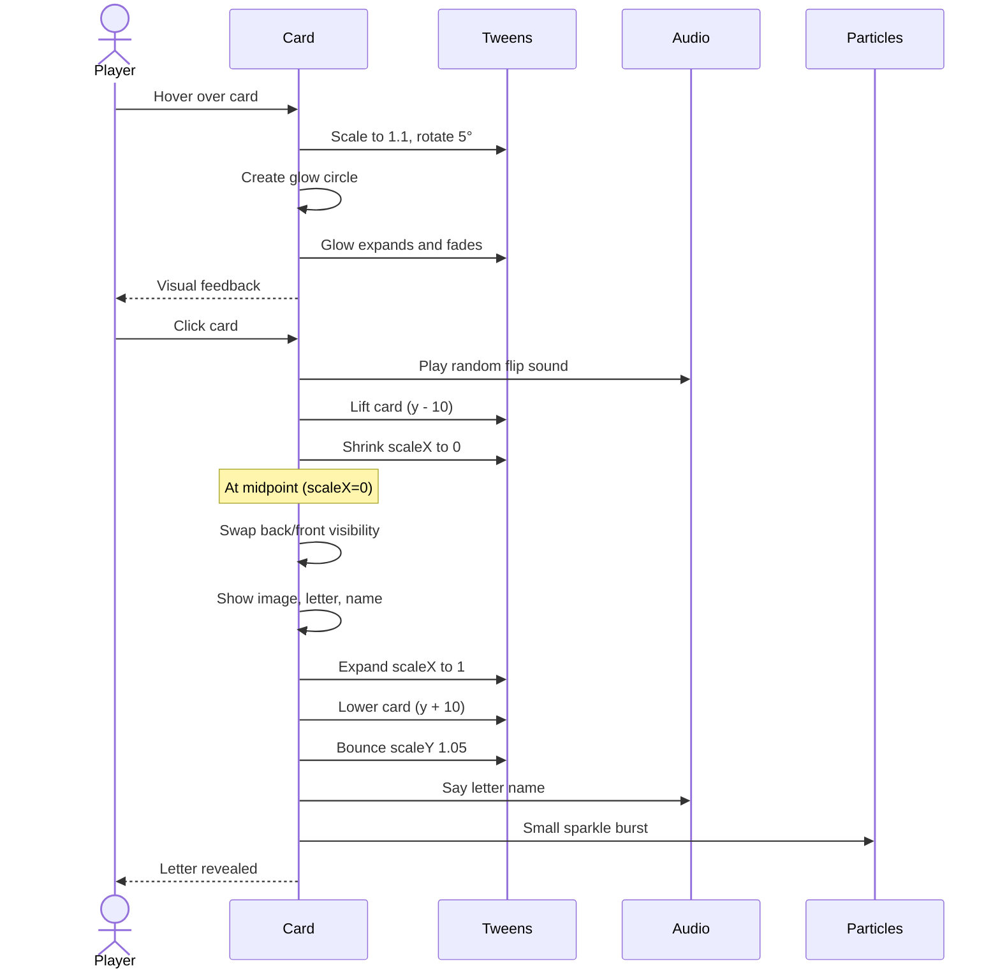

## Background Music System

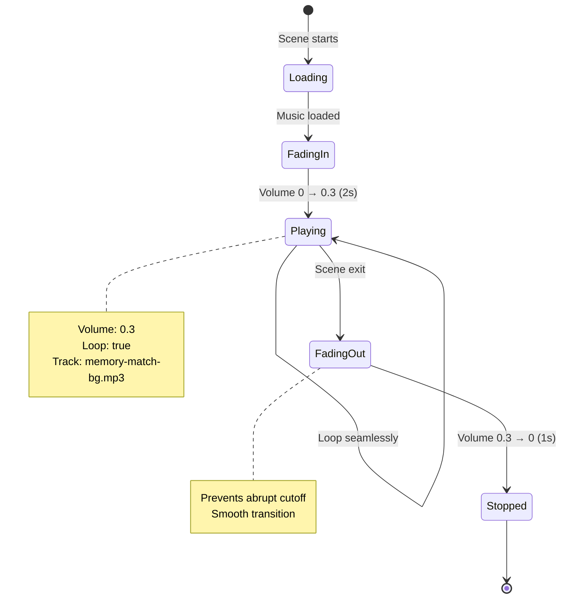

## Difficulty Selection UI

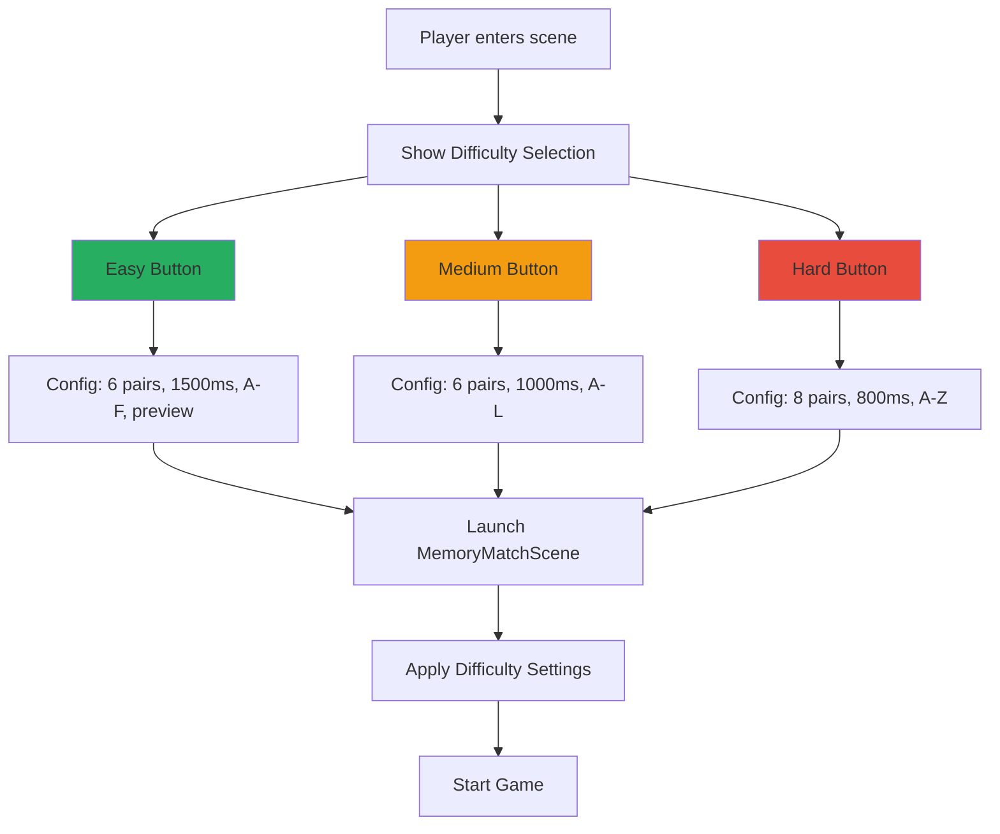

## Card Component Structure (Enhanced)

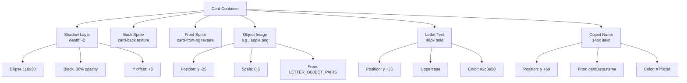

## Performance Optimization Strategy

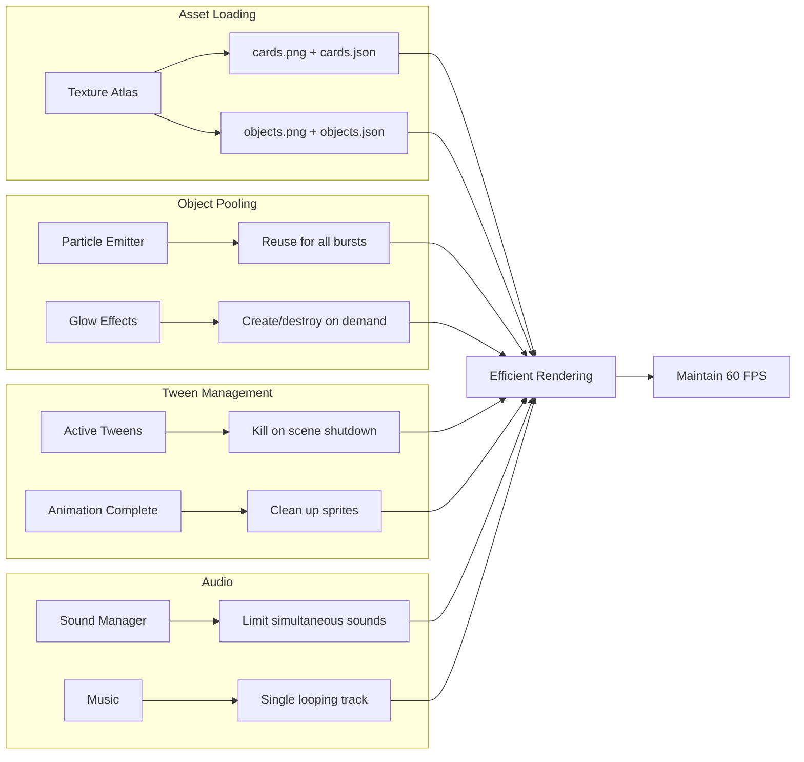

## Enhanced Match Effect

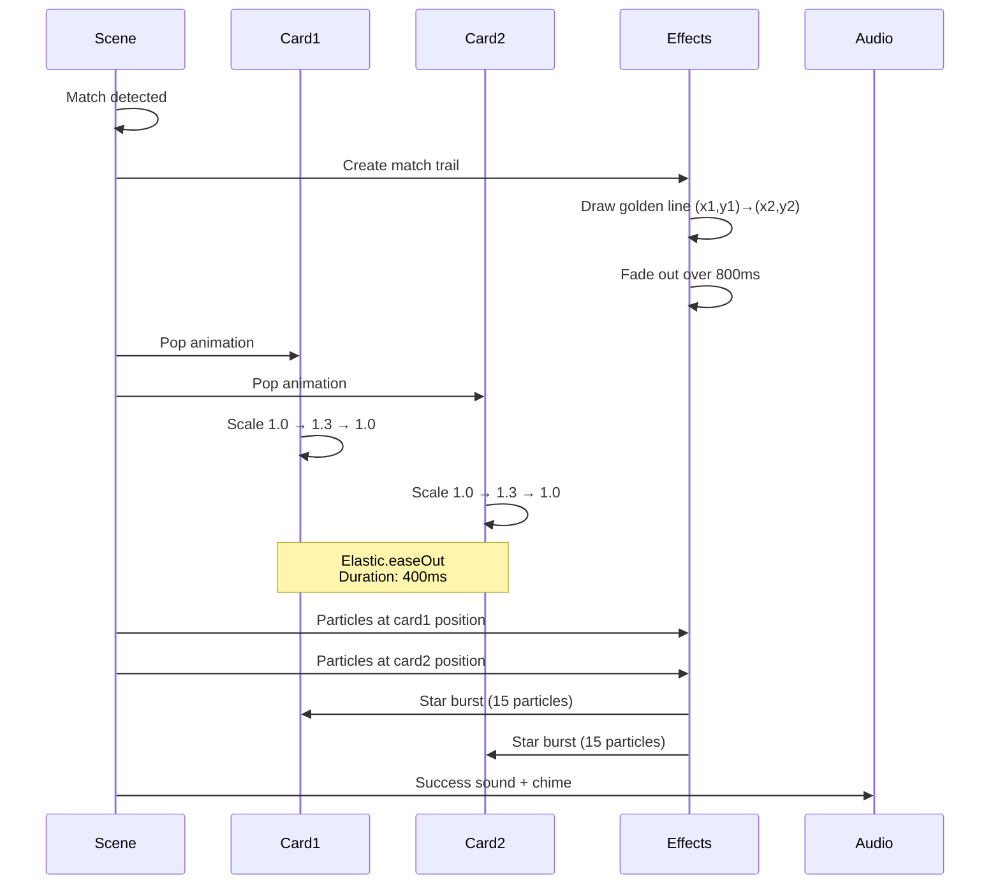

## Scene Transition Animation

```mermaid
gantt
    title Scene Entry Animation Timeline
    dateFormat SSS
    axisFormat %L ms

    section Camera
    Fade in camera :a1, 000, 500ms

    section Cards
    Card 0 fly in :b1, 000, 600ms
    Card 1 fly in :b2, 050, 600ms
    Card 2 fly in :b3, 100, 600ms
    Card 3 fly in :b4, 150, 600ms
    Card 4 fly in :b5, 200, 600ms
    Card 5 fly in :b6, 250, 600ms
    Card 11 fly in :b12, 550, 600ms

    section Music
    Start music :c1, 000, 0ms
    Fade in volume :c2, 000, 2000ms

    section UI
    UI elements fade in :d1, 800, 400ms
```

## Accessibility Features

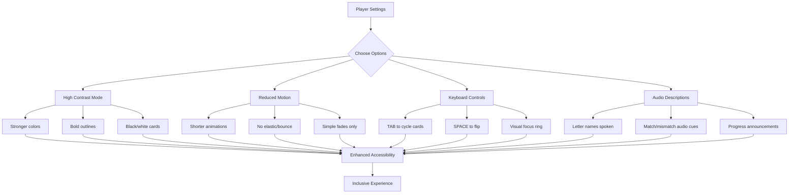

## Audio System Architecture

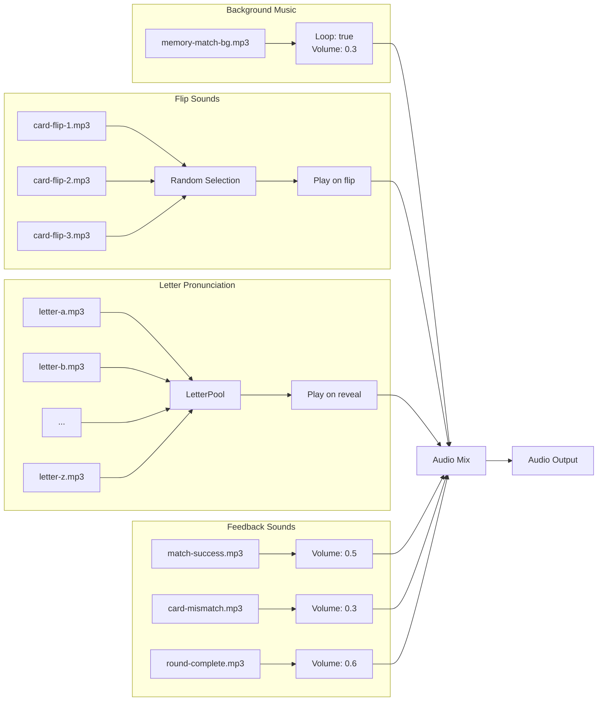

## Data Flow: Difficulty to Game Config

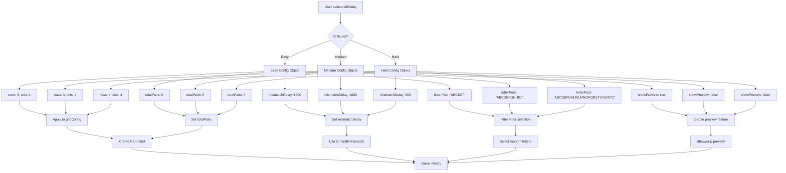

## Preview Mode (Easy Difficulty)

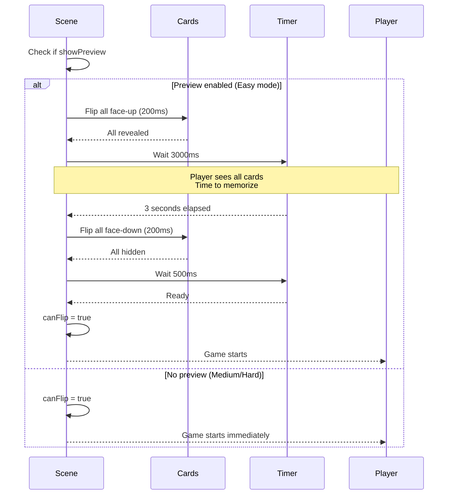

## Notes

### Why Enhanced Animations?

**User Experience Benefits**:
- Hover effects provide immediate feedback
- Glow creates magical, engaging feel
- Rotation adds depth and life
- Professional polish increases enjoyment

**Implementation**:
- Tweens are lightweight
- Effects are subtle, not distracting
- ADHD-friendly: engaging without overwhelming

### Letter-Object Associations

**Educational Value**:
- Visual connection strengthens memory
- Phonetic association (A = Apple)
- Multi-sensory learning (see image, hear name)
- Builds vocabulary alongside letter recognition

**Content Design**:
- Common, recognizable objects
- Clear, colorful images
- Age-appropriate choices
- Culturally relevant

### Difficulty Rationale

**Easy Mode**:
- Fewer unique letters (less cognitive load)
- Longer delay (more processing time)
- Preview mode (reduces anxiety)
- Perfect for beginners or ADHD players

**Medium Mode**:
- Standard memory game experience
- Balanced challenge
- Default for most players

**Hard Mode**:
- More cards (increased working memory demand)
- Faster pace (less time per decision)
- Full alphabet (maximum variety)
- For experienced players

### Audio Design Philosophy

**Background Music**:
- 60-90 BPM (calm, focused pace)
- No lyrics (no distraction)
- Loops seamlessly (no jarring transitions)
- Low volume (ambient, not dominant)

**Sound Effects**:
- Flip sounds: Quick, satisfying
- Match success: Positive, rewarding
- Mismatch: Gentle, neutral (not punishing)
- Letter names: Clear pronunciation
- Volume hierarchy: Feedback > Effects > Music

### Performance Considerations

**Texture Atlases**:
- Combine 26+ images into single texture
- Reduces draw calls
- Faster loading
- Better GPU utilization

**Object Pooling**:
- Particle emitters created once
- Reused for all effects
- No create/destroy overhead

**Tween Management**:
- Kill all on scene shutdown
- Prevents memory leaks
- Clean state transitions

### Accessibility Impact

**High Contrast**:
- Helps dyslexic players
- Reduces eye strain
- Clearer visual hierarchy

**Reduced Motion**:
- Prevents motion sensitivity issues
- Faster for some ADHD players
- Accessibility standard

**Keyboard Controls**:
- Mouse-free operation
- Focus management
- Tab navigation

### What This Phase Achieves

1. **Professional Quality**: Game feels polished and complete
2. **Educational Value**: Letter-object associations aid learning
3. **Accessibility**: Multiple difficulty and accessibility options
4. **Engagement**: Enhanced effects maintain interest
5. **Performance**: Optimized for smooth experience
6. **Replayability**: Difficulty variations extend gameplay

This phase transforms a functional prototype into a production-ready game worthy of Aurora's Letter Adventure.
