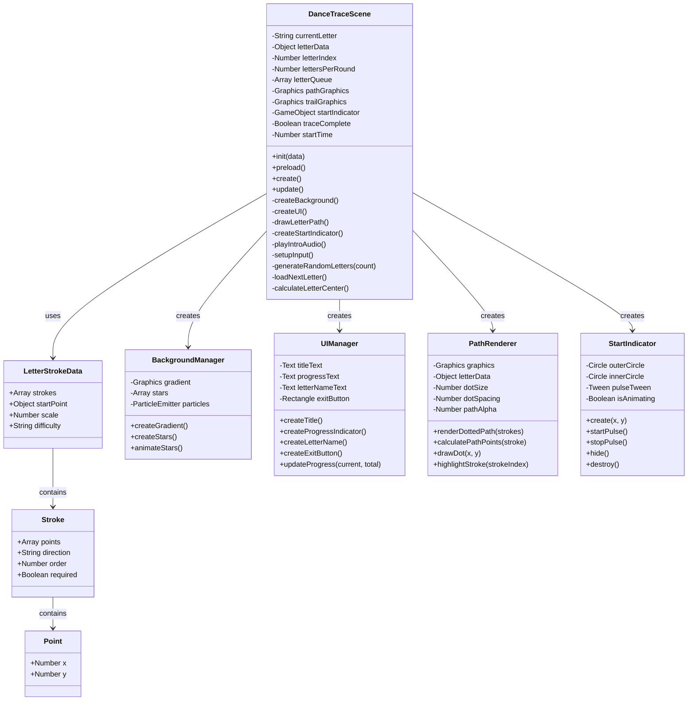
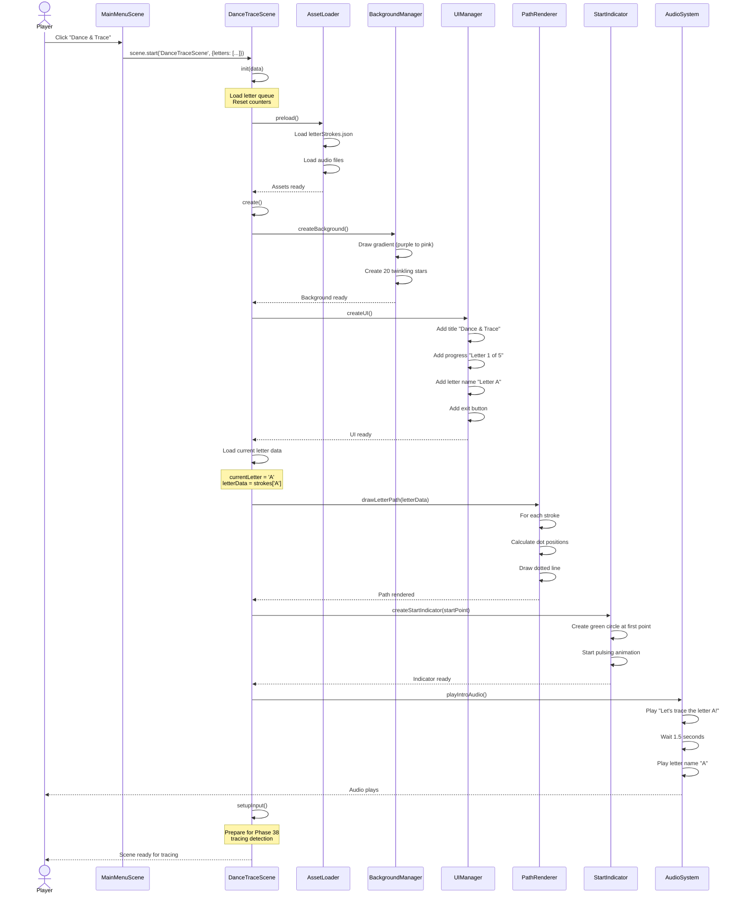
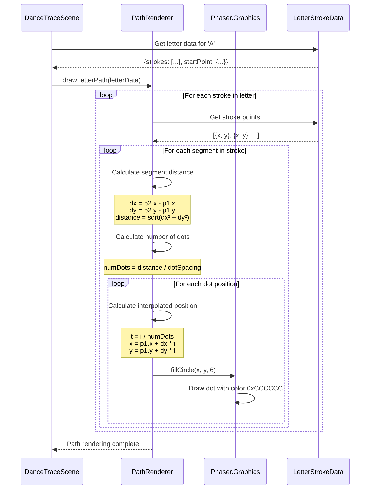
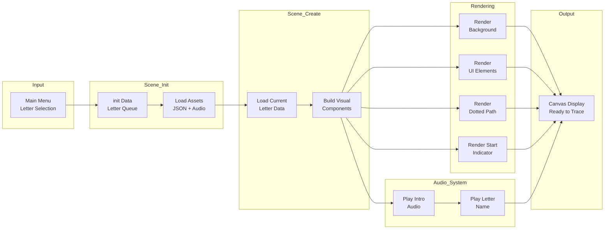
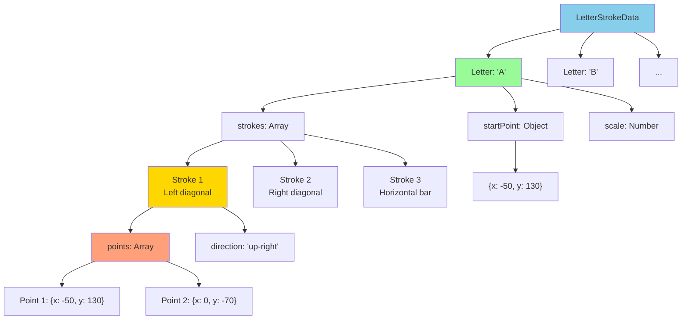

# Phase 37: Dance & Trace - Scene Setup - UML

## Class Diagram



## Sequence Diagram - Scene Initialization



## Sequence Diagram - Letter Path Rendering



## State Diagram - DanceTraceScene Lifecycle

```mermaid
stateDiagram-v2
    [*] --> Initializing: scene.start()

    Initializing --> Loading: init() complete
    Note right of Initializing: Set letter queue<br/>Reset counters<br/>Initialize variables

    Loading --> Creating: preload() complete
    Note right of Loading: Load JSON data<br/>Load audio files<br/>Load background assets

    Creating --> ReadyToTrace: create() complete
    Note right of Creating: Build background<br/>Create UI<br/>Render path<br/>Add start indicator

    ReadyToTrace --> AudioPlaying: Play intro
    Note right of ReadyToTrace: Scene visible<br/>Indicator pulsing<br/>Waiting for input

    AudioPlaying --> ReadyToTrace: Audio complete
    Note right of AudioPlaying: "Let's trace..."<br/>"Letter A"

    ReadyToTrace --> Tracing: User touches start
    Note right of ReadyToTrace: Phase 38:<br/>Path detection begins

    Tracing --> [*]: Letter complete
    Note right of Tracing: Phase 39:<br/>Celebration<br/>Load next letter

    state ReadyToTrace {
        [*] --> IndicatorPulsing
        IndicatorPulsing --> IndicatorPulsing: Tween loop
    }
```

## Component Diagram

```mermaid
graph TB
    subgraph "DanceTraceScene Components"
        Scene[DanceTraceScene<br/>Main Controller]

        subgraph "Visual Components"
            BG[BackgroundManager<br/>Gradient + Stars]
            UI[UIManager<br/>Title, Progress, Exit]
            Path[PathRenderer<br/>Dotted Letter Path]
            Start[StartIndicator<br/>Pulsing Circle]
        end

        subgraph "Data Components"
            LS[LetterStrokeData<br/>JSON from assets]
            Queue[Letter Queue<br/>Array of letters]
        end

        subgraph "Audio Components"
            Intro[Intro Audio<br/>"Let's trace..."]
            Letter[Letter Name Audio<br/>"A", "B", etc.]
        end

        subgraph "Input Components"
            Mouse[Mouse Input<br/>Phase 38]
            Touch[Touch Input<br/>Phase 38]
        end
    end

    Scene --> BG
    Scene --> UI
    Scene --> Path
    Scene --> Start
    Scene --> LS
    Scene --> Queue
    Scene --> Intro
    Scene --> Letter
    Scene --> Mouse
    Scene --> Touch

    Path --> LS
    Start --> LS

    style Scene fill:#90EE90
    style Path fill:#FFD700
    style Start fill:#FFD700
```

## Data Flow Diagram



## Letter Stroke Data Structure



## Animation Timeline

```mermaid
gantt
    title Phase 37: Animation Timeline (First 5 seconds)
    dateFormat X
    axisFormat %Ls

    section Background
    Gradient Render        :0, 100ms
    Stars Created          :100ms, 200ms
    Stars Twinkling        :300ms, 5s

    section UI Elements
    Title Display          :200ms, 100ms
    Progress Display       :300ms, 100ms
    Letter Name Display    :400ms, 100ms
    Exit Button            :500ms, 100ms

    section Letter Path
    Load Letter Data       :500ms, 200ms
    Calculate Path Points  :700ms, 300ms
    Render Dotted Path     :1000ms, 500ms

    section Start Indicator
    Create Circle          :1500ms, 100ms
    Start Pulsing          :1600ms, 3400ms

    section Audio
    Play Intro Audio       :1700ms, 1500ms
    Play Letter Name       :3200ms, 800ms

    section Ready State
    Scene Ready            :4000ms, 1s
```

## Path Rendering Algorithm

```mermaid
flowchart TD
    Start([Start Path Rendering])

    GetLetter[Get letter data<br/>for current letter]
    GetStrokes[Get strokes array<br/>from letter data]

    LoopStart{More strokes?}
    GetStroke[Get next stroke]
    GetPoints[Get points array<br/>from stroke]

    SegmentLoop{More segments?}
    GetSegment[Get point pair<br/>p1, p2]

    CalcDist[Calculate distance<br/>d = sqrt(dx² + dy²)]
    CalcDots[Calculate dot count<br/>n = floor(d / spacing)]

    DotLoop{More dots?}
    CalcPos[Calculate position<br/>x = p1.x + dx * t<br/>y = p1.y + dy * t]
    DrawDot[Draw dot at x, y<br/>radius = 6px<br/>color = 0xCCCCCC]

    NextDot[Next dot<br/>t += 1/n]
    NextSegment[Next segment]
    NextStroke[Next stroke]

    End([Path Complete])

    Start --> GetLetter
    GetLetter --> GetStrokes
    GetStrokes --> LoopStart

    LoopStart -->|Yes| GetStroke
    LoopStart -->|No| End

    GetStroke --> GetPoints
    GetPoints --> SegmentLoop

    SegmentLoop -->|Yes| GetSegment
    SegmentLoop -->|No| NextStroke

    GetSegment --> CalcDist
    CalcDist --> CalcDots
    CalcDots --> DotLoop

    DotLoop -->|Yes| CalcPos
    DotLoop -->|No| NextSegment

    CalcPos --> DrawDot
    DrawDot --> NextDot
    NextDot --> DotLoop

    NextSegment --> SegmentLoop
    NextStroke --> LoopStart
```

## Notes

### Why This Architecture?

**Separation of Concerns**
- BackgroundManager handles all background visuals
- UIManager handles all text/buttons
- PathRenderer handles letter path drawing
- StartIndicator handles pulsing animation
- Each component is independent and testable

**Data-Driven Design**
- Letter strokes defined in JSON (easily editable)
- No hardcoded letter shapes in JavaScript
- Can add new letters without code changes
- Artists/designers can modify letter paths

**Centered Coordinate System**
- All letter coordinates relative to (0, 0)
- Scene adds base offset (400, 320) for centering
- Letters remain centered regardless of complexity
- Simplifies path calculations

**Reusable Components**
- PathRenderer can be used in other scenes
- StartIndicator can mark any position
- Letter data format works for handwriting analysis
- BackgroundManager pattern reusable

### Performance Considerations

**Graphics Optimization**
- Use single Graphics object for all dots
- Pre-calculate all dot positions
- Minimize draw calls
- Stars use simple circles (fast)

**Animation Efficiency**
- Tweens managed by Phaser (optimized)
- Only start indicator animates continuously
- Background stars on independent timers
- No update() loop animations (all tween-based)

**Memory Management**
- Destroy previous letter graphics before loading next
- Reuse Graphics objects when possible
- Clear unused tweens
- Unload previous letter audio

### ADHD-Friendly Design Principles

1. **Clear Visual Hierarchy**: Title → Progress → Letter → Path
2. **High Contrast**: White text on gradient, gray dots on light background
3. **Obvious Starting Point**: Large, pulsing green circle
4. **Calming Colors**: Purple/pink gradient (not harsh)
5. **Minimal Distractions**: Subtle stars, simple UI
6. **Clear Exit**: Always visible, easy to leave
7. **Positive Progression**: "Letter 2 of 5" (not "3 remaining")

This foundation ensures Phase 38's tracing detection has a solid, therapeutic environment to work within.
