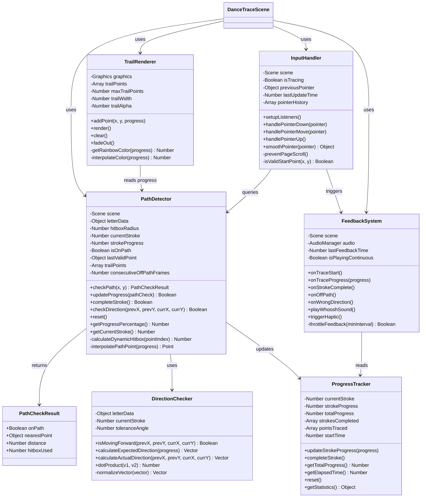
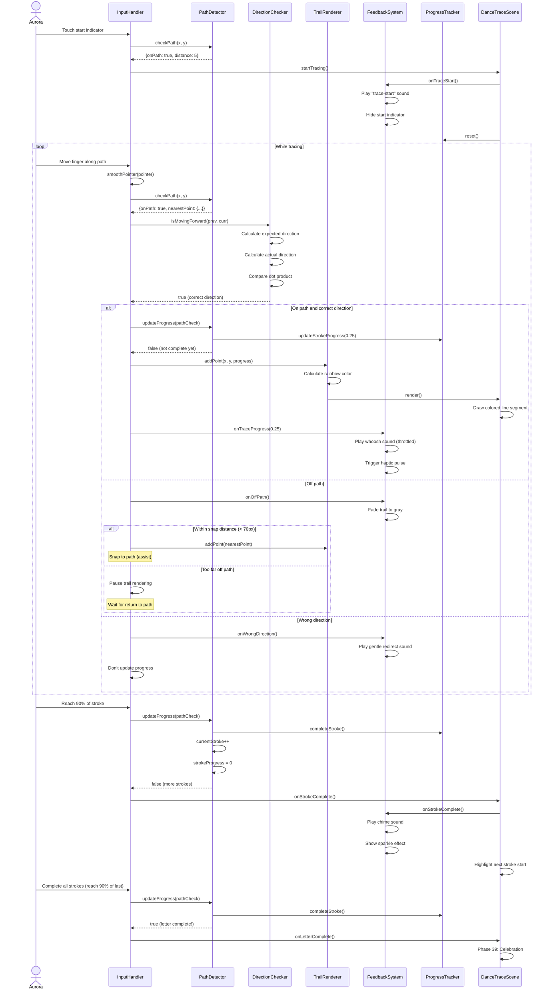
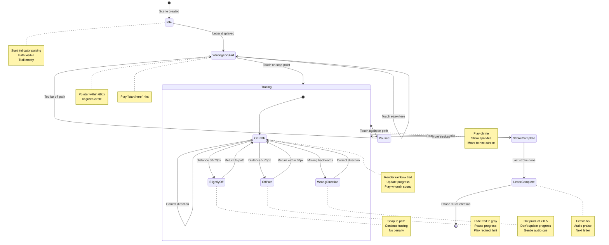
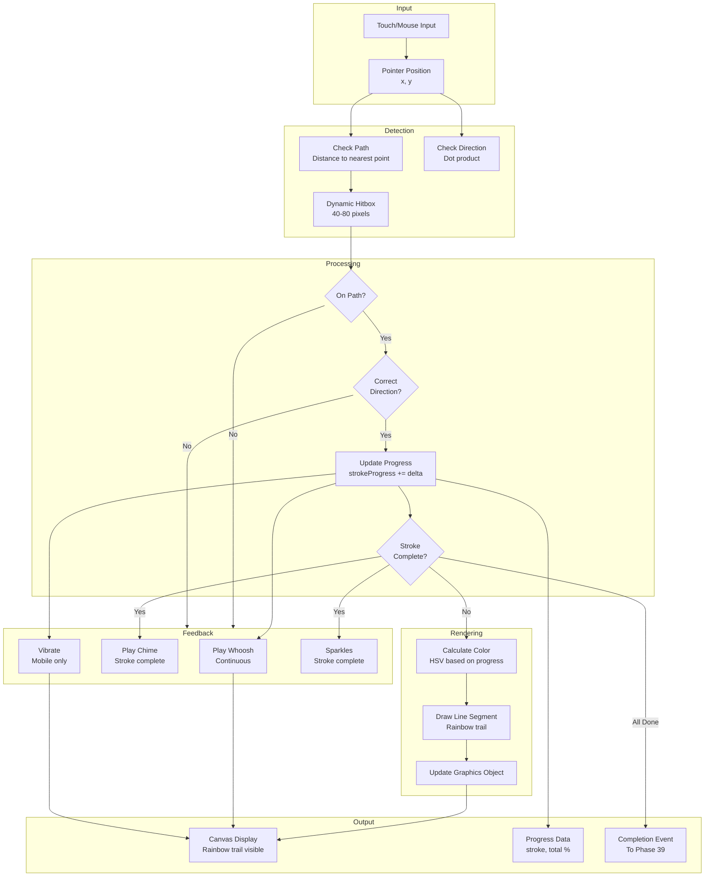
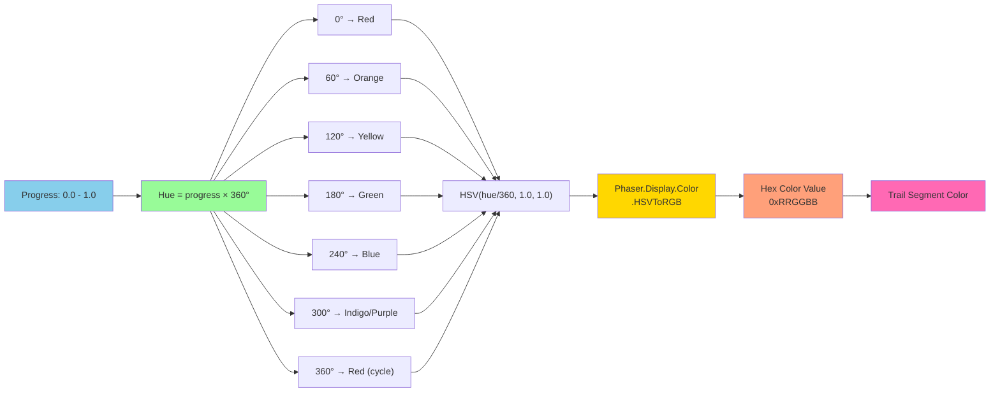
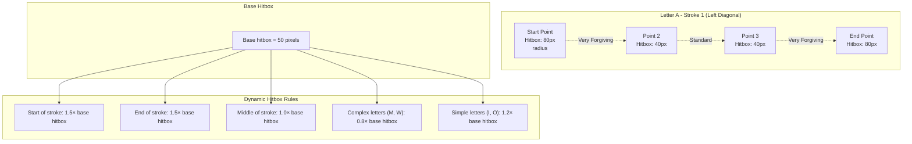

# Phase 38: Dance & Trace - Path Detection - UML

## Class Diagram



## Sequence Diagram - Tracing Interaction



## State Diagram - Tracing States



## Data Flow Diagram



## Path Detection Algorithm Flowchart

```mermaid
flowchart TD
    Start([Pointer Move Event])

    GetPointer[Get current pointer<br/>position x, y]
    GetStroke[Get current stroke<br/>from letterData]

    LoopPoints{Check all<br/>points in stroke}
    CalcDist[Calculate distance to point<br/>d = sqrt(dx² + dy²)]
    UpdateMin{d < minDist?}
    SaveMin[Save as nearest point<br/>minDist = d]
    NextPoint[Next point]

    CalcHitbox[Calculate dynamic hitbox<br/>Start/end: 80px<br/>Middle: 40px]
    CheckHitbox{minDist <<br/>hitbox?}

    OnPath[On Path!<br/>isOnPath = true]
    OffPath[Off Path<br/>isOnPath = false]

    CheckDirection[Check movement direction<br/>dotProduct(expected, actual)]
    DirectionOK{dotProduct<br/>> 0.5?}

    UpdateProgress[Update strokeProgress<br/>Calculate % along stroke]
    CheckComplete{progress<br/>>= 0.9?}

    CompleteStroke[Complete stroke<br/>currentStroke++<br/>strokeProgress = 0]
    CheckLetter{More<br/>strokes?}

    LetterDone[Letter Complete!<br/>Return true]
    ContinueTracing[Continue tracing<br/>Return false]

    RenderTrail[Add point to trail<br/>Render rainbow segment]
    PlayFeedback[Play audio feedback<br/>Trigger haptic]

    SnapToPath[Within 70px?<br/>Snap to nearest point]
    GentleHint[Play redirect hint<br/>Fade trail to gray]

    End([Return result])

    Start --> GetPointer
    GetPointer --> GetStroke
    GetStroke --> LoopPoints

    LoopPoints -->|Yes| CalcDist
    CalcDist --> UpdateMin
    UpdateMin -->|Yes| SaveMin
    UpdateMin -->|No| NextPoint
    SaveMin --> NextPoint
    NextPoint --> LoopPoints

    LoopPoints -->|No| CalcHitbox
    CalcHitbox --> CheckHitbox

    CheckHitbox -->|Yes| OnPath
    CheckHitbox -->|No| OffPath

    OnPath --> CheckDirection
    CheckDirection --> DirectionOK

    DirectionOK -->|Yes| UpdateProgress
    DirectionOK -->|No| GentleHint

    UpdateProgress --> CheckComplete
    CheckComplete -->|Yes| CompleteStroke
    CheckComplete -->|No| RenderTrail

    CompleteStroke --> CheckLetter
    CheckLetter -->|Yes| ContinueTracing
    CheckLetter -->|No| LetterDone

    RenderTrail --> PlayFeedback
    PlayFeedback --> ContinueTracing

    OffPath --> SnapToPath
    SnapToPath -->|Yes| UpdateProgress
    SnapToPath -->|No| GentleHint

    GentleHint --> ContinueTracing
    LetterDone --> End
    ContinueTracing --> End
```

## Rainbow Color Generation



## Hitbox Visualization



## Notes

### Algorithmic Complexity

**Path Detection: O(n)**
- n = number of points in current stroke
- Must check distance to each point
- Optimization: Binary search for progress-based lookup
- Typical: 10-30 points per stroke = fast

**Direction Check: O(1)**
- Simple vector math
- 2 subtractions, 2 multiplications, 1 addition
- Negligible performance impact

**Trail Rendering: O(m)**
- m = number of trail points (limit to 200)
- Draw each line segment
- Clear and redraw each frame
- Optimization: Only draw visible portions

### ADHD-Friendly Algorithms

**Forgiveness Layers**
1. **Generous Hitbox**: 50-80 pixel radius (vs. 10-20 typical)
2. **Snap-to-Path**: Auto-correct within 70 pixels
3. **Direction Tolerance**: 45-degree deviation allowed
4. **Progress Patience**: Must stay off-path > 500ms to lose progress
5. **No Penalties**: Never go backwards in progress

**Positive Feedback Loops**
- Every 5 points traced → whoosh sound
- Every 25% progress → brighter colors
- Stroke completion → chime + sparkles
- No negative audio cues
- Visual feedback only (gentle redirect)

### Performance Optimizations

1. **Limit Trail Points**: Keep last 200 points only
2. **Throttle Audio**: Whoosh sound max every 100ms
3. **Frame Rate**: Target 60 FPS (16ms per frame)
4. **Graphics Reuse**: Don't create new Graphics each frame
5. **Distance Caching**: Cache nearest point for 3 frames
6. **Input Smoothing**: Rolling average over 5 frames

This architecture ensures smooth, therapeutic tracing with rich visual feedback.
