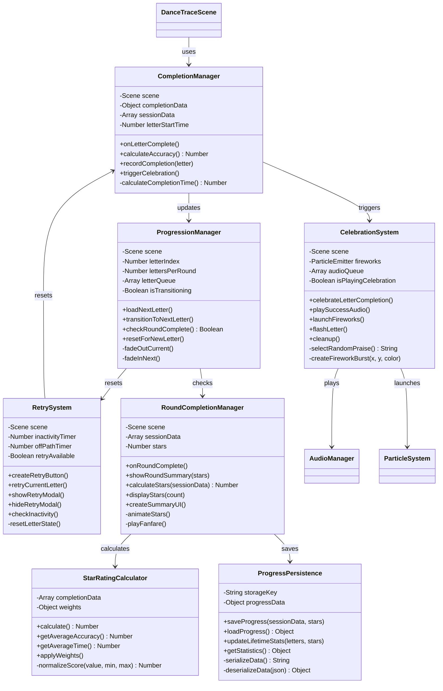
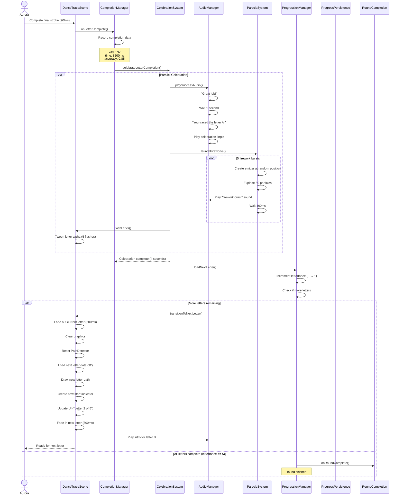
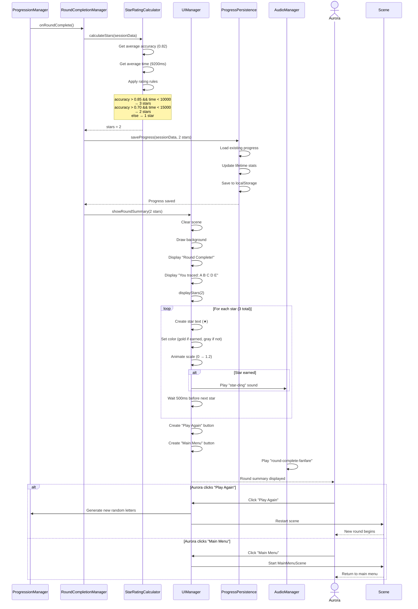
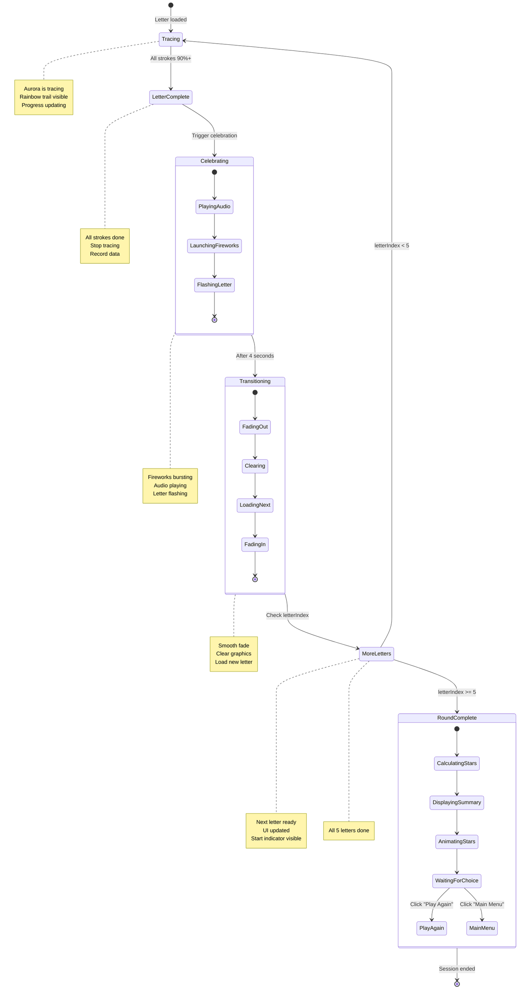
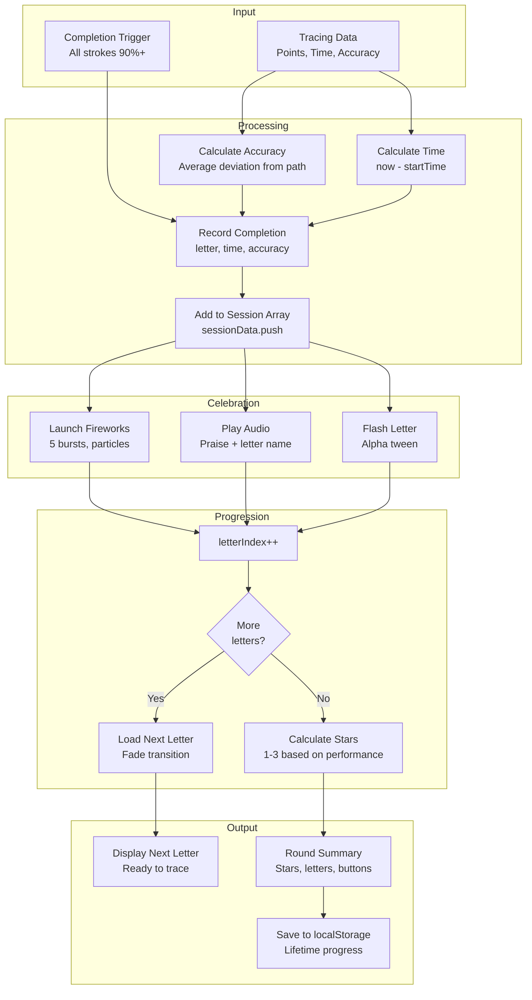
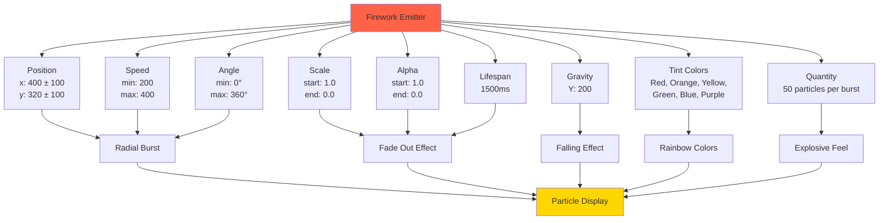
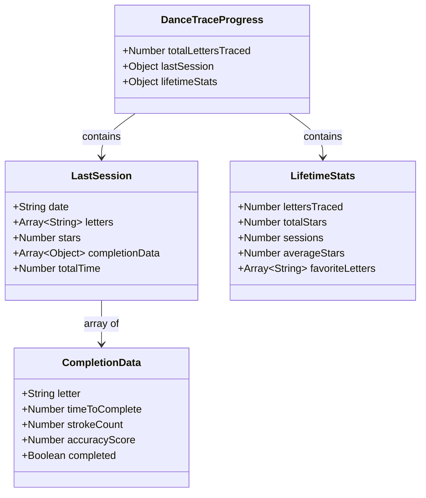

# Phase 39: Dance & Trace - Completion and Flow - UML

## Class Diagram



## Sequence Diagram - Letter Completion Flow



## Sequence Diagram - Round Completion Flow



## State Diagram - Letter and Round Flow



## Data Flow Diagram - Completion Data



## Firework Particle Configuration



## Star Rating Algorithm

```mermaid
flowchart TD
    Start([Calculate Stars])

    GetData[Get session data<br/>5 letters completed]
    CalcAvgAccuracy[Calculate average accuracy<br/>sum(accuracy) / 5]
    CalcAvgTime[Calculate average time<br/>sum(time) / 5]

    CheckThreeStar{accuracy > 0.85<br/>AND<br/>time < 10000ms?}
    CheckTwoStar{accuracy > 0.70<br/>AND<br/>time < 15000ms?}

    ThreeStar[Return 3 stars<br/>Excellent performance]
    TwoStar[Return 2 stars<br/>Good performance]
    OneStar[Return 1 star<br/>Completed successfully]

    End([Return stars])

    Start --> GetData
    GetData --> CalcAvgAccuracy
    CalcAvgAccuracy --> CalcAvgTime
    CalcAvgTime --> CheckThreeStar

    CheckThreeStar -->|Yes| ThreeStar
    CheckThreeStar -->|No| CheckTwoStar

    CheckTwoStar -->|Yes| TwoStar
    CheckTwoStar -->|No| OneStar

    ThreeStar --> End
    TwoStar --> End
    OneStar --> End

    style ThreeStar fill:#FFD700
    style TwoStar fill:#C0C0C0
    style OneStar fill:#CD7F32
```

## Retry System Flow

```mermaid
flowchart LR
    subgraph Triggers
        RetryButton[Retry Button Click]
        Inactivity[Inactivity > 10s]
        OffPath[Off path > 3s]
    end

    subgraph Actions
        ClearTrail[Clear Trail Graphics]
        ResetDetector[Reset PathDetector<br/>stroke: 0, progress: 0]
        ShowIndicator[Show Start Indicator<br/>Pulsing green circle]
        ResetFlags[Reset isTracing = false<br/>trailPoints = []]
    end

    subgraph Feedback
        PlayAudio[Play encouraging audio<br/>"Let's try again together!"]
        NoNegative[No negative messaging<br/>No penalties]
    end

    subgraph Result
        ReadyToTrace[Ready to trace again<br/>Same letter]
    end

    RetryButton --> ClearTrail
    Inactivity --> ClearTrail
    OffPath --> ClearTrail

    ClearTrail --> ResetDetector
    ResetDetector --> ShowIndicator
    ShowIndicator --> ResetFlags
    ResetFlags --> PlayAudio
    PlayAudio --> NoNegative
    NoNegative --> ReadyToTrace
```

## localStorage Data Structure



## Notes

### Celebration Timing Breakdown

**Total Celebration: 4 seconds**
- 0.0s: Completion detected
- 0.0s-0.5s: Play "Great job!" audio
- 0.5s-2.5s: Launch fireworks (5 bursts × 400ms spacing)
- 1.0s-2.0s: Play letter name audio
- 0.5s-3.5s: Flash letter (5 flashes × 400ms)
- 0.0s-3.5s: Celebration jingle plays
- 3.5s-4.0s: Fade out and cleanup
- 4.0s: Begin transition to next letter

### Transition Timing Breakdown

**Total Transition: 1 second**
- 0.0s-0.5s: Fade out current letter/trail (alpha 1 → 0)
- 0.5s: Clear graphics, load next letter data
- 0.5s-1.0s: Fade in new letter (alpha 0 → 1)
- 1.0s: Play intro audio, ready to trace

### Star Rating Philosophy

**1 Star = Success**
- Aurora completed all 5 letters
- Time and accuracy don't matter
- Always celebrate completion

**2 Stars = Good Performance**
- Average accuracy > 70%
- Average time < 15 seconds per letter
- Aurora is improving

**3 Stars = Excellent Performance**
- Average accuracy > 85%
- Average time < 10 seconds per letter
- Aurora has mastered this round

**Never 0 Stars**
- Completing 5 letters always earns at least 1 star
- No failure state in this therapeutic design

### Therapeutic Design Principles

1. **Always Celebrate**: Every completion triggers fireworks and praise
2. **No Failure**: Retry is "try again together", not "you failed"
3. **Progressive Success**: 1 star guaranteed, bonus stars for performance
4. **Positive Language**: "Great job!", "Let's try again!", "You did it!"
5. **Visual Rewards**: Fireworks are the primary dopamine trigger
6. **Gentle Guidance**: Off-path doesn't fail, just pauses
7. **Autonomy**: Aurora can retry anytime, no forced continues
8. **Persistence**: Progress saves for long-term motivation

This architecture ensures every session feels rewarding and therapeutic.
