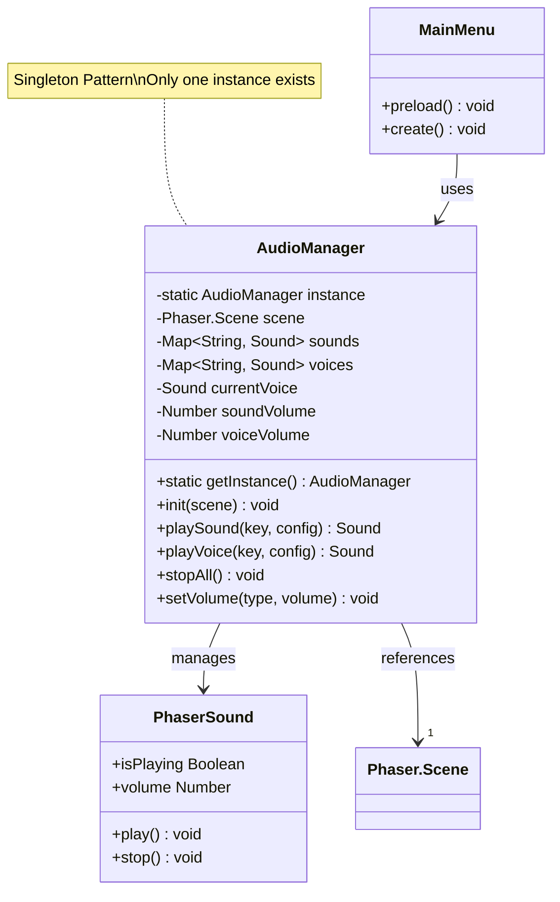
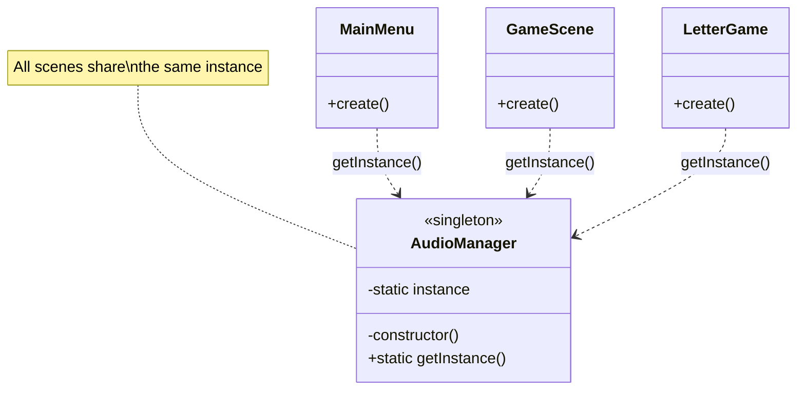
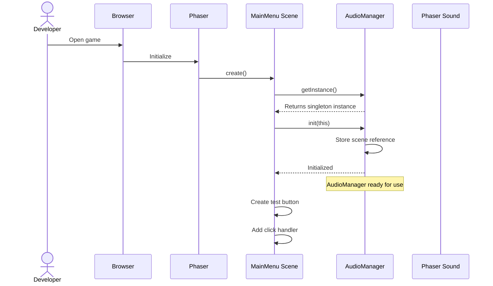
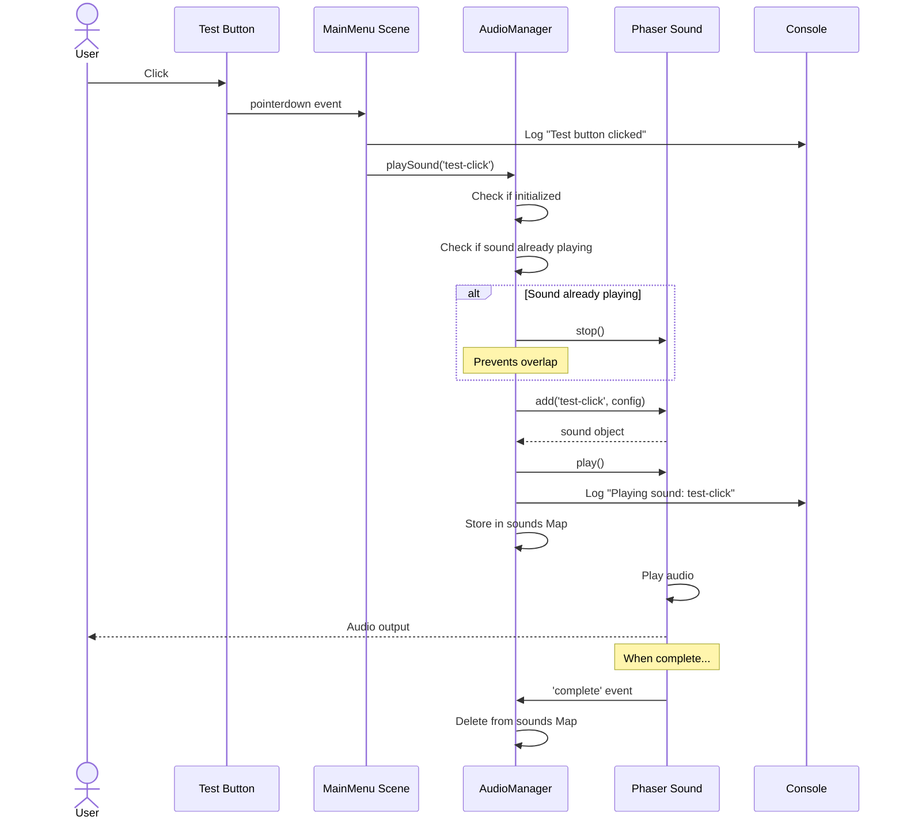
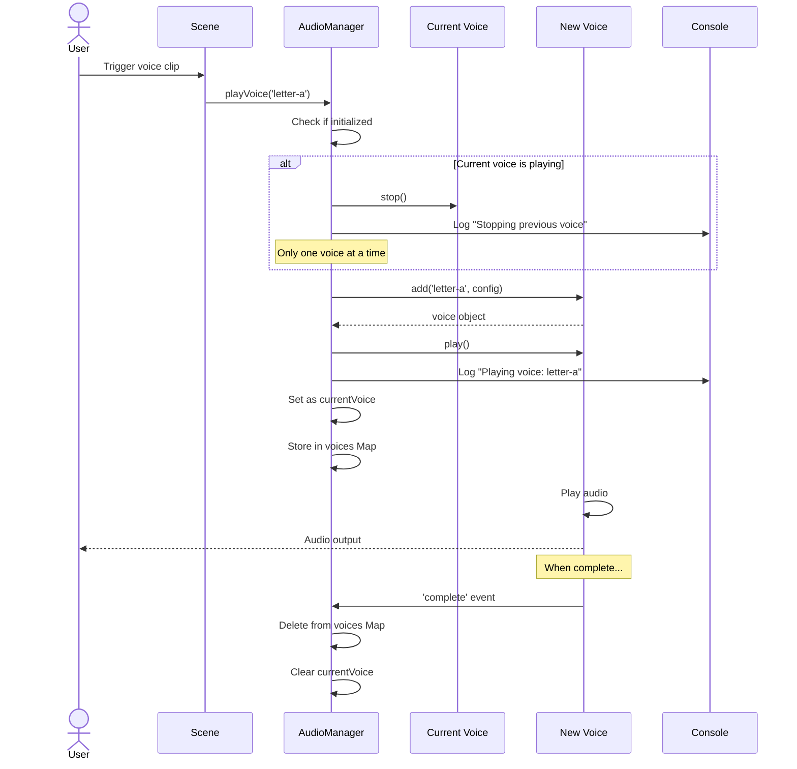
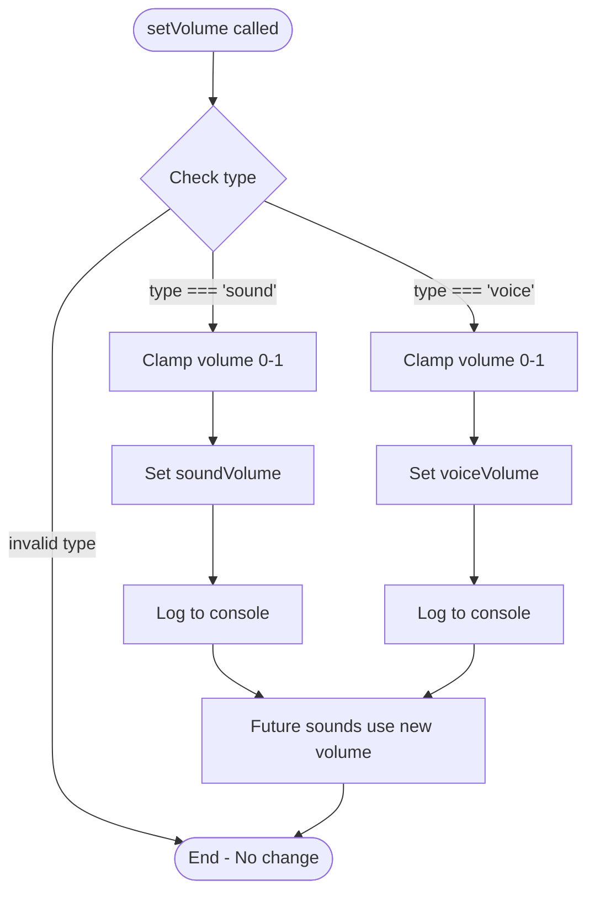
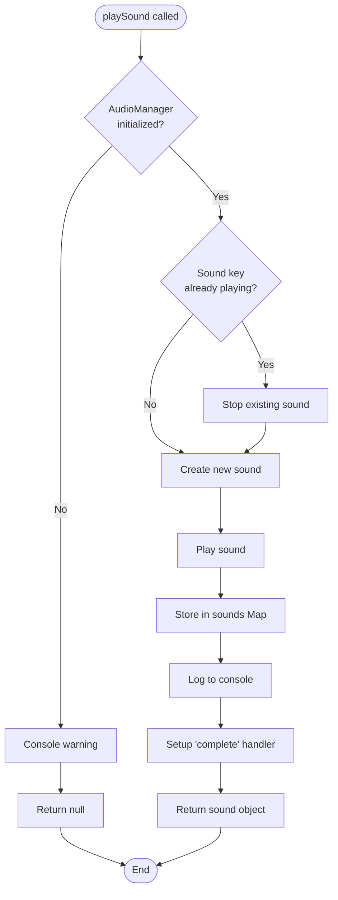
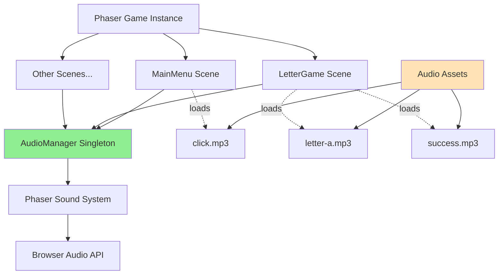
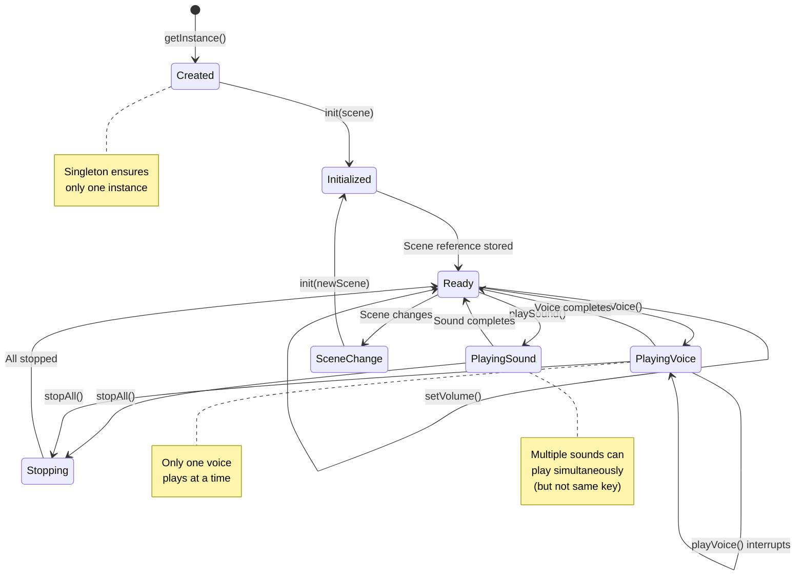

# Phase 4: AudioManager Service - UML

## AudioManager Class Diagram



## Singleton Pattern Illustration



## Service Initialization Sequence



## Audio Playback Sequence (Sound Effect)



## Audio Playback Sequence (Voice Clip)



## Volume Control Flow



## Overlap Prevention Flow



## stopAll() Flow

```mermaid
flowchart TD
    Start([stopAll called]) --> LogStart[Log "Stopping all audio"]

    LogStart --> IterateSounds[Iterate sounds Map]
    IterateSounds --> CheckPlaying{Is sound\nplaying?}

    CheckPlaying -->|Yes| StopSound[Stop sound]
    CheckPlaying -->|No| NextSound[Next sound]

    StopSound --> NextSound
    NextSound --> MoreSounds{More sounds?}

    MoreSounds -->|Yes| CheckPlaying
    MoreSounds -->|No| ClearSounds[Clear sounds Map]

    ClearSounds --> IterateVoices[Iterate voices Map]
    IterateVoices --> CheckVoicePlaying{Is voice\nplaying?}

    CheckVoicePlaying -->|Yes| StopVoice[Stop voice]
    CheckVoicePlaying -->|No| NextVoice[Next voice]

    StopVoice --> NextVoice
    NextVoice --> MoreVoices{More voices?}

    MoreVoices -->|Yes| CheckVoicePlaying
    MoreVoices -->|No| ClearVoices[Clear voices Map]

    ClearVoices --> ClearCurrent[Set currentVoice = null]
    ClearCurrent --> End([End])
```

## Component Integration Diagram



## State Diagram - AudioManager Lifecycle



## Error Handling Flow

```mermaid
flowchart TD
    Start([Audio method called]) --> CheckInit{AudioManager\ninitialized?}

    CheckInit -->|No| WarnNotInit[Console warning:<br/>"Cannot play - not initialized"]
    CheckInit -->|Yes| TryPlay[Try to play audio]

    WarnNotInit --> ReturnNull1[Return null]

    TryPlay --> Success{Success?}

    Success -->|Yes| ReturnSound[Return sound object]
    Success -->|No| CatchError[Catch error]

    CatchError --> LogError[Console error:<br/>"Error playing sound"]
    LogError --> ReturnNull2[Return null]

    ReturnNull1 --> End([End])
    ReturnNull2 --> End
    ReturnSound --> End

    style WarnNotInit fill:#FFA500
    style LogError fill:#FF6B6B
    style ReturnSound fill:#90EE90
```

## Memory Management

```mermaid
flowchart TD
    Start([Sound plays]) --> Playing[Sound is playing]

    Playing --> StoreMap[Store in Map<br/>sounds.set(key, sound)]
    StoreMap --> SetupHandler[Setup 'complete' handler]

    SetupHandler --> WaitComplete[Wait for completion]

    WaitComplete --> Complete{Sound completes}

    Complete -->|complete event| RemoveMap[sounds.delete(key)]
    Complete -->|manual stop| RemoveMap

    RemoveMap --> GarbageCollect[JavaScript GC<br/>cleans up sound object]

    GarbageCollect --> End([End - Memory freed])

    style RemoveMap fill:#90EE90
    style GarbageCollect fill:#87CEEB
```

## Notes

### Why Singleton Pattern?

**Single Source of Truth**
- One AudioManager across all scenes
- Consistent volume settings
- Centralized audio state management
- No duplicate audio managers

**Memory Efficient**
- Single instance instead of multiple
- Shared sound caching
- Better resource management

**State Persistence**
- Volume settings persist across scene changes
- Audio state tracked globally
- Easy to implement pause/resume

### Why Separate Sound and Voice?

**Different Behavior**
- Sounds: Multiple can overlap (unless same key)
- Voices: Only one at a time (instructions should be clear)

**Different Volume Controls**
- Users may want different volumes
- Voice clips need to be clear
- Sound effects can be quieter

**ADHD-Friendly Design**
- Voice instructions shouldn't be interrupted
- Sound effects shouldn't overwhelm
- Clear audio feedback for actions

### Design Decisions

**Map vs Array for Storage**
- Fast lookup by key
- Easy to check if sound exists
- Efficient cleanup

**Console Logging**
- Helps with debugging
- Shows audio events clearly
- Can be disabled in production

**Overlap Prevention**
- Same sound key: Stop previous (no echo)
- Voice clips: Only one at a time (clarity)
- Different sounds: Can overlap (richer feedback)

**Volume Clamping**
- Always 0-1 range
- Prevents audio distortion
- Consistent behavior

### What This Phase Enables

1. **Centralized Control**: All audio through one service
2. **Consistent Behavior**: Same patterns across all scenes
3. **Easy Testing**: Console logs show what's happening
4. **Scalability**: Easy to add more audio features later
5. **Maintainability**: One place to fix audio issues

This architecture supports the game's growth while keeping audio management simple and reliable.
