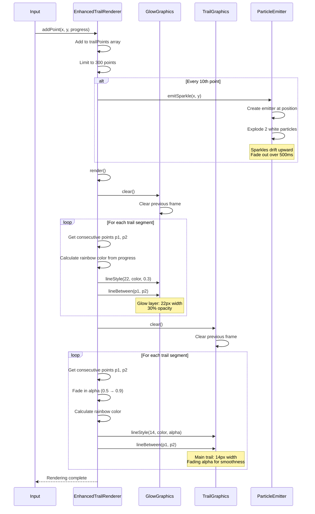
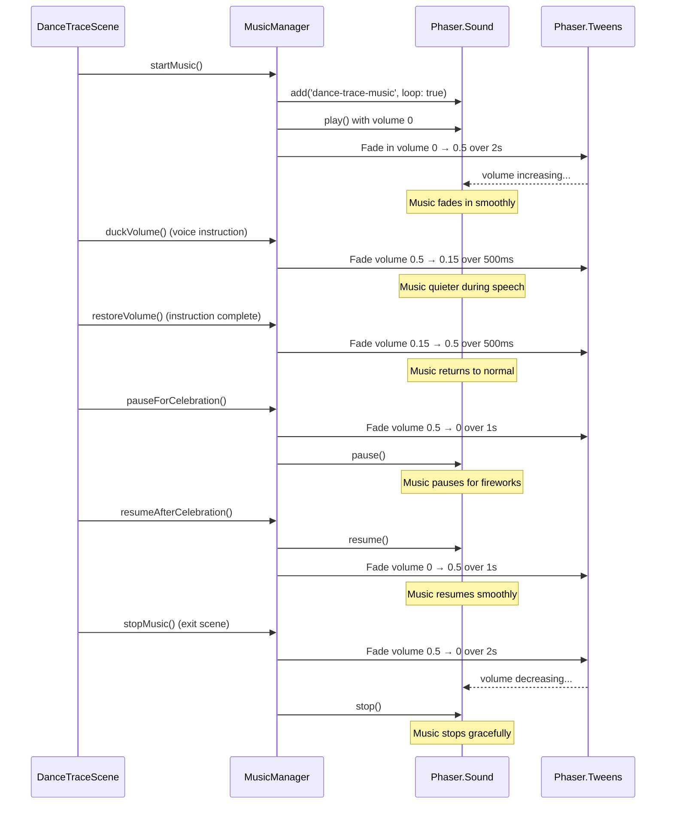
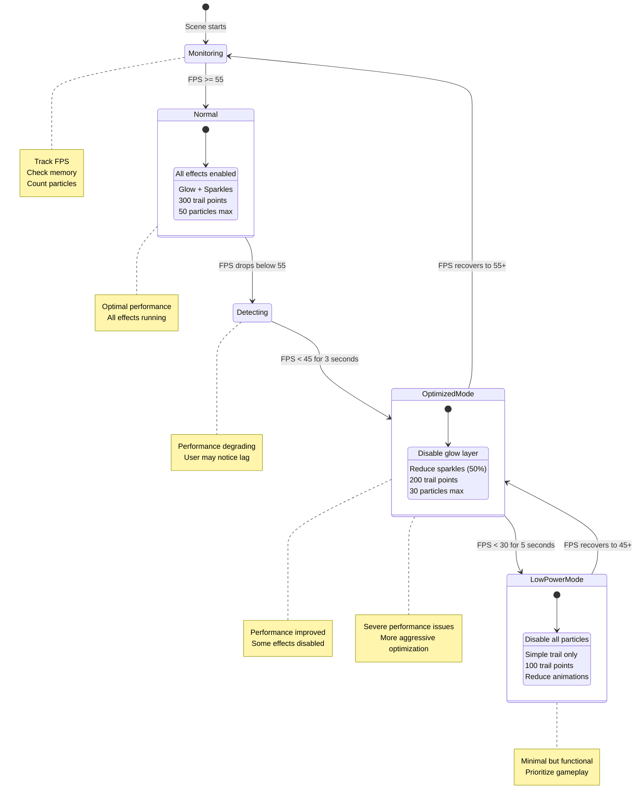
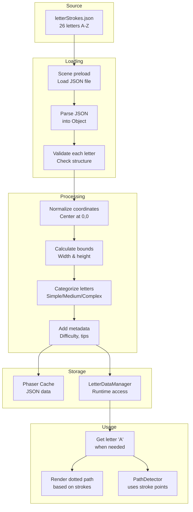
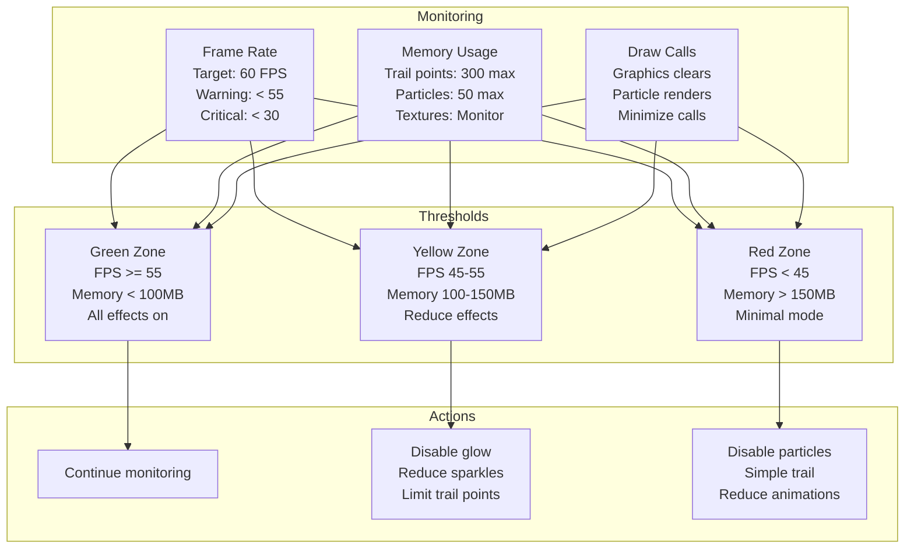
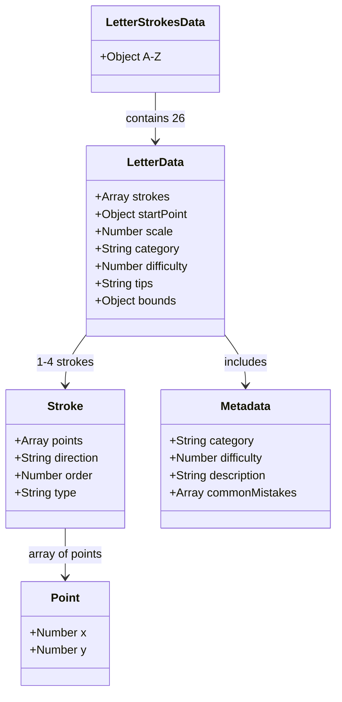

# Phase 40: Dance & Trace - Polish - UML

## Class Diagram

```mermaid
classDiagram
    class EnhancedTrailRenderer {
        -Graphics trailGraphics
        -Graphics glowGraphics
        -ParticleEmitter sparkles
        -Array trailPoints
        -Number maxTrailPoints
        -Object fadeConfig

        +addPoint(x, y, progress)
        +render()
        +emitSparkle(x, y)
        +clear()
        -fadeInSegment(point)
        -renderGlow()
        -renderTrail()
    }

    class MusicManager {
        -Sound bgMusic
        -Boolean isMusicPlaying
        -Number defaultVolume
        -Number duckedVolume
        -Scene scene

        +startMusic()
        +stopMusic()
        +duckVolume()
        +restoreVolume()
        +pauseForCelebration()
        +resumeAfterCelebration()
        -fadeIn(duration)
        -fadeOut(duration)
    }

    class HapticManager {
        -Boolean isSupported
        -Boolean isEnabled
        -Object patterns

        +vibrate(pattern)
        +traceStart()
        +traceProgress()
        +strokeComplete()
        +letterComplete()
        +starEarn()
        -checkSupport()
    }

    class LetterDataManager {
        -Object letterStrokes
        -Array validatedLetters
        -Object letterMetadata

        +loadAllLetters()
        +getLetterData(letter) Object
        +validateLetter(letter) Boolean
        +getCategoryLetters(category) Array
        +getLetterStats(letter) Object
        -normalizeCoordinates(data)
        -calculateBounds(strokes)
    }

    class AnimationPolish {
        -Scene scene
        -Object tweenConfig
        -Array activeTweens

        +animateStartIndicator(indicator)
        +animateLetterPathFadeIn(graphics, strokes)
        +animateCompletionFlash(targets)
        +animateButtonHover(button)
        +animateStarEarn(star)
        -createSmoothTween(config)
        -cleanupTweens()
    }

    class PerformanceOptimizer {
        -Number targetFPS
        -Number currentFPS
        -Boolean lowPowerMode
        -Object metrics

        +monitorFPS()
        +optimizeGraphics()
        +limitParticles(count)
        +cleanupMemory()
        +detectLowPerformance()
        -adjustQuality()
        -logMetrics()
    }

    class AccessibilityManager {
        -String colorblindMode
        -Boolean highContrast
        -Number dotSize
        -Boolean showGuidelines
        -Object preferences

        +applyColorblindMode(mode)
        +toggleHighContrast()
        +adjustDotSize(size)
        +showHandwritingLines()
        +savePreferences()
        +loadPreferences()
    }

    class TutorialManager {
        -Boolean hasSeenTutorial
        -Scene scene
        -Container tutorialOverlay

        +checkFirstTime() Boolean
        +showTutorial()
        +dismissTutorial()
        +showExampleAnimation()
        +markAsCompleted()
        -createOverlay()
    }

    DanceTraceScene --> EnhancedTrailRenderer : uses
    DanceTraceScene --> MusicManager : uses
    DanceTraceScene --> HapticManager : uses
    DanceTraceScene --> LetterDataManager : loads from
    DanceTraceScene --> AnimationPolish : applies
    DanceTraceScene --> PerformanceOptimizer : monitors
    DanceTraceScene --> AccessibilityManager : configures
    DanceTraceScene --> TutorialManager : shows

    EnhancedTrailRenderer --> ParticleSystem : emits sparkles
    MusicManager --> AudioManager : controls
    AnimationPolish --> TweenSystem : creates
    PerformanceOptimizer --> FrameRateMonitor : checks
```



## Sequence Diagram - Enhanced Trail Rendering



## Sequence Diagram - Music Management



## State Diagram - Performance Optimization



## Data Flow Diagram - Letter Data Loading



## Animation Timeline - Letter Path Fade In

```mermaid
gantt
    title Letter Path Fade-In Animation (Letter A - 60 dots total)
    dateFormat X
    axisFormat %Lms

    section Stroke 1 (20 dots)
    Dot 1  :0ms, 20ms
    Dot 2  :20ms, 20ms
    Dot 3  :40ms, 20ms
    Dots 4-20 :60ms, 340ms

    section Stroke 2 (20 dots)
    Dot 21 :400ms, 20ms
    Dot 22 :420ms, 20ms
    Dots 23-40 :440ms, 360ms

    section Stroke 3 (20 dots)
    Dot 41 :800ms, 20ms
    Dot 42 :820ms, 20ms
    Dots 43-60 :840ms, 360ms

    section Complete
    All visible :1200ms, 100ms
```

## Haptic Pattern Visualization

```mermaid
gantt
    title Haptic Feedback Patterns
    dateFormat X
    axisFormat %Lms

    section Trace Start
    Pulse :0ms, 20ms

    section Trace Progress
    Pulse :0ms, 15ms

    section Stroke Complete
    Pulse :0ms, 30ms

    section Letter Complete
    Pulse 1 :0ms, 50ms
    Wait    :50ms, 100ms
    Pulse 2 :150ms, 50ms
    Wait    :200ms, 100ms
    Pulse 3 :300ms, 50ms

    section Star Earn
    Pulse 1 :0ms, 20ms
    Wait    :20ms, 100ms
    Pulse 2 :120ms, 20ms
    Wait    :140ms, 100ms
    Pulse 3 :240ms, 20ms
```

## Performance Metrics Dashboard



## Letter Data Structure Complete



## Accessibility Color Palettes

```mermaid
graph LR
    subgraph Normal
        N1[Red → Orange → Yellow<br/>→ Green → Blue → Purple]
    end

    subgraph Deuteranopia
        D1[Blue → Purple → Pink<br/>→ Yellow → Orange → Brown]
    end

    subgraph Protanopia
        P1[Blue → Cyan → Yellow<br/>→ Orange → Brown → Dark]
    end

    subgraph Tritanopia
        T1[Red → Pink → Cyan<br/>→ Green → Teal → Blue]
    end

    subgraph High Contrast
        H1[White → Light Gray → Gray<br/>→ Dark Gray → Black]
    end

    Normal -.->|Convert| Deuteranopia
    Normal -.->|Convert| Protanopia
    Normal -.->|Convert| Tritanopia
    Normal -.->|Simplify| High Contrast
```

## Notes

### Enhanced Trail Layering

**3-Layer System:**
1. **Glow Layer (Bottom)**: 22px width, 30% opacity, creates soft aura
2. **Main Trail (Middle)**: 14px width, 90% opacity, vivid colors
3. **Sparkles (Top)**: Small particles, 100% opacity, magic dust effect

**Why 3 Layers?**
- Depth and dimension
- Professional polish
- Satisfying visual feedback
- Maintains clarity (not overwhelming)

### Music Selection Criteria

**Therapeutic Requirements:**
- 90-110 BPM (calming but not sleepy)
- No sudden changes (smooth dynamics)
- No vocals (avoid distraction)
- Loopable (seamless restart)
- Positive emotional tone
- Focus-enhancing (not background noise)

**Instrumentation:**
- Piano: Gentle, familiar, calming
- Kalimba: Magical, whimsical, light
- Strings: Warm, supportive, gentle
- Nature sounds: Water, birds, wind (subtle undertone)

**Avoid:**
- Heavy bass (overwhelming)
- Percussion (distracting)
- Dissonance (creates tension)
- Silence (too stark)

### Haptic Design Philosophy

**Subtlety is Key:**
- Short pulses (15-50ms)
- Gentle intensity
- Meaningful patterns
- Not constant (would annoy)
- Celebrate milestones

**Pattern Design:**
- Single pulse = Progress
- Double pulse = Minor milestone
- Triple pulse = Major celebration
- Rhythm = Joy (letter complete pattern)

### Performance Optimization Strategy

**Graceful Degradation:**
1. **Full Quality** (60 FPS): All effects enabled
2. **Optimized** (45-55 FPS): Disable glow, reduce sparkles
3. **Low Power** (30-45 FPS): Trail only, no particles
4. **Emergency** (< 30 FPS): Minimal rendering, notify user

**Never Sacrifice:**
- Core gameplay (tracing detection)
- Main trail (primary feedback)
- Audio (essential for instructions)
- Progress tracking

**Can Sacrifice:**
- Glow effect
- Sparkle particles
- Background animations
- Complex tweens

This architecture ensures Dance & Trace feels premium while maintaining broad device compatibility and ADHD-friendly therapeutic design.
