# Phase 41: Game Session Orchestrator - UML

## Class Diagram

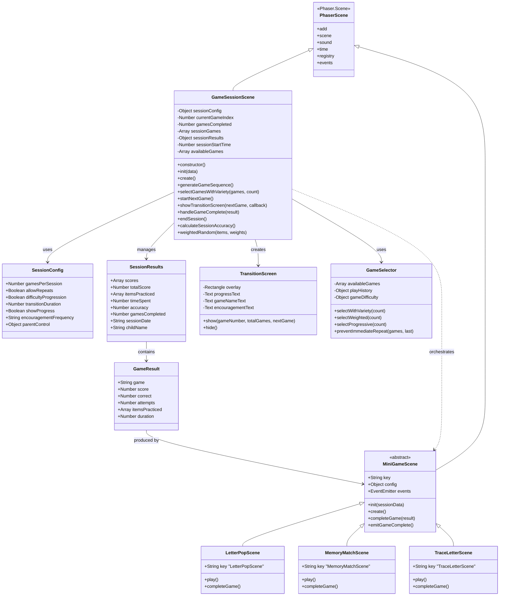

## Sequence Diagram: Session Flow

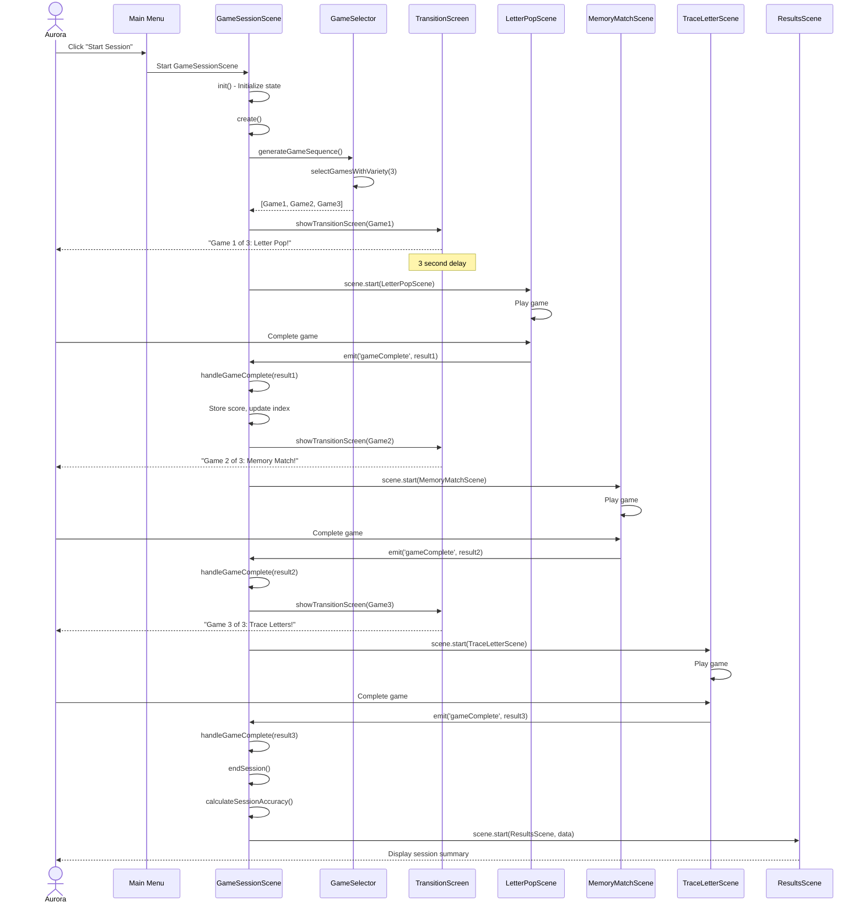

## State Diagram: Session States

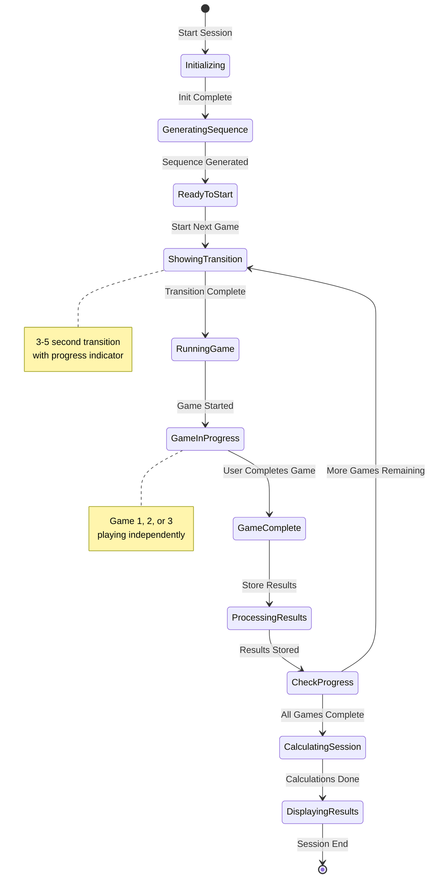

## Activity Diagram: Game Selection Algorithm

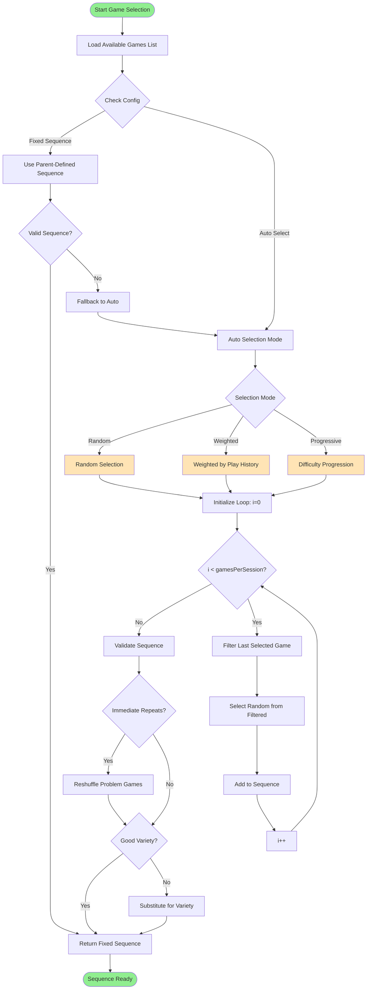

## Component Diagram

```mermaid
graph TB
    Session[GameSessionScene]

    subgraph Core Components
        Config[Session Config]
        State[Session State Manager]
        Results[Results Aggregator]
    end

    subgraph Selection System
        Selector[Game Selector]
        Randomizer[Random Engine]
        History[Play History Tracker]
        Difficulty[Difficulty Manager]
    end

    subgraph Transition System
        Transition[Transition Screen]
        Progress[Progress Indicator]
        Encourage[Encouragement System]
    end

    subgraph Mini-Games
        Game1[LetterPopScene]
        Game2[MemoryMatchScene]
        Game3[TraceLetterScene]
        Game4[SightWordScene]
        Game5[PhonicsScene]
    end

    subgraph External Systems
        Audio[Audio Manager]
        Registry[Game Registry]
        SceneMgr[Scene Manager]
    end

    Session --> Config
    Session --> State
    Session --> Results

    Session --> Selector
    Selector --> Randomizer
    Selector --> History
    Selector --> Difficulty

    Session --> Transition
    Transition --> Progress
    Transition --> Encourage

    Session -.->|Launches| Game1
    Session -.->|Launches| Game2
    Session -.->|Launches| Game3
    Session -.->|Launches| Game4
    Session -.->|Launches| Game5

    Session --> Audio
    Session --> Registry
    Session --> SceneMgr

    Game1 -.->|Results| Results
    Game2 -.->|Results| Results
    Game3 -.->|Results| Results
    Game4 -.->|Results| Results
    Game5 -.->|Results| Results

    style Session fill:#FFB6C1
    style Selector fill:#87CEEB
    style Transition fill:#DDA0DD
```

## Data Flow Diagram

```mermaid
flowchart LR
    Start[Session Start] --> Init[Initialize State]
    Init --> LoadGames[Load Available Games]
    LoadGames --> SelectSeq[Select Game Sequence]

    SelectSeq --> Queue[Game Queue]
    Queue --> Trans1[Transition 1]

    Trans1 --> Game1[Play Game 1]
    Game1 --> Result1[Game 1 Result]
    Result1 --> Agg1[Aggregate Results]

    Agg1 --> Trans2[Transition 2]
    Trans2 --> Game2[Play Game 2]
    Game2 --> Result2[Game 2 Result]
    Result2 --> Agg2[Aggregate Results]

    Agg2 --> Trans3[Transition 3]
    Trans3 --> Game3[Play Game 3]
    Game3 --> Result3[Game 3 Result]
    Result3 --> Agg3[Aggregate Results]

    Agg3 --> Calc[Calculate Totals]
    Calc --> Summary[Session Summary]
    Summary --> Display[Display Results]

    style Start fill:#90EE90
    style Result1 fill:#87CEEB
    style Result2 fill:#87CEEB
    style Result3 fill:#87CEEB
    style Summary fill:#FFD700
    style Display fill:#FF69B4
```

## Sequence Diagram: Transition Screen

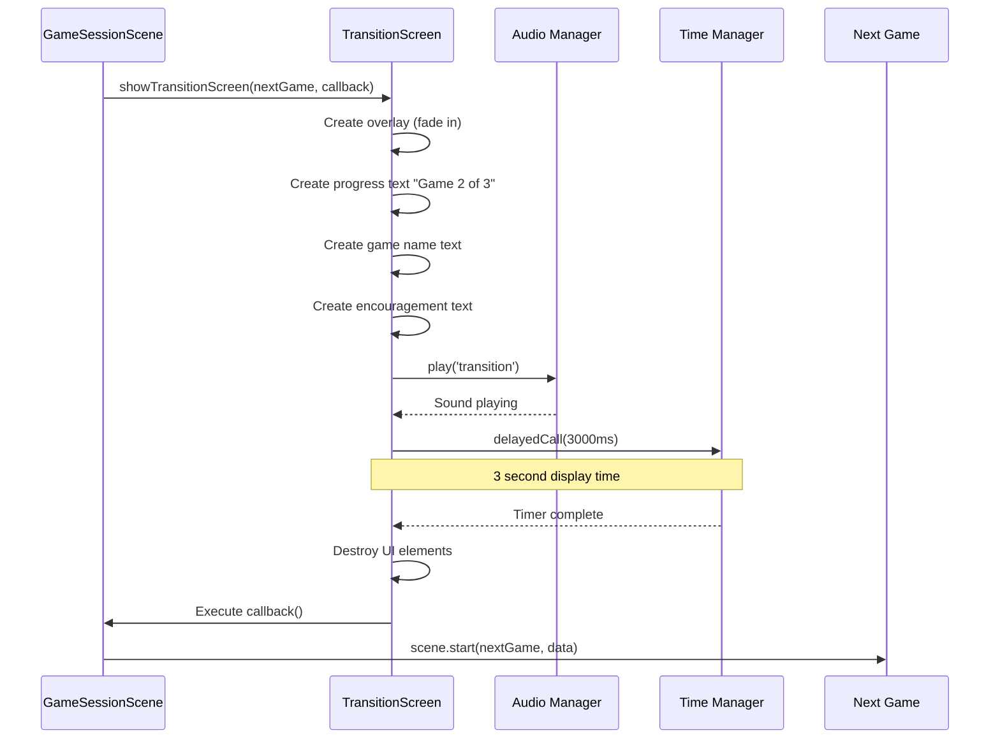

## State Diagram: Mini-Game Lifecycle in Session

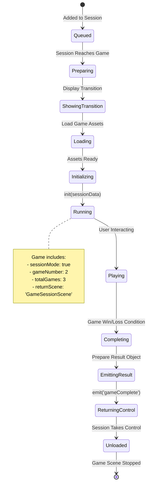

## Object Diagram: Session Runtime State

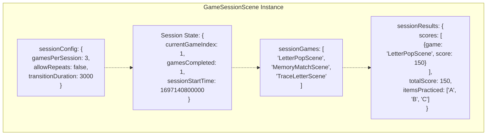

## Component Interaction Diagram

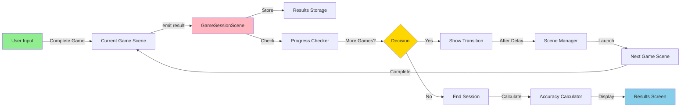

## Architecture Pattern: Session Orchestration

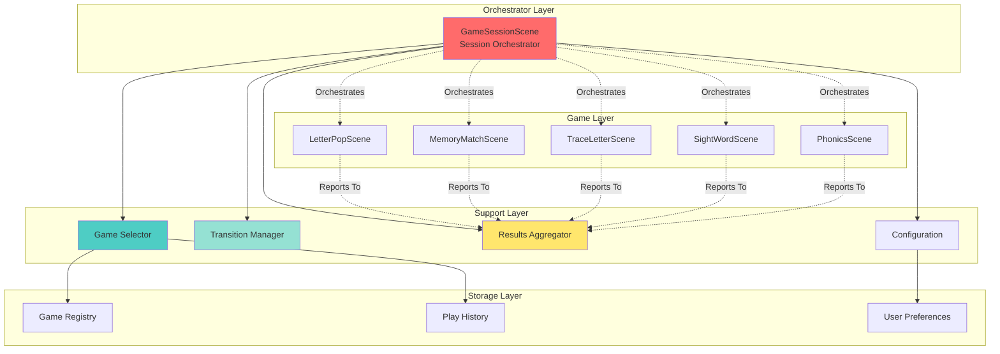

## Notes

### Architecture Decisions

**Orchestrator Pattern**
- GameSessionScene acts as conductor, not participant
- Mini-games remain independent, unaware of orchestration
- Session passes context data to games via init()
- Games emit completion events back to session
- Loose coupling allows games to work standalone or in session

**Game Selection Strategy**
- Multiple algorithms supported (random, weighted, progressive)
- No-repeat filter prevents immediate repetition
- Weighted selection favors less-played games over time
- Progressive mode increases difficulty through session
- Parent override allows custom sequences

**State Management**
- Session state isolated within GameSessionScene
- Results aggregate incrementally (no post-processing)
- Timing tracked from session start
- Clean separation between session state and game state

**Transition System**
- 3-second transitions maintain momentum without rushing
- Progress indicators provide orientation ("Game 2 of 3")
- Encouragement messages boost motivation
- Countdown prevents Aurora from feeling rushed
- Auto-advance (no button) keeps flow smooth

### Why This Design?

**Separation of Concerns**
- Games don't know about sessions
- Session doesn't know game internals
- Transition logic isolated in dedicated methods
- Results aggregation separate from game logic

**Flexibility**
- Easy to add new mini-games (just add to list)
- Selection algorithm can be swapped
- Transition duration configurable
- Session length adjustable (1-5 games)

**ADHD Optimization**
- Variety prevents boredom (3 different games)
- Progress indicators reduce anxiety ("2 of 3 done!")
- Encouragement maintains motivation
- Predictable structure (always 3 games) reduces cognitive load
- Smooth transitions maintain engagement

**Scalability**
- Supports any number of mini-games
- Works with 1-5+ games per session
- Results structure extensible
- Easy to add session types (themed, skill-focused, etc.)

### Data Flow Principles

1. **Top-Down Control**: Session controls game launching
2. **Bottom-Up Reporting**: Games report results up to session
3. **Centralized Aggregation**: Session owns aggregate data
4. **Encapsulated State**: Each game manages own state
5. **Event-Driven Completion**: Games emit events, don't call session directly

This architecture ensures smooth session flow while maintaining game independence and flexibility for future enhancements.
