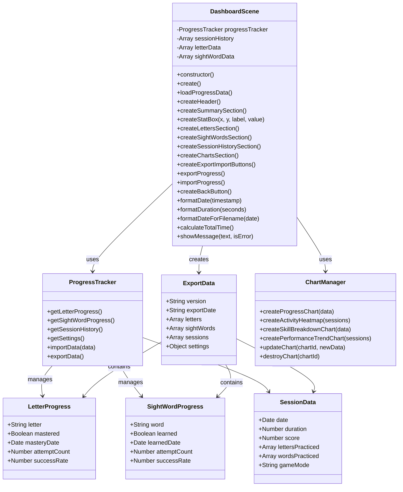
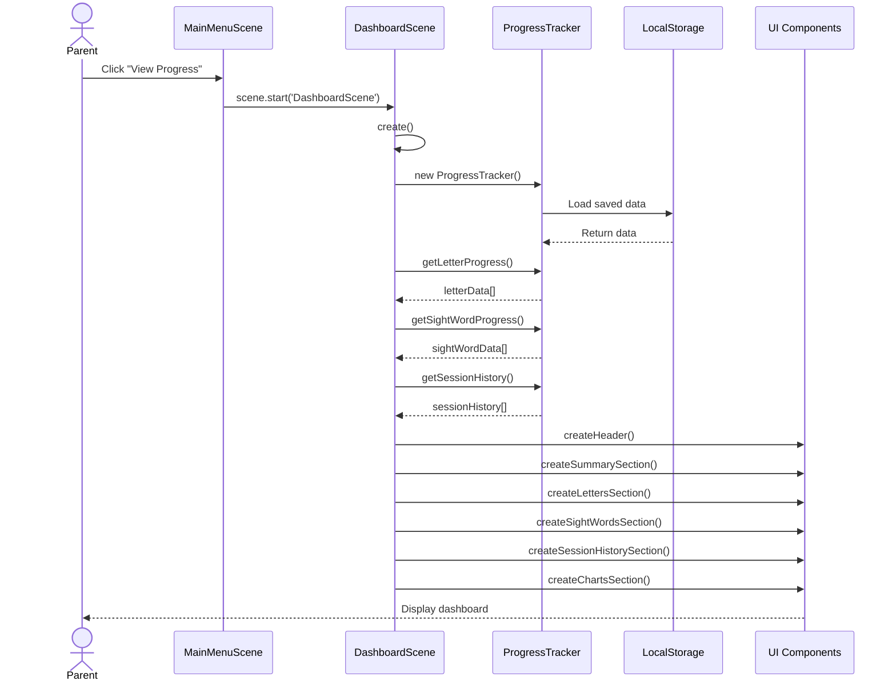
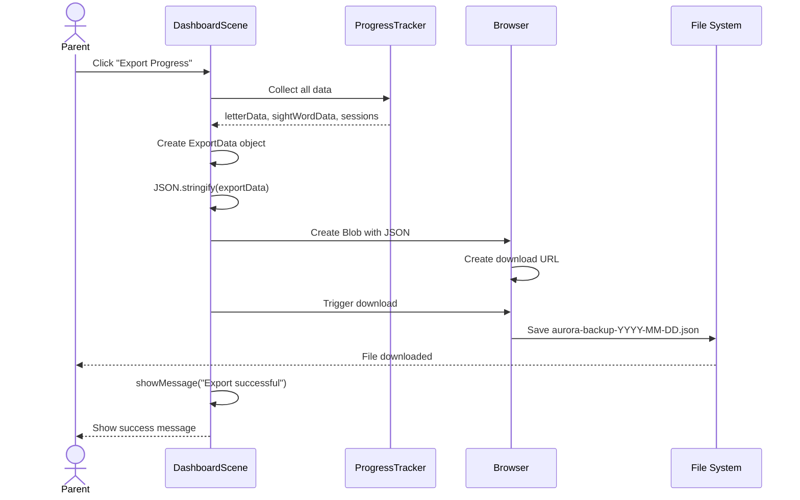
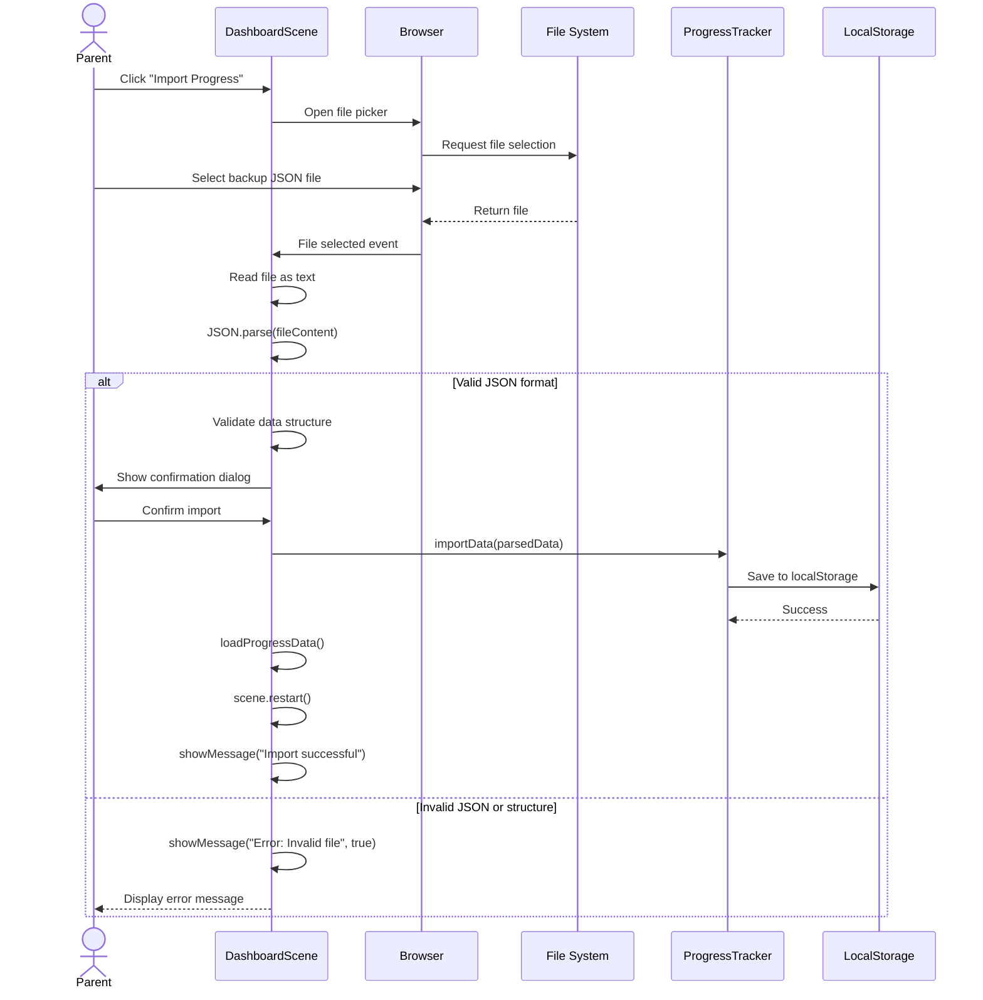
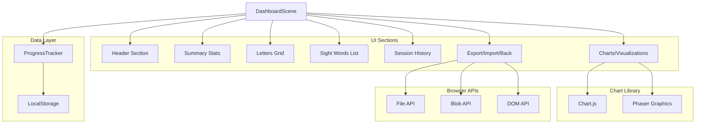
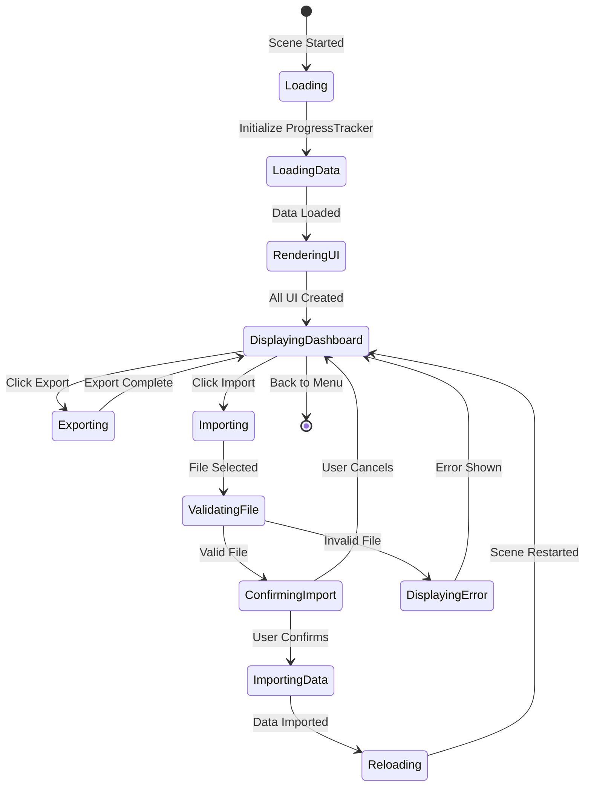
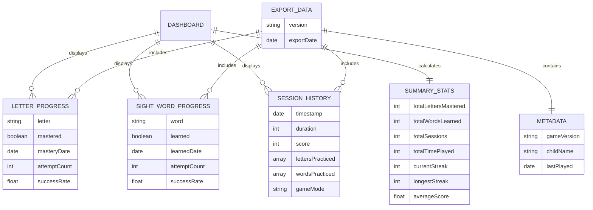
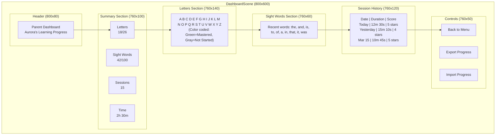
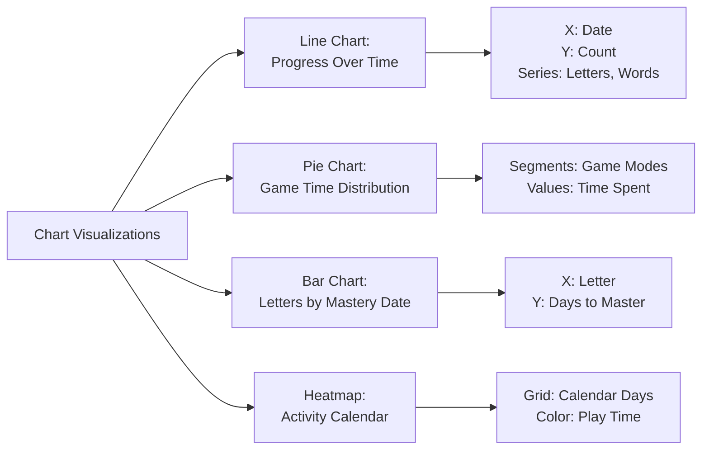

# Phase 43: Parent Dashboard - UML

## Class Diagram



## Sequence Diagram - Dashboard Load



## Sequence Diagram - Export Progress



## Sequence Diagram - Import Progress



## Component Diagram



## State Diagram - Dashboard Lifecycle



## Activity Diagram - View Dashboard

```mermaid
flowchart TD
    Start([Parent Opens Dashboard]) --> Init[Initialize DashboardScene]
    Init --> LoadTracker[Create ProgressTracker]
    LoadTracker --> LoadData[Load Progress Data]

    LoadData --> CheckData{Data Exists?}
    CheckData -->|Yes| RenderFull[Render Full Dashboard]
    CheckData -->|No| RenderEmpty[Render Empty State]

    RenderFull --> DisplaySummary[Display Summary Stats]
    DisplaySummary --> DisplayLetters[Display Letter Grid]
    DisplayLetters --> DisplayWords[Display Sight Words]
    DisplayWords --> DisplayHistory[Display Session History]
    DisplayHistory --> DisplayCharts[Render Charts]
    DisplayCharts --> DisplayControls[Add Export/Import Buttons]

    RenderEmpty --> ShowMessage[Show "No Progress Yet"]
    ShowMessage --> DisplayControls

    DisplayControls --> WaitInput{Wait for User Action}

    WaitInput -->|Export| ExportFlow[Run Export Process]
    WaitInput -->|Import| ImportFlow[Run Import Process]
    WaitInput -->|Back| ReturnMenu[Return to Main Menu]
    WaitInput -->|Wait| WaitInput

    ExportFlow --> WaitInput
    ImportFlow --> ReloadData[Reload Dashboard Data]
    ReloadData --> WaitInput

    ReturnMenu --> End([Exit Dashboard])
```

## Data Model Diagram



## UI Layout Diagram



## Chart Types Diagram



## Notes

### Architecture Decisions

**Data Source**
- All data comes from ProgressTracker singleton
- ProgressTracker abstracts LocalStorage implementation
- Allows future migration to other storage (IndexedDB, server sync)

**Chart Rendering Options**
1. **Chart.js (Recommended)**:
   - Professional, feature-rich charting library
   - Easy to integrate with canvas overlay
   - Large file size (~200KB) but worth it for MVP

2. **Phaser Graphics**:
   - Lighter weight, no external dependency
   - More work to implement custom charts
   - Better for simple visualizations

**Export/Import Format**
- JSON for human readability and debugging
- Include version number for future schema migrations
- Metadata helps identify backup source and date

**UI Layout**
- Fixed 800x600 for MVP (matches game resolution)
- Sections stack vertically with clear visual separation
- Scrolling can be added post-MVP if needed

### Performance Considerations

**Large Data Sets**
- Limit session history display to recent 10-20 entries
- Use "Load More" button for older sessions
- Consider pagination if history exceeds 100 sessions

**Chart Rendering**
- Initialize charts only when visible
- Cache chart instances to avoid recreating
- Destroy charts when leaving scene to free memory

**File Operations**
- Validate JSON structure before processing
- Limit import file size (e.g., max 5MB)
- Show loading indicator for large imports

### Security Considerations

**Import Validation**
- Check JSON structure matches expected schema
- Sanitize any user-generated content (child names, notes)
- Prevent code injection through malformed JSON

**Data Privacy**
- No automatic cloud sync (parent controlled only)
- Export files stored locally, not transmitted
- Consider encrypting sensitive data in future versions

This dashboard provides parents with comprehensive visibility into their child's learning progress while maintaining simplicity and performance.
