# Phase 44: Deployment Preparation - UML

## Class Diagram

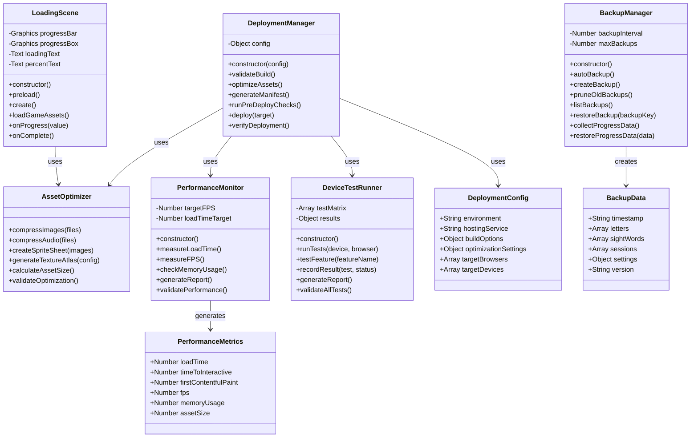

## Sequence Diagram - Game Load with Optimization

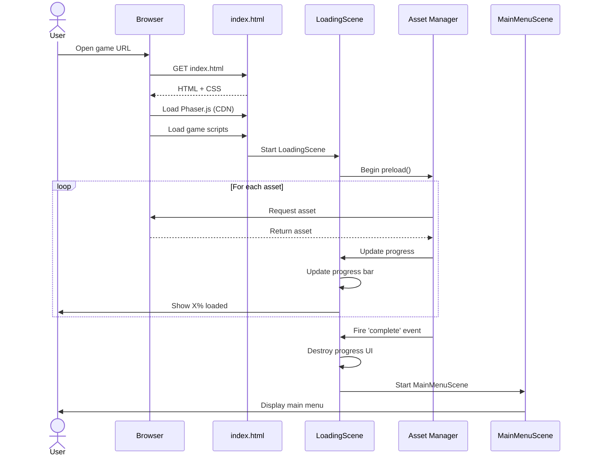

## Sequence Diagram - Asset Optimization Process

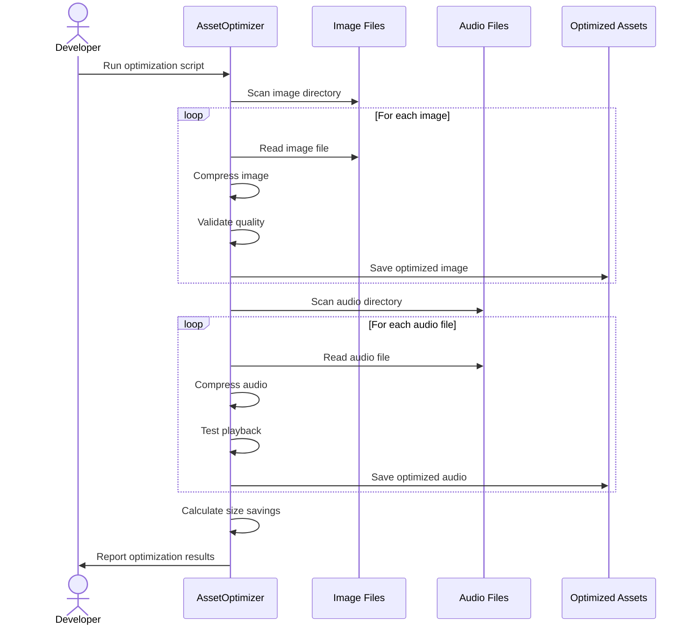

## Sequence Diagram - Backup and Restore

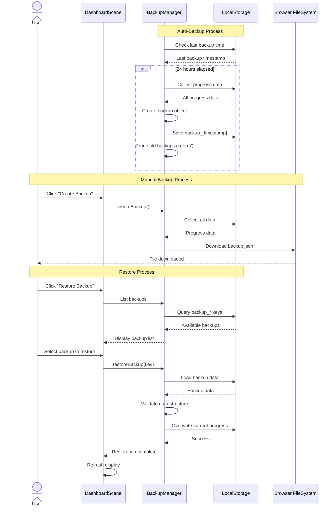

## Sequence Diagram - Deployment Process

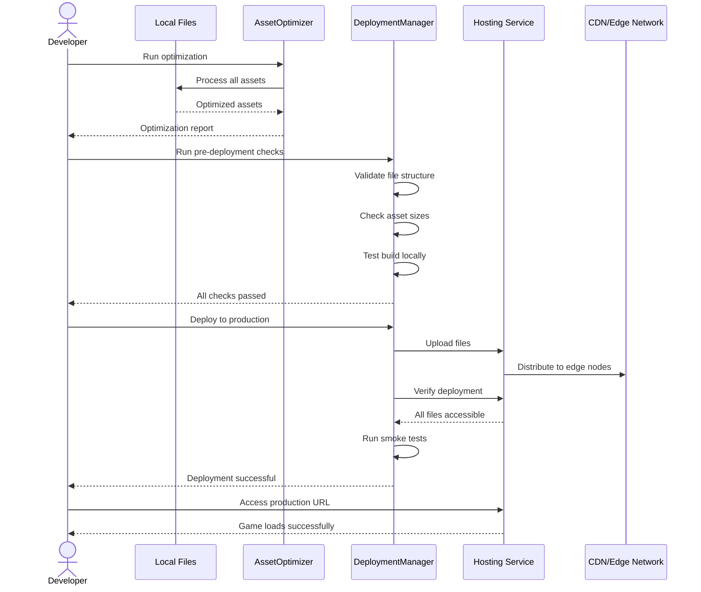

## Activity Diagram - Pre-Deployment Workflow

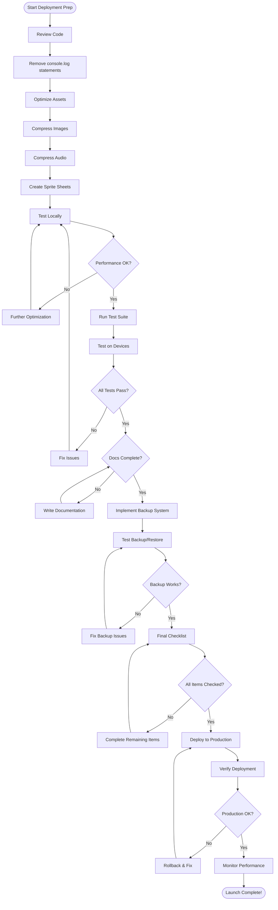

## Component Diagram - Deployment Architecture

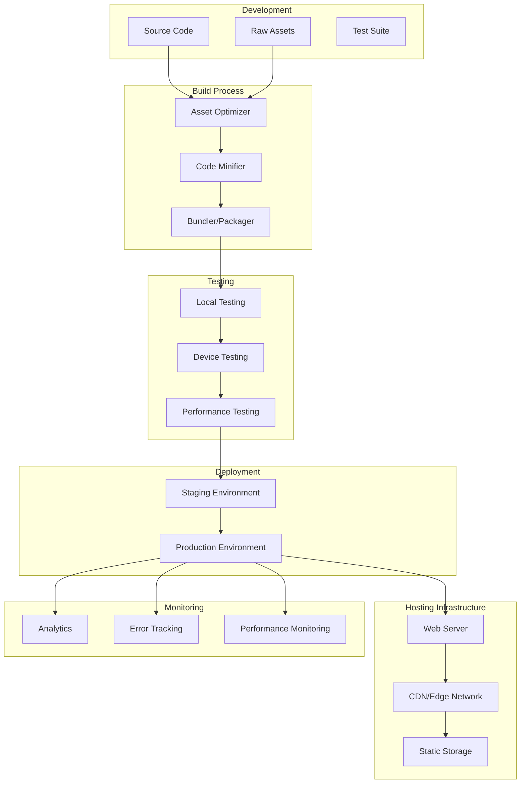

## State Diagram - Deployment Status

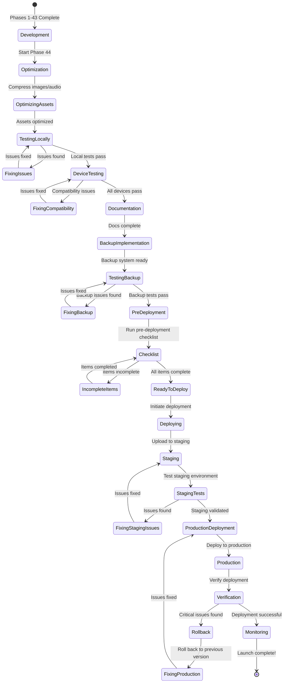

## Data Flow Diagram - Asset Loading

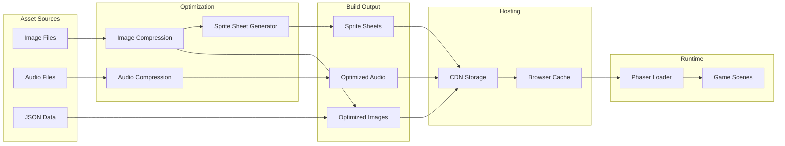

## Device Testing Matrix Diagram

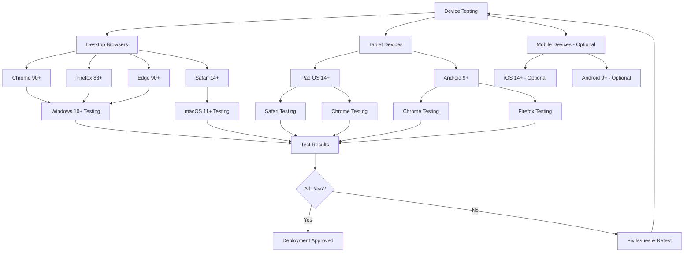

## Performance Monitoring Diagram

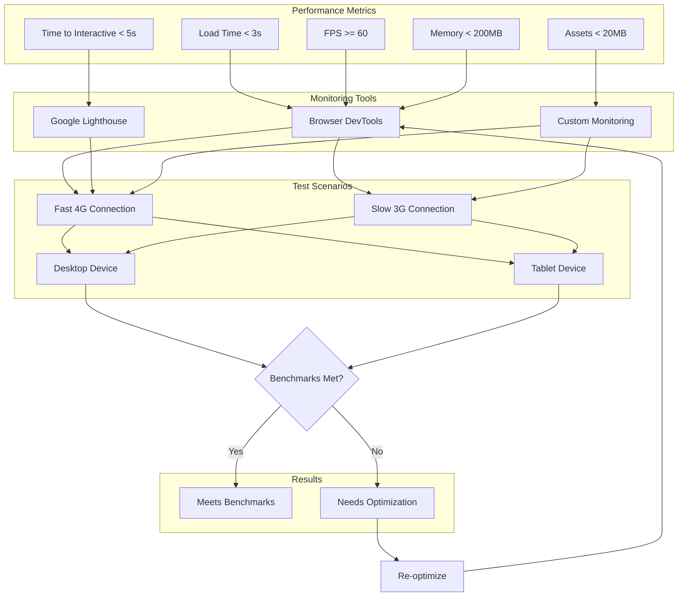

## Backup System Architecture

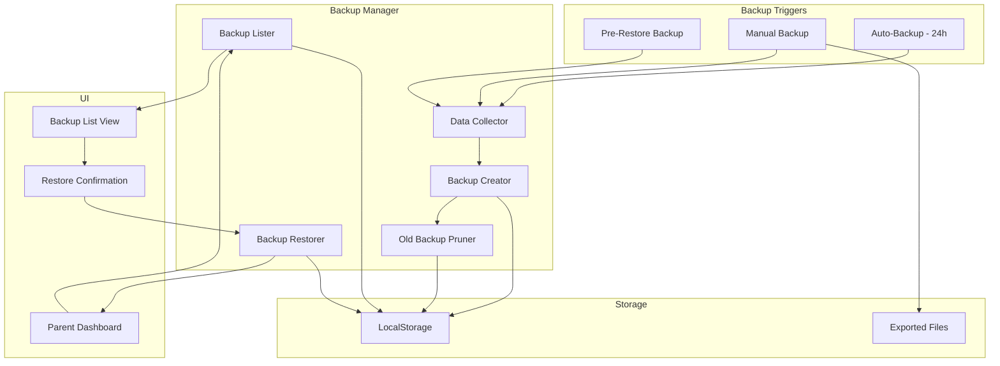

## Notes

### Architecture Decisions

**Loading Strategy**
- Implement LoadingScene as first scene
- Show progress bar for user feedback
- Load critical menu assets first, game assets lazily
- Cache assets in browser for subsequent visits

**Asset Optimization Approach**
- Use lossless compression for images (maintains quality)
- Convert audio to MP3 format (broad compatibility)
- Create sprite sheets for small UI elements
- Target 70% size reduction from raw assets

**Backup Strategy**
- Auto-backup every 24 hours (not intrusive)
- Keep 7 most recent backups (balance storage vs. history)
- Manual backups saved to files (user-controlled)
- Pre-restore automatic backup (safety net)

**Deployment Architecture**
- Static file hosting (simple, scalable, cheap)
- CDN for global distribution (fast loading worldwide)
- HTTPS required (security and modern browser features)
- No backend required for MVP (reduces complexity)

### Performance Considerations

**Critical Metrics**
1. **Load Time < 3s**: First impression matters
2. **Time to Interactive < 5s**: User can start playing quickly
3. **60 FPS**: Smooth gameplay experience
4. **< 200MB Memory**: Works on modest devices

**Optimization Priorities**
1. Compress assets (biggest impact)
2. Implement loading screen (perceived performance)
3. Lazy load non-critical assets
4. Minify code (smaller but measurable impact)

**Testing Priorities**
1. Desktop browsers (primary target)
2. iPad/tablets (secondary target)
3. Mobile phones (optional for MVP)

### Deployment Considerations

**Hosting Options Comparison**

| Service | Pros | Cons | Best For |
|---------|------|------|----------|
| GitHub Pages | Free, easy, version control | Public repos only | Open source projects |
| Netlify | Free tier, auto-deploy, CDN | Limited build minutes | Quick deployments |
| Vercel | Fast, serverless functions | Learning curve | Advanced features |
| AWS S3 | Scalable, reliable | More complex setup | Production scale |

**Recommended for MVP**: GitHub Pages or Netlify
- Both offer free tiers
- Simple deployment process
- Good performance
- No credit card required

### Security and Privacy

**Data Storage**
- All data stored locally (LocalStorage)
- No server transmission (privacy-friendly)
- No user accounts required (simplicity)
- No cookies or tracking (compliance-friendly)

**Backup Files**
- JSON format (human-readable)
- No encryption in MVP (add in future for sensitive data)
- User-controlled export/import (transparency)

### Scalability Considerations

**Current Limitations**
- LocalStorage typically 5-10MB limit
- Single-device progress (no cloud sync)
- No multi-user support

**Future Enhancements**
- Cloud sync with user accounts
- Multi-device support
- Server-side backup storage
- Analytics and usage tracking (with consent)

This deployment architecture ensures Aurora's Letter Adventure launches successfully while maintaining performance, reliability, and user privacy.
