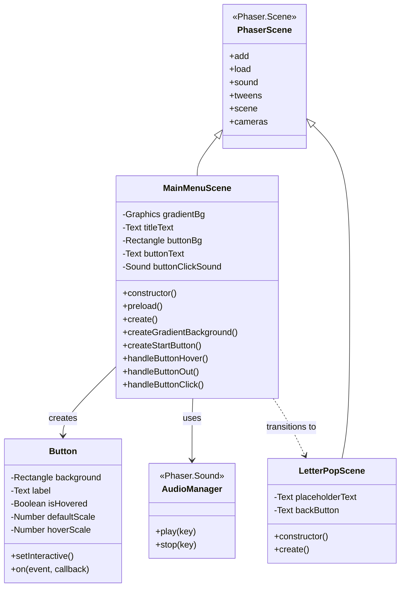
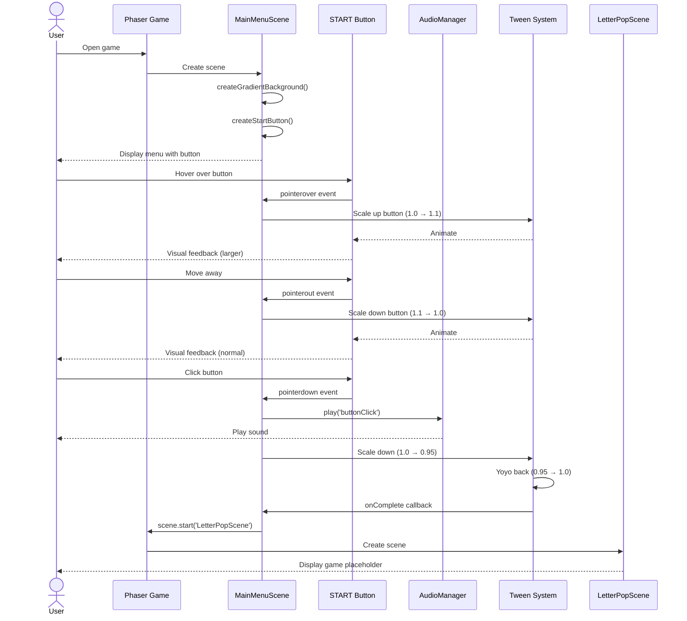
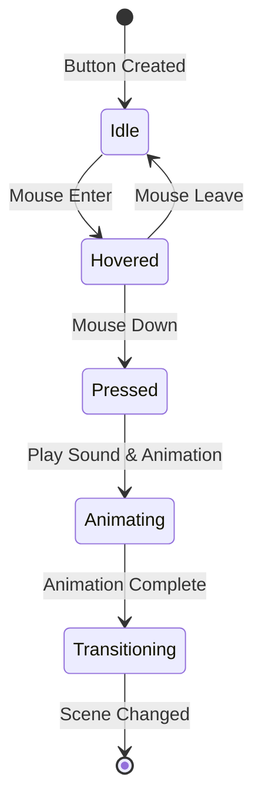
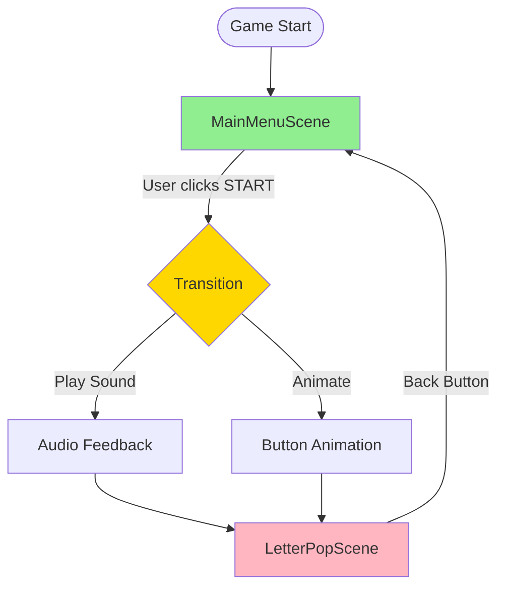
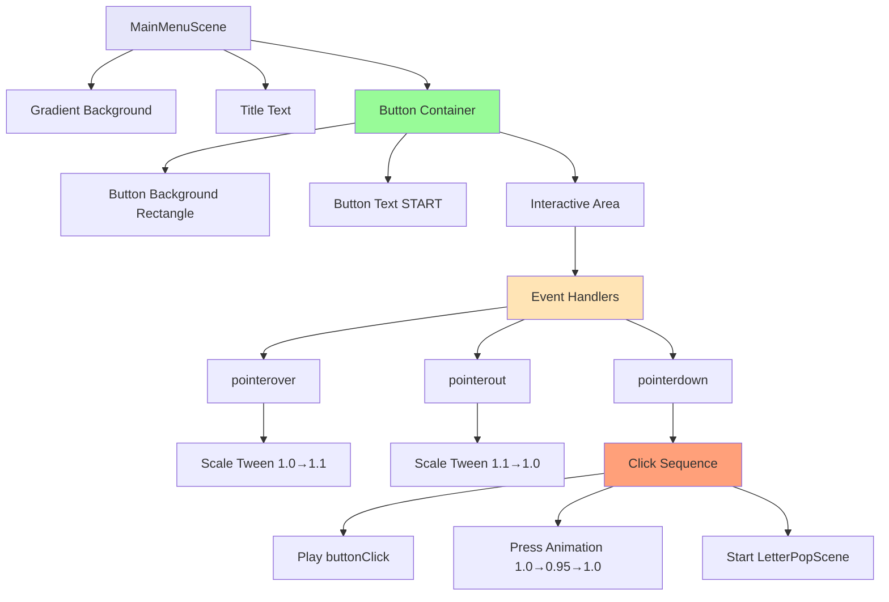
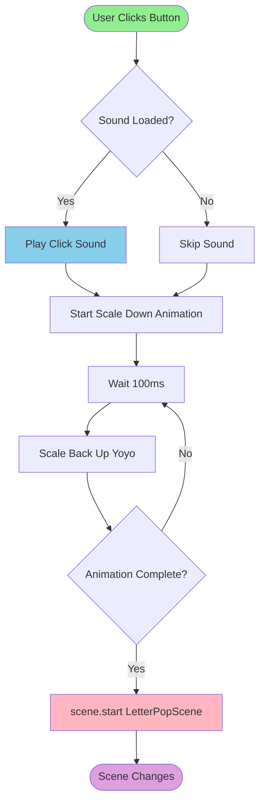
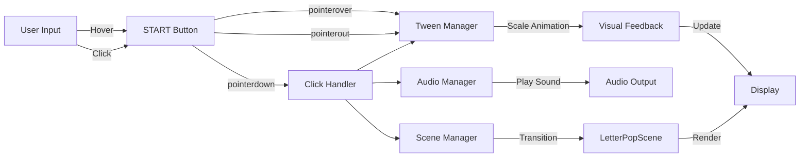
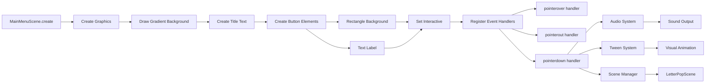
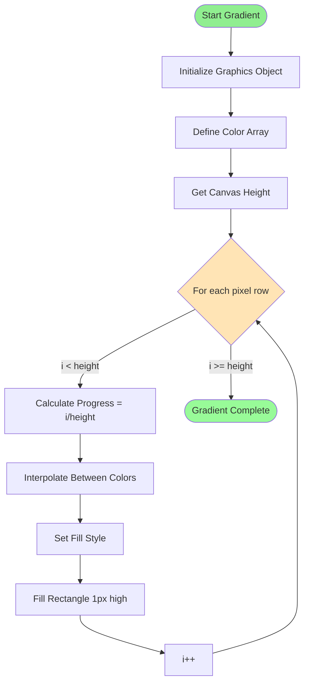
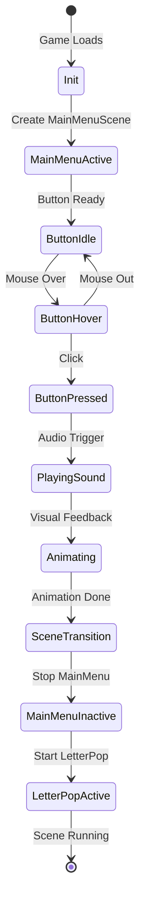

# Phase 5: Main Menu UI - UML

## Class Diagram

## Sequence Diagram: User Interaction Flow

## State Diagram: Button States

## Scene Transition Diagram

## UI Component Hierarchy

## Activity Diagram: Button Click Flow

## Component Interaction Diagram

## Data Flow Diagram

## Gradient Creation Algorithm

## Scene Management State

## Notes

### Architecture Decisions

**Scene Structure**
- MainMenuScene extends Phaser.Scene directly
- Keeps all UI creation in create() method
- Helper methods for organization (createGradientBackground, createStartButton)
- Single responsibility: display menu and handle START interaction

**Button Implementation**
- Composite of Rectangle (background) and Text (label)
- Both elements animated together for unified effect
- Interactive area set on Rectangle, not Text (larger hit area)
- Event handlers directly on button object (no separate Button class needed for Phase 5)

**Animation Strategy**
- Phaser tweens for all animations (smooth, performant)
- Hover: 200ms scale to 1.1
- Press: 100ms scale to 0.95, yoyo back
- onComplete callback ensures scene transition happens after animation

**Audio Integration**
- Sound loaded in preload()
- Played on button press (not hover - less overwhelming)
- Graceful degradation if sound not available

### Why This Design?

**Simplicity**
- No custom Button class yet (overkill for one button)
- Direct event handlers (clear cause and effect)
- Inline animations (easy to tweak)

**Performance**
- Gradient drawn once in create()
- Tweens managed by Phaser (optimized)
- Minimal objects in scene graph

**Extensibility**
- Easy to add more buttons later
- Can extract Button class in future phases
- Scene transition pattern reusable

**ADHD-Friendly**
- Immediate visual feedback (hover)
- Audio confirmation (click)
- Smooth animations (not jarring)
- Clear visual hierarchy (button stands out)

### Component Relationships

1. **MainMenuScene owns all components**
   - Creates gradient background
   - Creates title text
   - Creates button elements
   - Manages event handlers

2. **Button is composite of two game objects**
   - Rectangle provides visual background and interactive area
   - Text provides label
   - Both animated together via tween targets array

3. **Event handlers coordinate systems**
   - Hover handlers → Tween system (visual)
   - Click handler → Audio system (sound)
   - Click handler → Tween system (animation)
   - Click handler → Scene system (transition)

4. **Scene transition is one-way**
   - MainMenu → LetterPop
   - LetterPop has back button for testing
   - Later phases will handle proper game flow

This architecture is intentionally simple for Phase 5, but structured to allow easy refactoring as the game grows in complexity.
