# Phase 6: Letter Pop - Scene Setup - UML

## Class Diagram

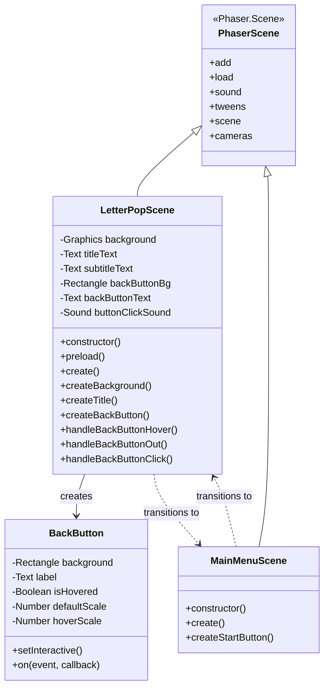

## Sequence Diagram: Scene Flow

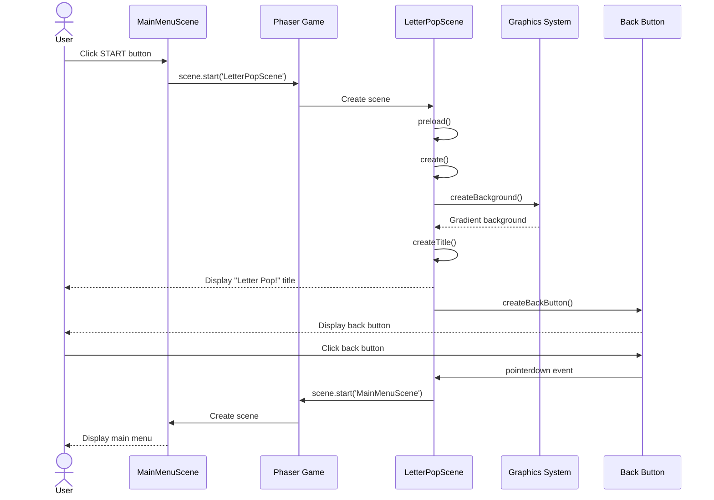

## Sequence Diagram: Back Button Interaction

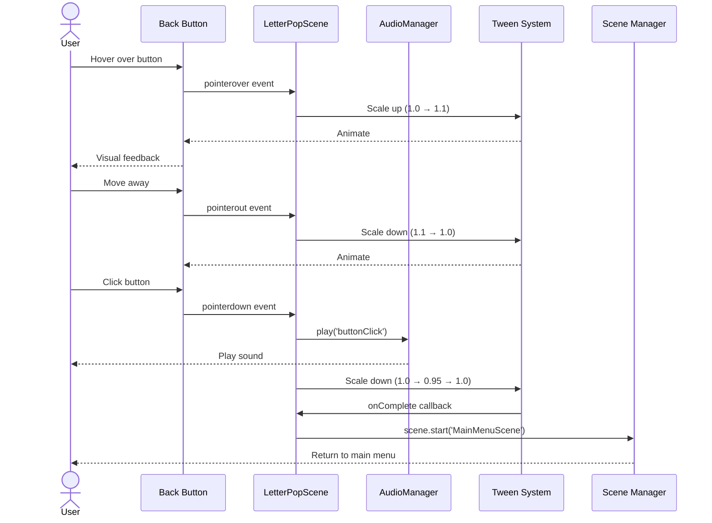

## State Diagram: Scene States

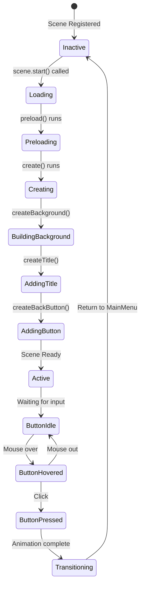

## Scene Transition Diagram

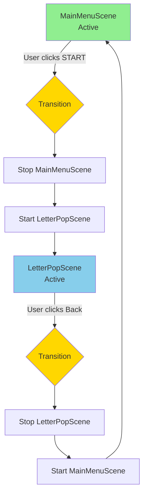

## UI Component Hierarchy

```mermaid
graph TB
    LetterPop[LetterPopScene]
    LetterPop --> BG[Background Layer]
    LetterPop --> UI[UI Layer]

    BG --> Gradient[Gradient Graphics]
    Gradient --> Color1[Sky Blue #87CEEB]
    Gradient --> Color2[Turquoise #00CED1]

    UI --> Title[Title Text]
    UI --> Subtitle[Subtitle Text]
    UI --> ButtonGroup[Back Button Group]

    Title --> TitleStyle[Font: 64px Bold<br/>Color: White<br/>Stroke: Blue]
    Subtitle --> SubStyle[Font: 24px<br/>Color: White<br/>Stroke: Blue]

    ButtonGroup --> BtnBG[Button Background<br/>Rectangle]
    ButtonGroup --> BtnText[Button Text<br/>"< Menu"]
    ButtonGroup --> BtnInteractive[Interactive Area]

    BtnInteractive --> Events[Event Handlers]
    Events --> Hover[pointerover/out]
    Events --> Click[pointerdown]

    Hover --> ScaleTween[Scale Animation]
    Click --> ClickSequence[Click Sequence]

    ClickSequence --> PlaySound[Play Sound]
    ClickSequence --> PressAnim[Press Animation]
    ClickSequence --> SceneChange[Start MainMenuScene]

    style LetterPop fill:#E6E6FA
    style BG fill:#87CEEB
    style UI fill:#98FB98
    style ButtonGroup fill:#FFB6C1
```

## Activity Diagram: Scene Creation

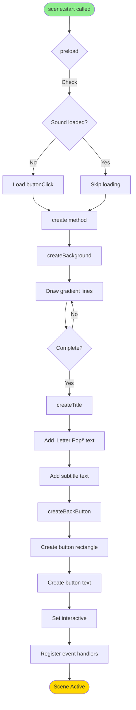

## Component Interaction Diagram

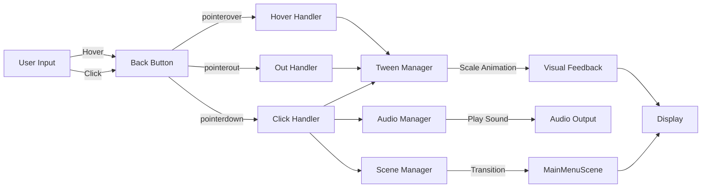

## Data Flow Diagram

```mermaid
flowchart LR
    A[LetterPopScene.create] --> B[Initialize Graphics]
    B --> C[Define Color Array]
    C --> D[Get Canvas Dimensions]

    D --> E[Loop Through Pixels]
    E --> F[Calculate Color Interpolation]
    F --> G[Draw Gradient Line]
    G --> H{More Lines?}
    H -->|Yes| E
    H -->|No| I[Background Complete]

    I --> J[Create Title Text]
    J --> K[Apply Text Styling]
    K --> L[Position Title]

    L --> M[Create Button Rectangle]
    M --> N[Create Button Text]
    N --> O[Set Interactive Zone]
    O --> P[Register Event Listeners]

    P --> Q[Scene Ready for Input]
```

## Layout Diagram

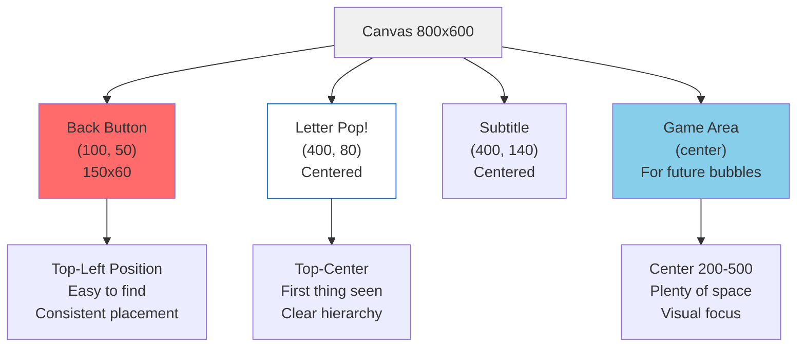

## Background Creation Algorithm

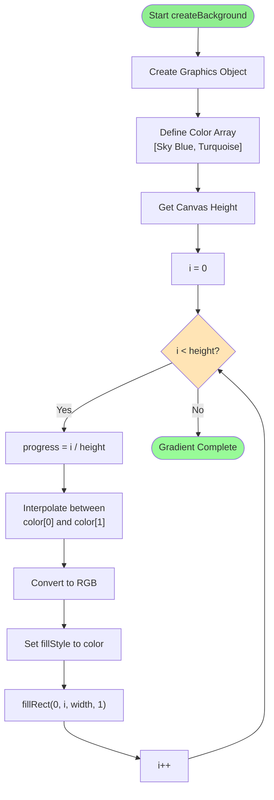

## Scene Lifecycle State Machine

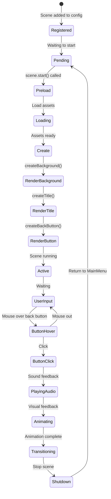

## Notes

### Architecture Decisions

**Scene Structure**
- LetterPopScene is self-contained and independent
- Extends Phaser.Scene for full framework access
- Helper methods organize code clearly
- Similar structure to MainMenuScene for consistency

**Background Strategy**
- Gradient drawn once during create()
- Uses Graphics object for pixel-by-pixel control
- Colors chosen for contrast with future white bubbles
- Gradient gives depth and visual interest without distracting

**Button Implementation**
- Reuses pattern from MainMenuScene
- Composite of Rectangle + Text
- Could be extracted to reusable Button class in future
- For now, simple and direct implementation

**Layout Design**
- Back button in top-left (web convention, easy to find)
- Title at top-center (clear visual hierarchy)
- Large empty center space for future gameplay
- Consistent with ADHD-friendly design principles

### Why This Design?

**Simplicity**
- Minimal components in this phase
- Focus on visual setup, not game logic
- Easy to understand and extend

**Performance**
- Gradient drawn once, not animated
- Few objects in scene graph
- Lightweight and fast to render

**Consistency**
- Button behavior matches MainMenuScene
- Color scheme distinct but harmonious
- Navigation pattern is predictable

**Extensibility**
- Center area ready for bubbles in Phase 7
- Scene structure supports adding game objects
- Button pattern can be reused for future UI

### Component Relationships

1. **LetterPopScene owns all UI components**
   - Creates and manages background
   - Creates and positions title
   - Creates and wires up back button

2. **Background is static**
   - Created once in create()
   - No updates needed
   - Provides colorful backdrop

3. **Back button mirrors START button**
   - Same interaction pattern
   - Same animation behavior
   - Consistent user experience

4. **Scene transitions are bidirectional**
   - MainMenu → LetterPop → MainMenu
   - Clean scene start/stop
   - No state leakage between scenes

### Future Considerations

**Phase 7 will add:**
- Bubble game object class
- Single static bubble display
- Letter rendering in bubble
- Foundation for bubble gameplay

**This phase provides:**
- Visual environment for bubbles
- Navigation framework
- Consistent UI patterns
- Clean scene structure to build upon

The architecture is intentionally simple but well-structured to support incremental complexity in future phases.
