# Phase 7: Letter Pop - Single Static Bubble - UML

## Class Diagram

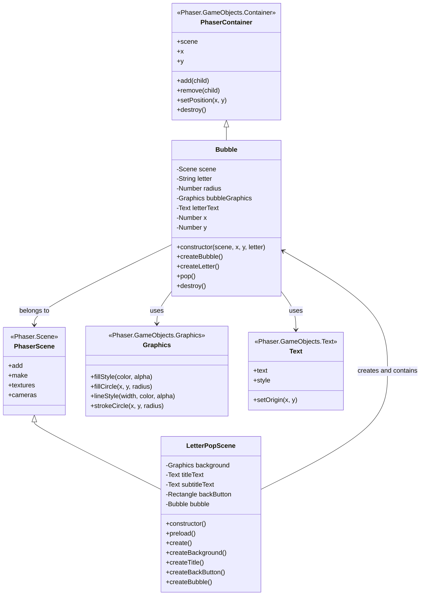

## Sequence Diagram: Bubble Creation

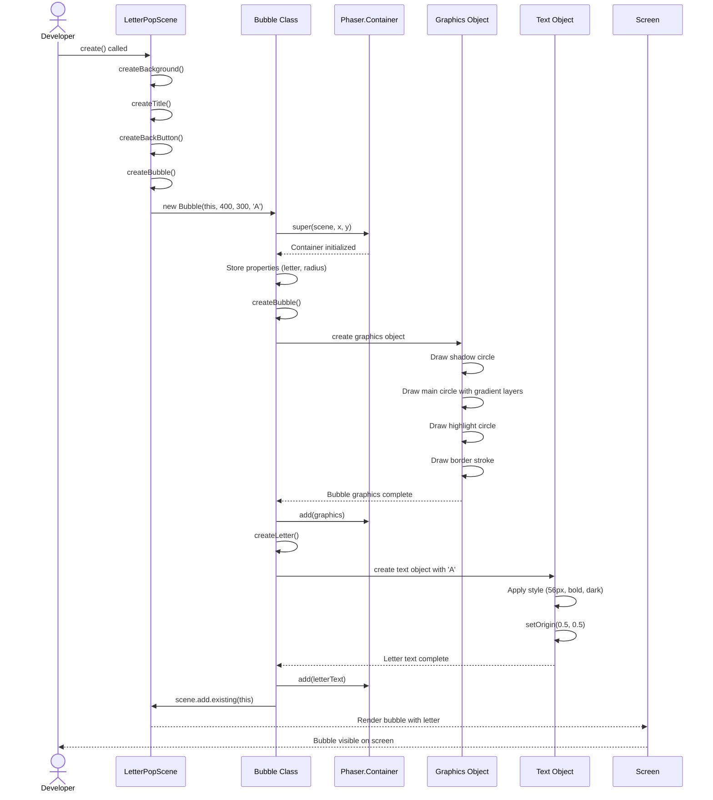

## Sequence Diagram: Gradient Rendering

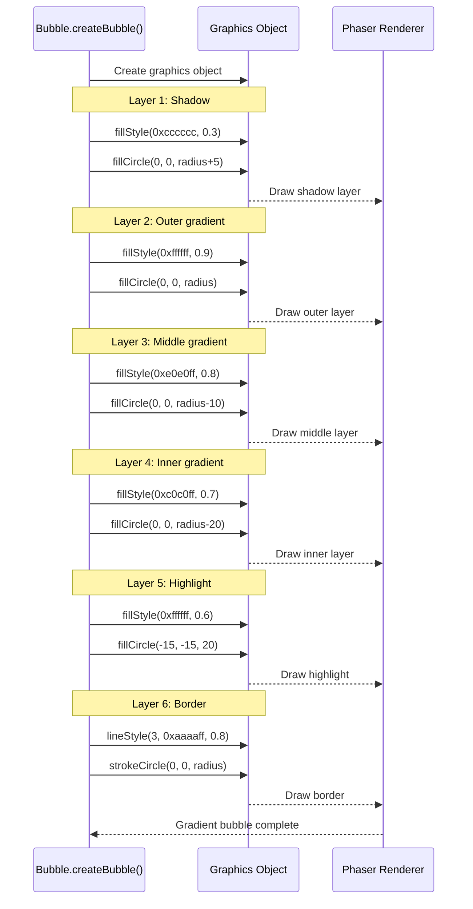

## State Diagram: Bubble Lifecycle

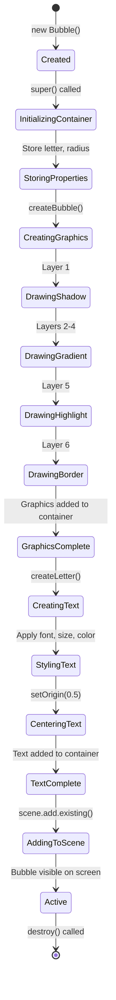

## Component Hierarchy

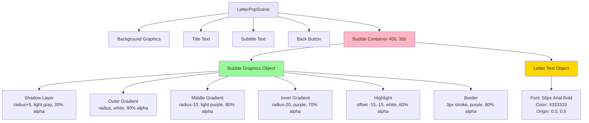

## Object Composition Diagram

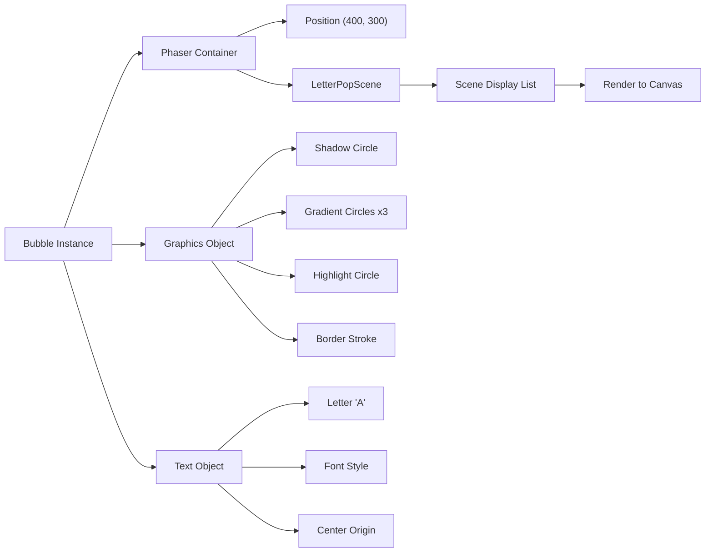

## Activity Diagram: Bubble Creation Flow

```mermaid
flowchart TD
    Start([createBubble called]) --> NewInstance[new Bubble this, 400, 300, A]
    NewInstance --> Constructor[Bubble constructor]

    Constructor --> StoreScene[Store scene reference]
    StoreScene --> StoreLetter[Store letter = A]
    StoreLetter --> StoreRadius[Store radius = 70]
    StoreRadius --> CallSuper[Call super scene, x, y]
    CallSuper --> ContainerInit[Container initialized]

    ContainerInit --> CreateGraphics{createBubble}
    CreateGraphics --> InitGraphics[graphics = scene.add.graphics]

    InitGraphics --> DrawShadow[Draw shadow circle]
    DrawShadow --> DrawOuter[Draw outer gradient circle]
    DrawOuter --> DrawMiddle[Draw middle gradient circle]
    DrawMiddle --> DrawInner[Draw inner gradient circle]
    DrawInner --> DrawHighlight[Draw highlight circle]
    DrawHighlight --> DrawBorder[Draw border stroke]
    DrawBorder --> AddGraphics[add graphics to container]

    AddGraphics --> CreateLetter{createLetter}
    CreateLetter --> InitText[letterText = scene.add.text]
    InitText --> SetContent[Set text content to A]
    SetContent --> SetStyle[Apply font style]
    SetStyle --> SetOrigin[setOrigin 0.5, 0.5]
    SetOrigin --> AddText[add text to container]

    AddText --> AddToScene[scene.add.existing this]
    AddToScene --> Complete([Bubble visible])

    style Start fill:#90EE90
    style CreateGraphics fill:#87CEEB
    style CreateLetter fill:#FFD700
    style Complete fill:#98FB98
```

## Data Flow Diagram

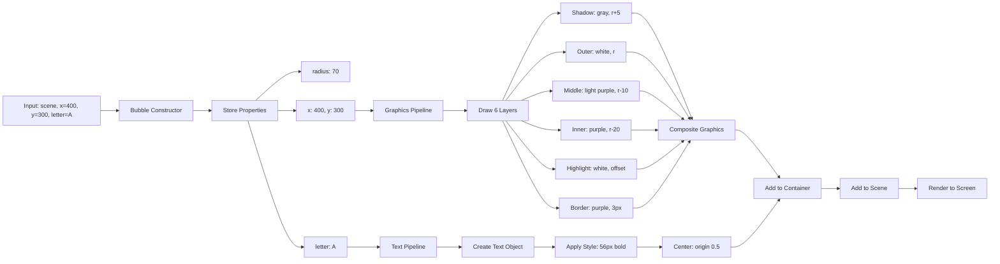

## Scene Layout Diagram

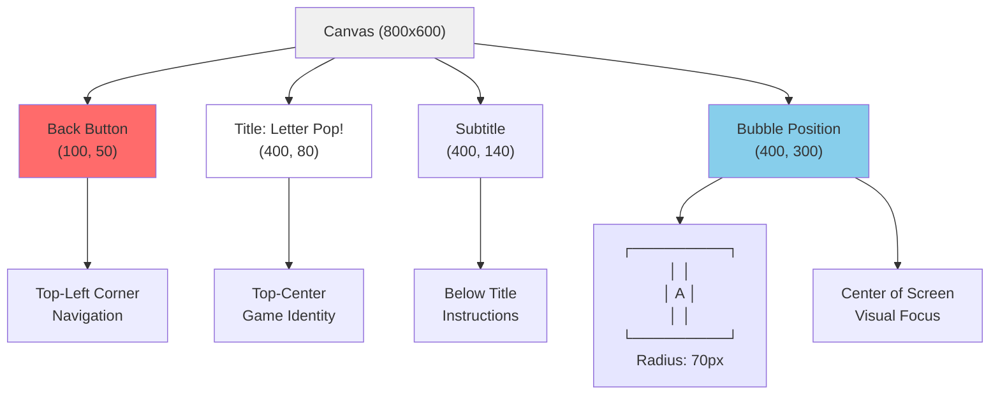

## Gradient Rendering Algorithm

```mermaid
flowchart TD
    Start([Start Gradient]) --> CreateGraphics[Create Graphics Object]
    CreateGraphics --> DefineRadius[radius = 70]

    DefineRadius --> Layer1{Draw Layer 1}
    Layer1 --> Shadow["fillStyle(gray, 0.3)<br/>fillCircle(0, 0, 75)"]
    Shadow --> Layer2{Draw Layer 2}

    Layer2 --> Outer["fillStyle(white, 0.9)<br/>fillCircle(0, 0, 70)"]
    Outer --> Layer3{Draw Layer 3}

    Layer3 --> Middle["fillStyle(light purple, 0.8)<br/>fillCircle(0, 0, 60)"]
    Middle --> Layer4{Draw Layer 4}

    Layer4 --> Inner["fillStyle(purple, 0.7)<br/>fillCircle(0, 0, 50)"]
    Inner --> Layer5{Draw Layer 5}

    Layer5 --> Highlight["fillStyle(white, 0.6)<br/>fillCircle(-15, -15, 20)"]
    Highlight --> Layer6{Draw Layer 6}

    Layer6 --> Border["lineStyle(3, purple, 0.8)<br/>strokeCircle(0, 0, 70)"]
    Border --> Complete([Gradient Complete])

    style Start fill:#90EE90
    style Layer1 fill:#FFE4B5
    style Layer2 fill:#FFE4B5
    style Layer3 fill:#FFE4B5
    style Layer4 fill:#FFE4B5
    style Layer5 fill:#FFE4B5
    style Layer6 fill:#FFE4B5
    style Complete fill:#98FB98
```

## Text Centering Mechanism

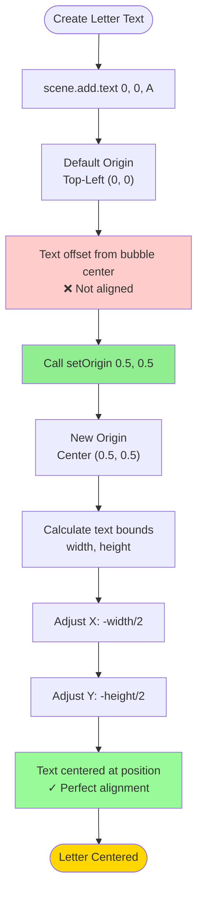

## Notes

### Architecture Decisions

**Bubble as Container**
- Extends Phaser.GameObjects.Container for composability
- Contains both graphics (bubble shape) and text (letter)
- Easy to move, scale, or animate as a single unit
- Can add more children in future (animations, effects)

**Graphics-Based Rendering**
- Uses Graphics object for maximum flexibility
- Gradient achieved by layering circles with decreasing alpha
- Could alternatively use canvas texture for smoother gradients
- Current approach is simpler and more maintainable

**Letter as Text Object**
- Standard Phaser text object
- Easy to change letter dynamically
- setOrigin(0.5) ensures perfect centering
- Could be replaced with bitmap font for performance if needed

**Gradient Technique**
- Multiple overlapping circles create gradient effect
- Each layer has slightly different color and alpha
- Simulates 3D spherical shading
- Highlight circle creates glossy appearance

### Why This Design?

**Container Pattern**
- Bubble is self-contained unit
- Can be instantiated multiple times easily
- All components move together
- Clean separation of concerns

**Gradient Layers**
- Simple to implement
- Good visual result
- Performant (drawn once, not animated)
- Easy to adjust colors/radius

**Static for Now**
- No animation in this phase (intentional)
- Establishes visual foundation
- Future phases will add:
  - Floating animation
  - Click interaction
  - Pop effects
  - Sound

**Reusability**
- Bubble class accepts any letter as parameter
- Can easily create bubbles for any letter A-Z
- Future phases will use this for multiple bubbles
- Same class can be used for different game modes

### Component Relationships

1. **Bubble owns its visual elements**
   - Graphics for bubble shape
   - Text for letter display
   - Both are children of Container

2. **LetterPopScene owns Bubble instance**
   - Scene creates bubble
   - Scene positions bubble
   - Scene can later add more bubbles

3. **Bubble is independent**
   - Doesn't depend on specific scene
   - Can be added to any scene
   - Self-contained creation logic

4. **Layering creates depth**
   - Multiple circles with alpha blending
   - Inner circles darker (depth perception)
   - Highlight creates 3D effect
   - Border provides definition

### Visual Hierarchy

**In the scene:**
1. Background (blue gradient)
2. Title text (top)
3. Bubble (center) ← Visual focus
4. Letter (in bubble) ← Learning target
5. Back button (top-left)

**In the bubble:**
1. Shadow (outermost, subtle)
2. Main gradient (bulk of bubble)
3. Highlight (top-left, glossy effect)
4. Border (defines edge)
5. Letter (centermost, highest contrast)

### Performance Considerations

**Efficient Rendering**
- Graphics drawn once in create()
- No per-frame updates (static)
- Lightweight objects (one container, one graphics, one text)
- Scales well to multiple bubbles

**Memory Usage**
- One graphics object per bubble (reasonable)
- No dynamic textures created
- Text object reuses font cache
- Clean destroy() for cleanup

### Future Extensions

**This foundation supports:**
- **Phase 8+**: Floating animation (tween bubble.y)
- **Phase 9+**: Click interaction (setInteractive on container)
- **Phase 10+**: Pop animation (scale down, fade out)
- **Phase 11+**: Multiple bubbles (array of Bubble instances)
- **Phase 12+**: Random letters (pass different letter parameter)
- **Phase 13+**: Difficulty levels (different speeds, sizes)

**The Bubble class is designed to be:**
- Simple (minimal complexity for Phase 7)
- Extensible (easy to add features)
- Reusable (works with any letter)
- Maintainable (clear, well-organized code)

This phase establishes the core game object that all future gameplay will build upon.
