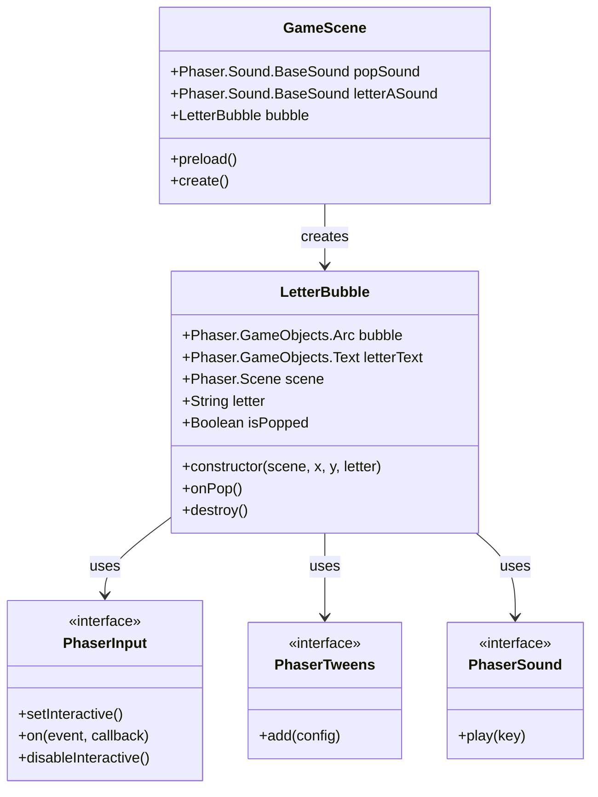
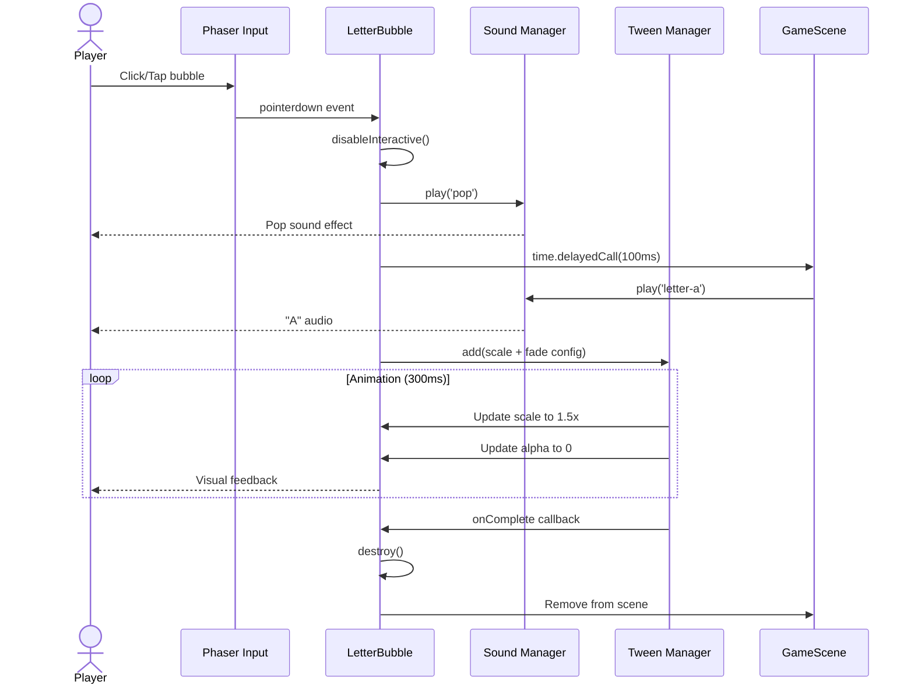
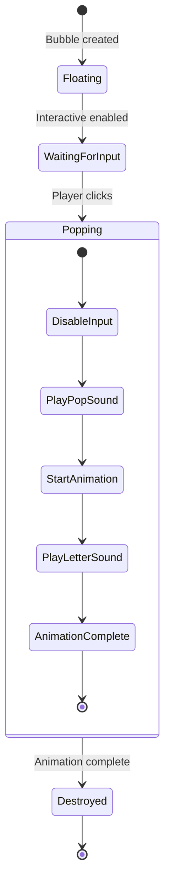
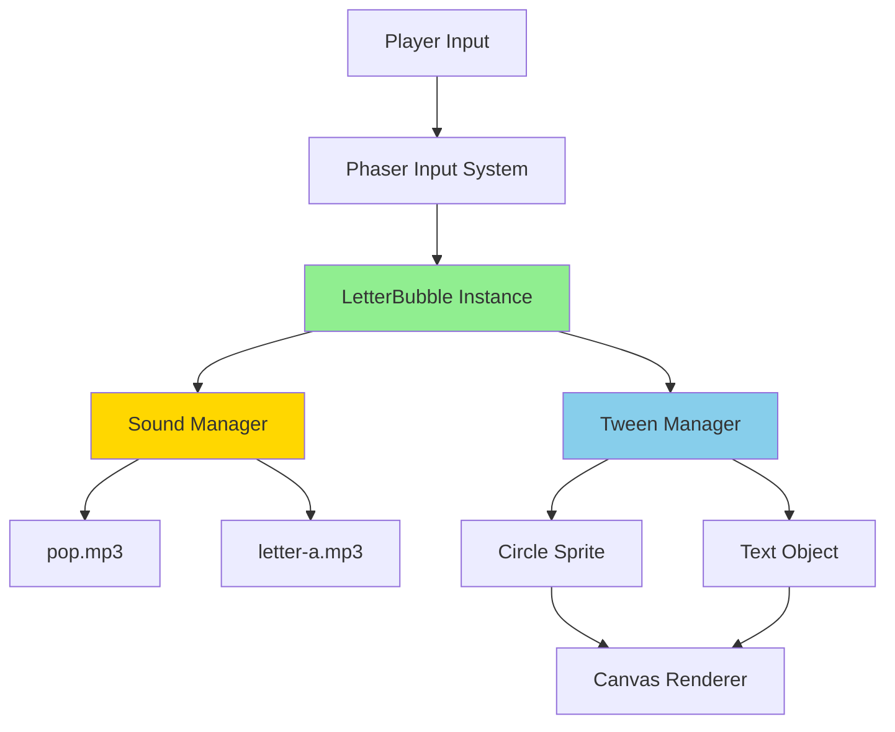
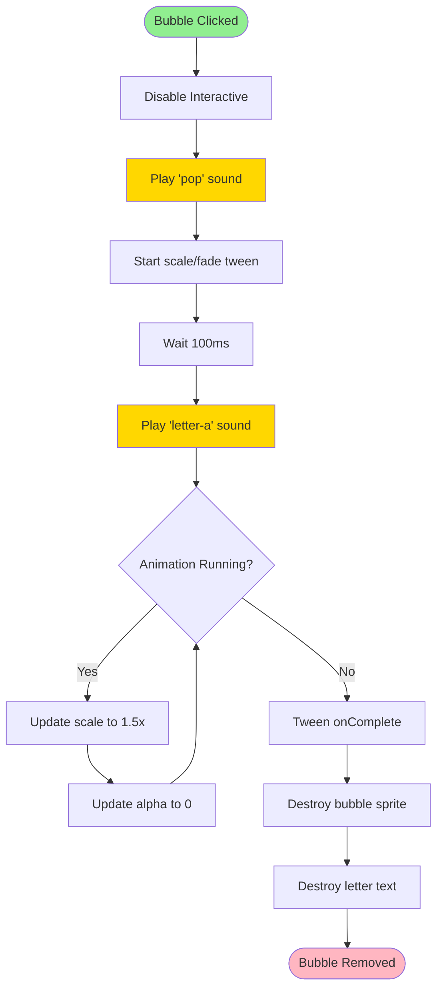
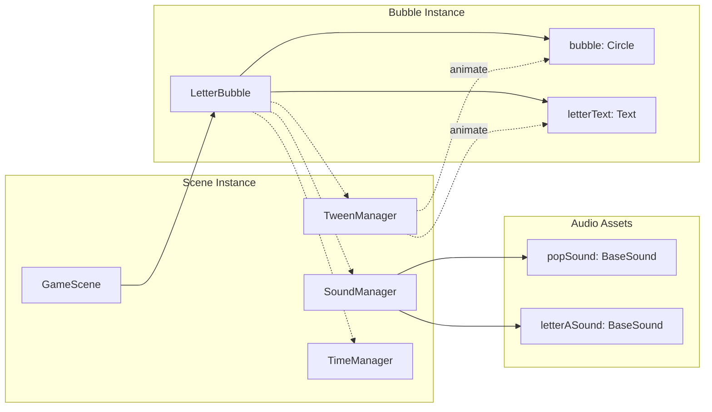
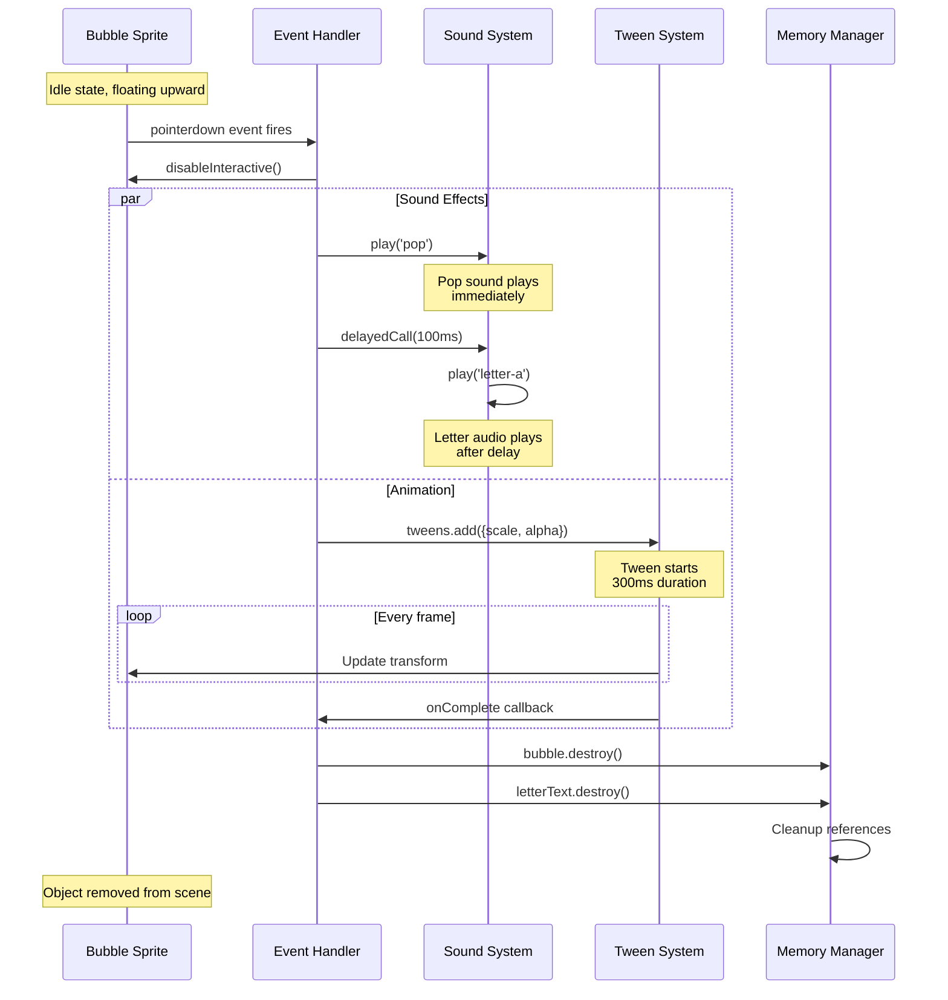

# Phase 8: Letter Pop - Bubble Interaction - UML

## Class Diagram



## Sequence Diagram: Bubble Pop Interaction



## State Diagram: Bubble Lifecycle



## Component Diagram



## Activity Diagram: Pop Animation Flow



## Object Diagram: Runtime Instance



## Event Flow Diagram



## Timing Diagram

```mermaid
gantt
    title Bubble Pop Event Timeline
    dateFormat X
    axisFormat %L ms

    section User
    Click bubble :milestone, m1, 0, 0

    section Audio
    Pop sound plays :a1, 0, 50
    100ms delay :milestone, 100, 0
    Letter sound plays :a2, 100, 250

    section Animation
    Scale 1.0 to 1.5 :t1, 0, 300
    Alpha 1.0 to 0.0 :t2, 0, 300

    section Cleanup
    Destroy objects :milestone, m2, 300, 0
```

## Notes

### Why This Architecture?

**Event-Driven Design**
- Bubble responds to pointer events asynchronously
- Decoupled from game loop timing
- Easy to extend with additional effects

**Sound Sequencing**
- Pop sound provides immediate tactile feedback
- Letter sound follows to reinforce learning
- 100ms delay prevents audio overlap

**Animation Coordination**
- Tween handles smooth interpolation automatically
- onComplete callback ensures proper cleanup
- All animations run on game object references

**Resource Management**
- disableInteractive() prevents double-clicks
- destroy() properly removes objects from memory
- No memory leaks from abandoned tweens

### Phaser-Specific Patterns

**Interactive Game Objects**
```javascript
// Enable pointer events on any display object
sprite.setInteractive();

// Listen for pointer events
sprite.on('pointerdown', callback);
sprite.on('pointerover', callback);
sprite.on('pointerout', callback);

// Disable when done
sprite.disableInteractive();
```

**Tween System**
```javascript
// Phaser tweens handle smooth animation
this.tweens.add({
    targets: [object1, object2],  // Can animate multiple objects
    scaleX: 1.5,                  // Target property
    scaleY: 1.5,
    alpha: 0,
    duration: 300,                // Milliseconds
    ease: 'Power2',               // Easing function
    onComplete: callback          // Cleanup callback
});
```

**Sound Management**
```javascript
// Preload in scene
this.load.audio('key', 'path/to/audio.mp3');

// Play from anywhere in scene
this.sound.play('key');

// With options
this.sound.play('key', {
    volume: 0.5,
    loop: false
});
```

**Delayed Execution**
```javascript
// Execute callback after delay (milliseconds)
this.time.delayedCall(100, () => {
    // Code runs after 100ms
});
```

### What This Phase Proves

1. **User Input Works**: Pointer events are properly configured
2. **Audio System Works**: Sounds load and play correctly
3. **Animation System Works**: Tweens run smoothly
4. **Timing Works**: Delayed callbacks execute properly
5. **Memory Management Works**: Objects are properly destroyed
6. **Visual Feedback Works**: Player sees immediate response

This establishes the core interaction pattern for the entire game.
