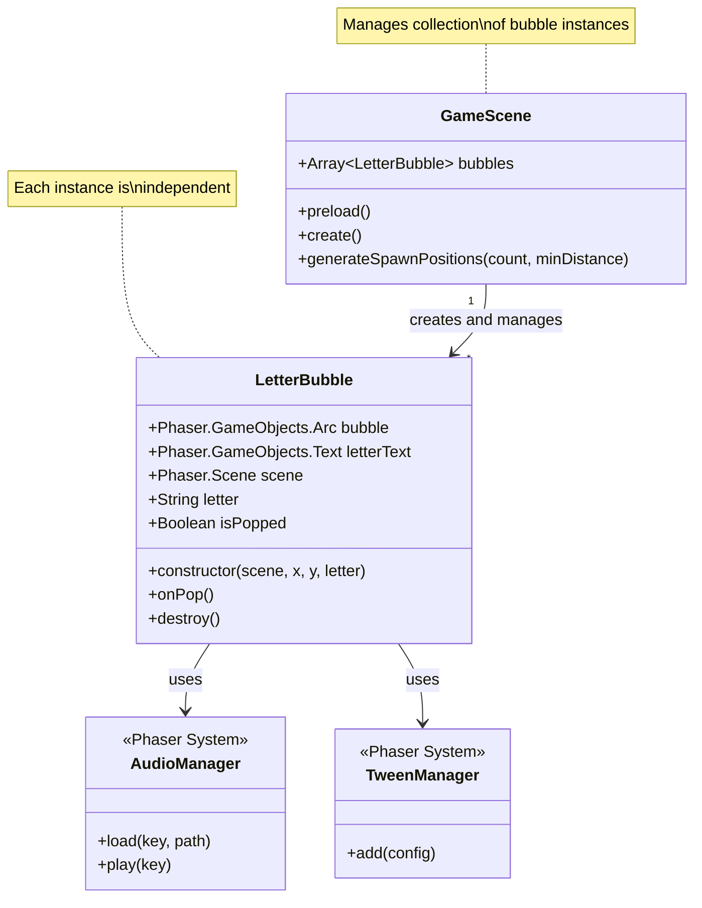
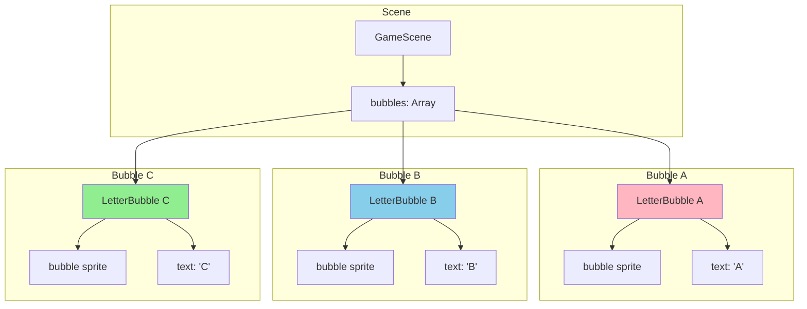
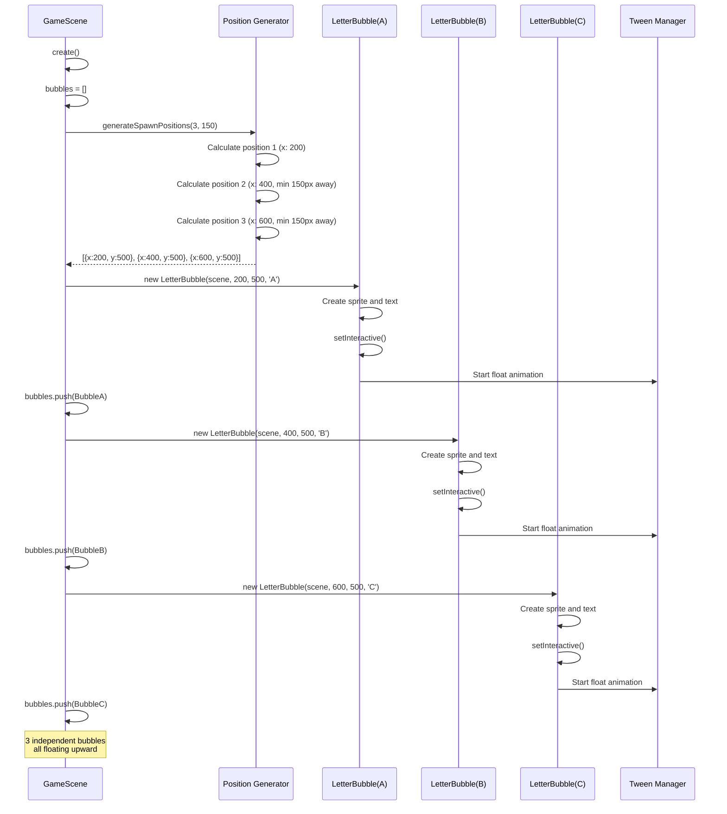
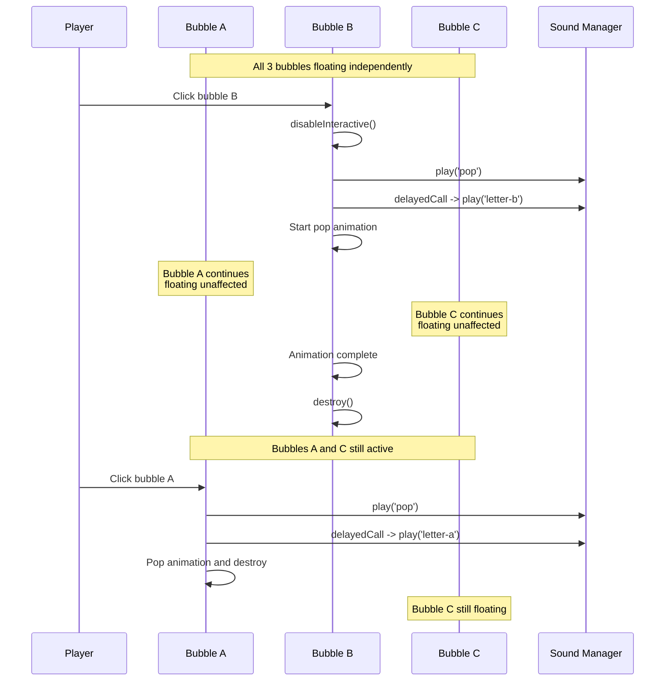
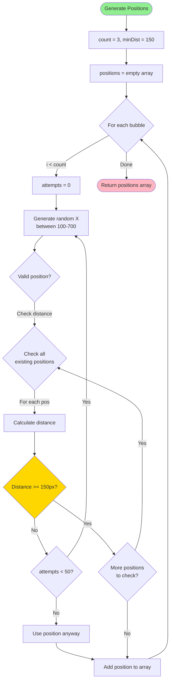
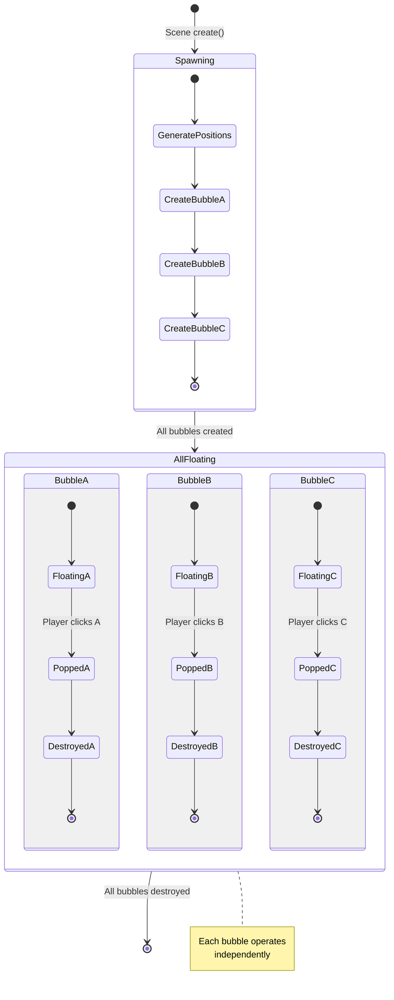
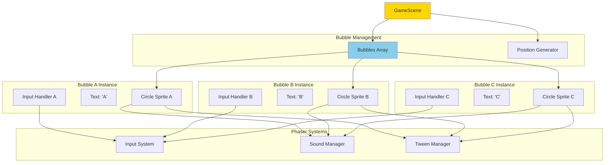
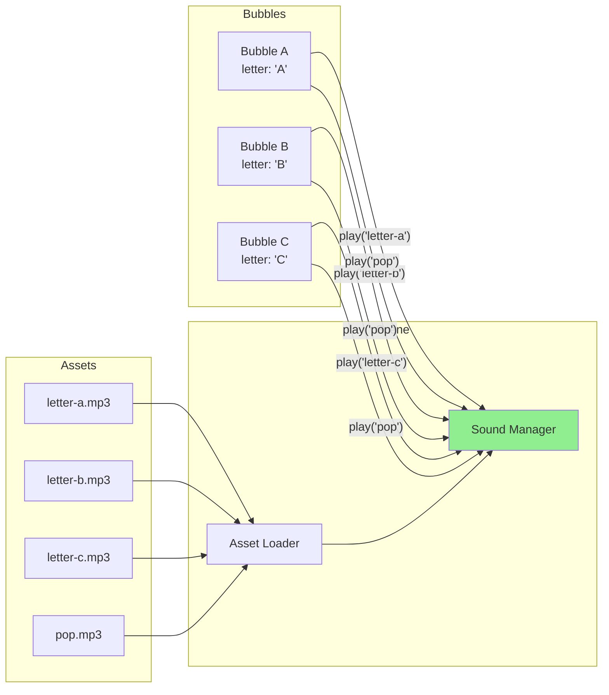
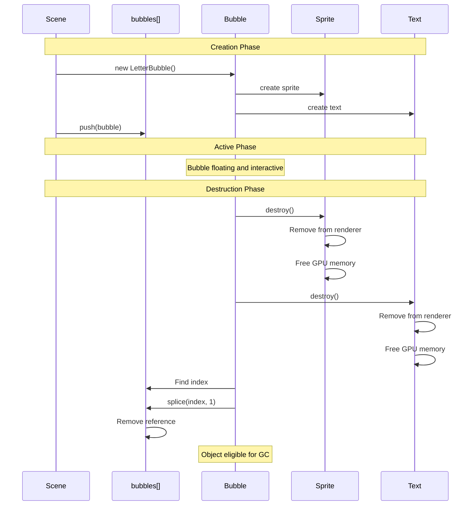

# Phase 9: Letter Pop - Multiple Bubbles - UML

## Class Diagram



## Object Diagram: Multiple Bubble Instances



## Sequence Diagram: Multiple Bubble Creation



## Sequence Diagram: Independent Bubble Popping



## Activity Diagram: Spawn Position Generation



## State Diagram: Multiple Bubble Lifecycle



## Component Diagram: Multi-Bubble Architecture



## Data Flow Diagram: Audio Routing



## Timing Diagram: Simultaneous Floating

```mermaid
gantt
    title Multiple Bubble Timeline
    dateFormat X
    axisFormat %L ms

    section Bubble A
    Spawn A :milestone, ma1, 0, 0
    Float upward :a1, 0, 5000
    Player clicks :milestone, ma2, 2000, 0
    Pop animation :a2, 2000, 2300
    Destroyed :milestone, ma3, 2300, 0

    section Bubble B
    Spawn B :milestone, mb1, 0, 0
    Float upward :b1, 0, 5000
    Player clicks :milestone, mb2, 3500, 0
    Pop animation :b2, 3500, 3800
    Destroyed :milestone, mb3, 3800, 0

    section Bubble C
    Spawn C :milestone, mc1, 0, 0
    Float upward :c1, 0, 5000
    Player clicks :milestone, mc2, 4200, 0
    Pop animation :c2, 4200, 4500
    Destroyed :milestone, mc3, 4500, 0
```



## Collision Avoidance Algorithm

```mermaid
flowchart TD
    Start([Need new position]) --> Generate[Generate random X]
    Generate --> SetValid[validPosition = true]
    SetValid --> Loop{For each<br/>existing position}

    Loop -->|More positions| CalcDist[Calculate abs(newX - existingX)]
    CalcDist --> CheckDist{Distance < 150?}

    CheckDist -->|Yes: Too close| Invalid[validPosition = false]
    Invalid --> Break[Break loop]
    Break --> IsValid{validPosition?}

    CheckDist -->|No: Good spacing| Loop
    Loop -->|No more positions| IsValid

    IsValid -->|false| Attempts{attempts < 50?}
    Attempts -->|Yes| Increment[attempts++]
    Increment --> Generate

    Attempts -->|No| Fallback[Use position anyway<br/>to prevent infinite loop]
    Fallback --> Return

    IsValid -->|true| Return([Return valid position])

    style Start fill:#90EE90
    style Return fill:#FFB6C1
    style CheckDist fill:#FFD700
```

## Memory Management Diagram



## Notes

### Why This Architecture?

**Array-Based Management**
- Centralized tracking of all active bubbles
- Easy iteration for future features (e.g., "pop all", "count remaining")
- Simple cleanup when removing individual bubbles

**Independent Instances**
- Each bubble is self-contained
- No shared state between bubbles
- One bubble popping doesn't affect others
- Easier to debug and test

**Position Generation Algorithm**
- Prevents overlapping bubbles
- Maintains minimum spacing
- Fallback after 50 attempts prevents infinite loops
- Simple distance calculation (1D, X-axis only)

**Dynamic Audio Routing**
- Letter key generated from bubble's letter property
- Pattern: `letter-${this.letter.toLowerCase()}`
- Scales to any number of letters without code changes
- Example: Letter "A" → audio key "letter-a"

### Phaser-Specific Patterns

**Managing Multiple Game Objects**
```javascript
// Store in array for easy tracking
this.bubbles = [];

// Create multiple instances
letters.forEach((letter, i) => {
    const bubble = new LetterBubble(this, x, y, letter);
    this.bubbles.push(bubble);
});

// Clean up on destroy
const index = this.bubbles.indexOf(this);
if (index > -1) {
    this.bubbles.splice(index, 1);
}
```

**Dynamic Audio Keys**
```javascript
// Preload with consistent naming
this.load.audio('letter-a', 'path/to/A.mp3');
this.load.audio('letter-b', 'path/to/B.mp3');
this.load.audio('letter-c', 'path/to/C.mp3');

// Play dynamically based on data
const key = `letter-${letter.toLowerCase()}`;
this.sound.play(key);
```

**Random Number Generation**
```javascript
// Phaser's built-in random utilities
const x = Phaser.Math.Between(100, 700);
const y = Phaser.Math.Between(0, 600);

// FloatBetween for decimals
const speed = Phaser.Math.FloatBetween(1.0, 2.5);
```

### Scaling Considerations

**From 3 to Many Bubbles**
- Current: 3 bubbles, fixed spacing
- Future: 10+ bubbles, dynamic spacing
- Algorithm already handles variable count
- May need to adjust minDistance parameter

**Performance with Multiple Instances**
- 3 bubbles: No performance concerns
- 10 bubbles: Should be fine (simple graphics)
- 50+ bubbles: May need object pooling
- Each bubble has its own tweens and listeners

**Memory Management**
- Properly destroy sprites and text objects
- Remove from tracking array
- Stop any running tweens
- Phaser handles garbage collection

### What This Phase Proves

1. **Instance Management**: Multiple objects can coexist
2. **Independent Behavior**: Each bubble operates separately
3. **Dynamic Audio**: Audio keys are generated programmatically
4. **Collision Avoidance**: Simple spacing algorithm works
5. **Cleanup**: Memory is properly freed when bubbles pop
6. **Scalability**: Pattern supports future expansion

This proves our bubble system can handle multiple concurrent instances, which is essential for making the game fun and challenging.
