# Aurora's Letter Adventure - UML Documentation

## Overview

This document provides architectural diagrams using Mermaid syntax. These diagrams show the structure, relationships, and flows of the game system.

---

## System Architecture

### High-Level Component Diagram

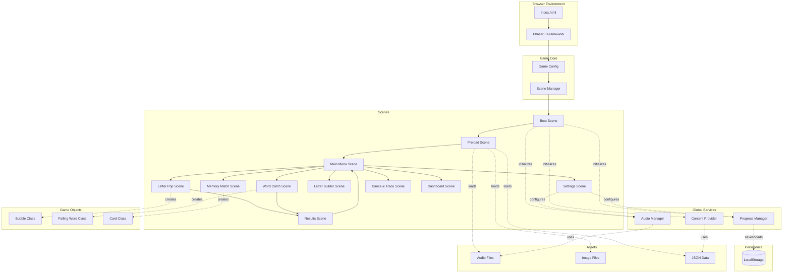

---

## Scene State Machine

### Game Flow Diagram

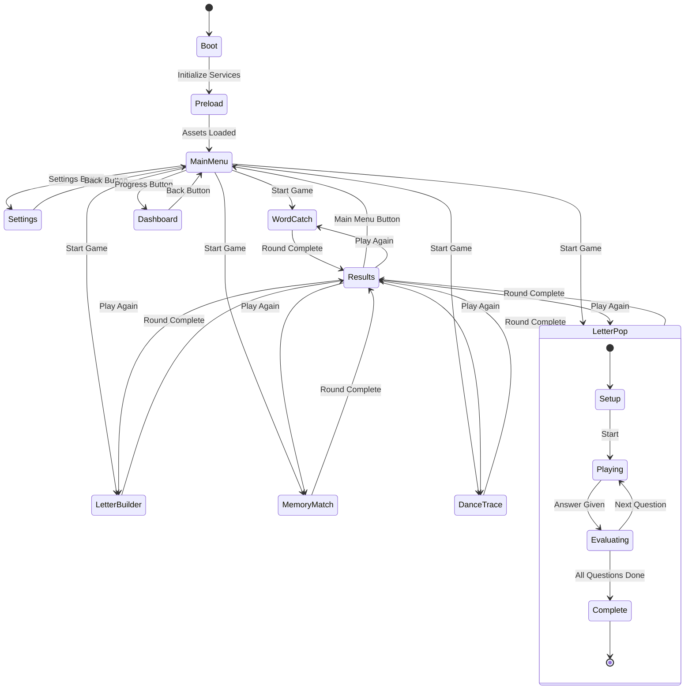

---

## Core Class Diagrams

### Global Services

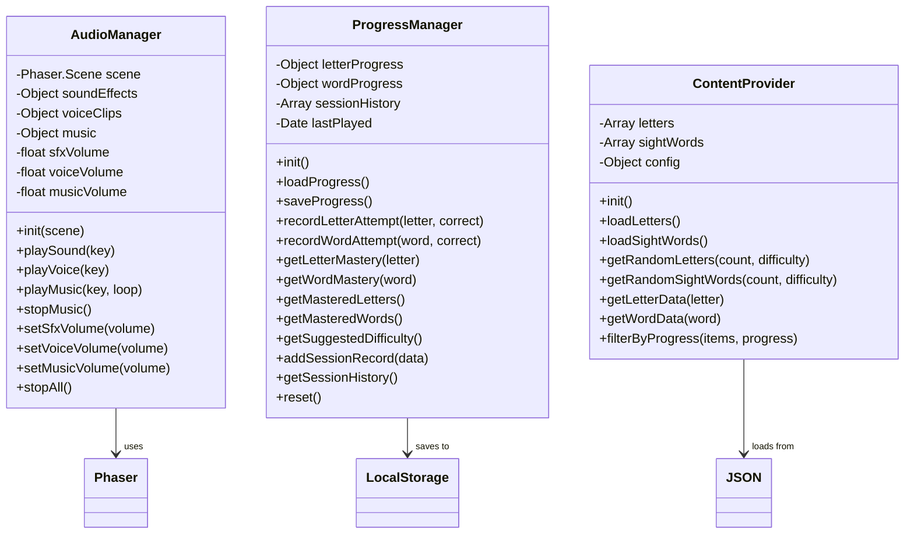

### Scene Base Classes

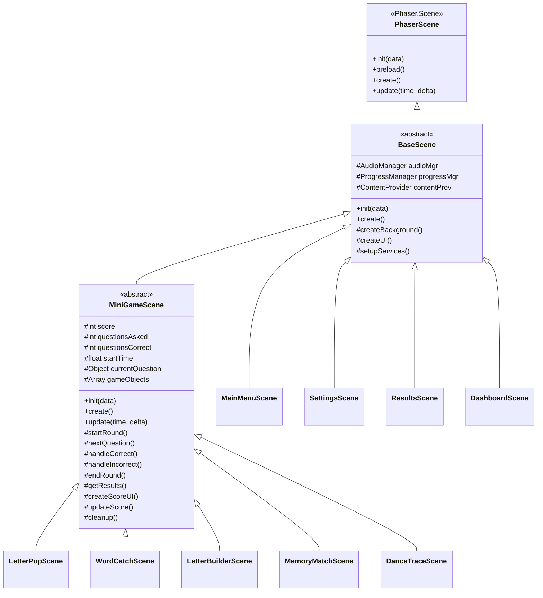

### Mini-Game Specific Classes

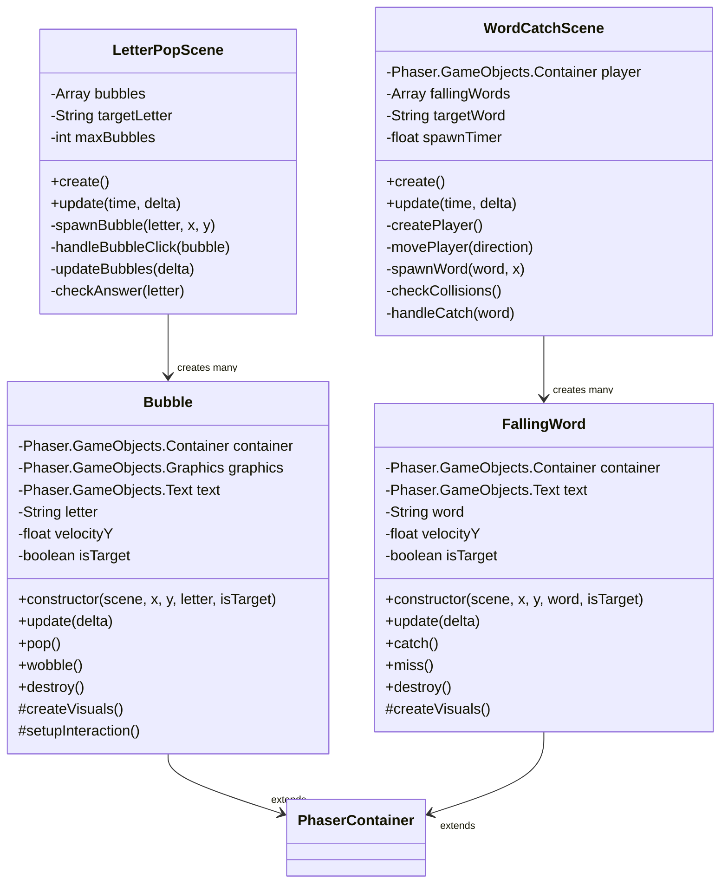

---

## Sequence Diagrams

### Game Launch Sequence

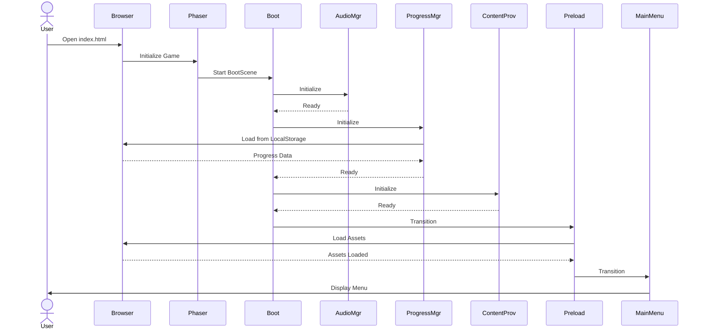

### Letter Pop Gameplay Sequence

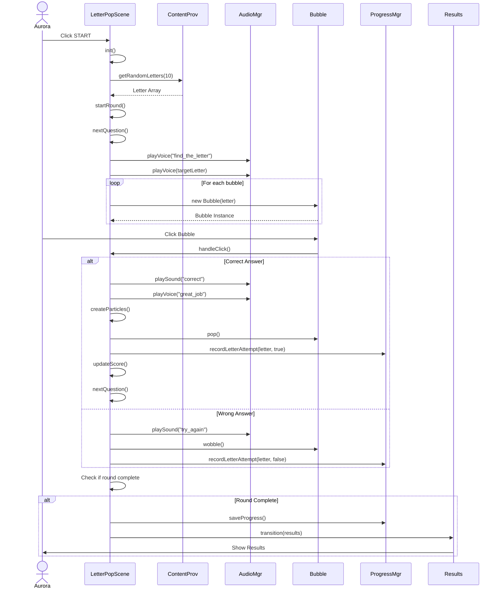

### Progress Saving Sequence

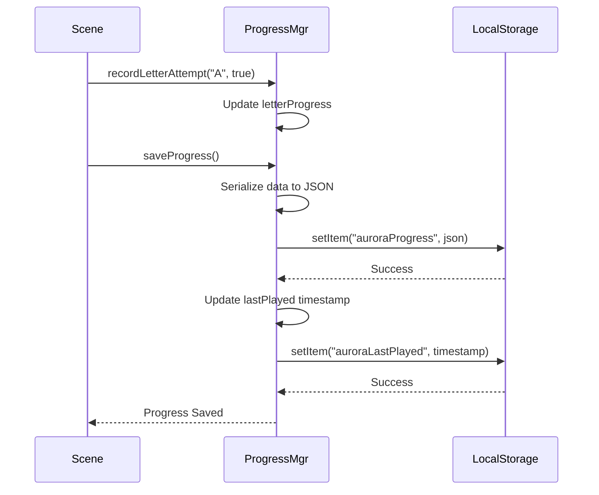

### Audio Playback Sequence

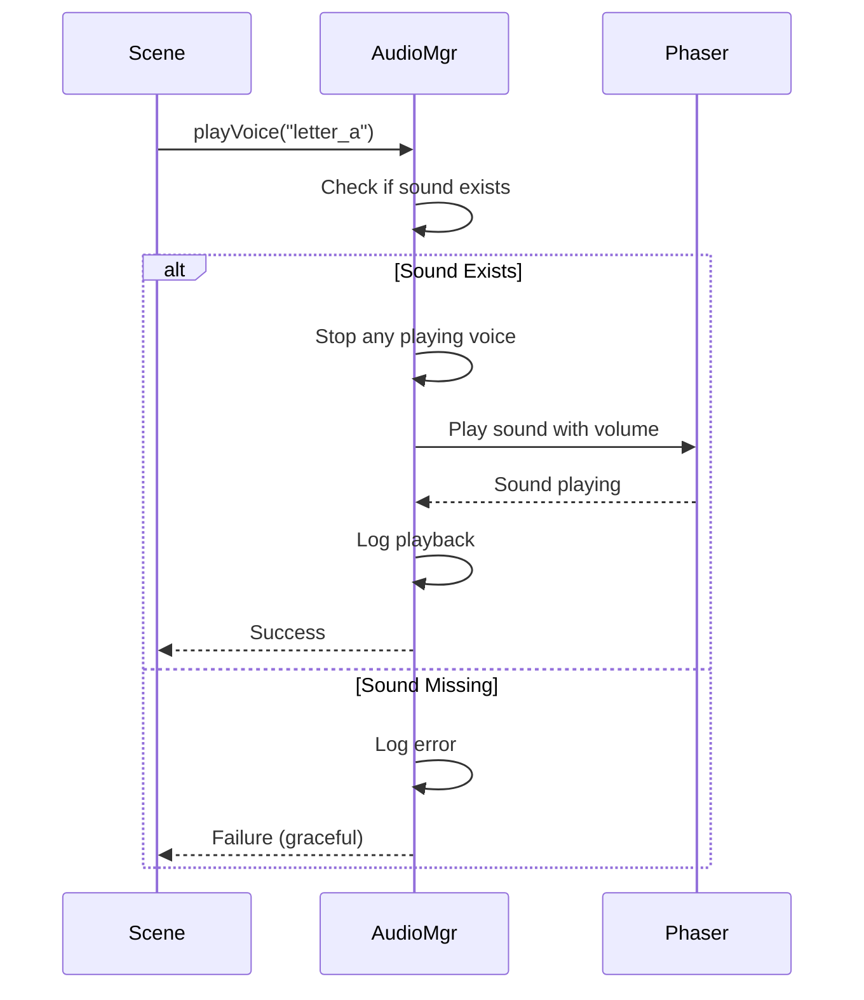

---

## Data Models

### Progress Data Structure

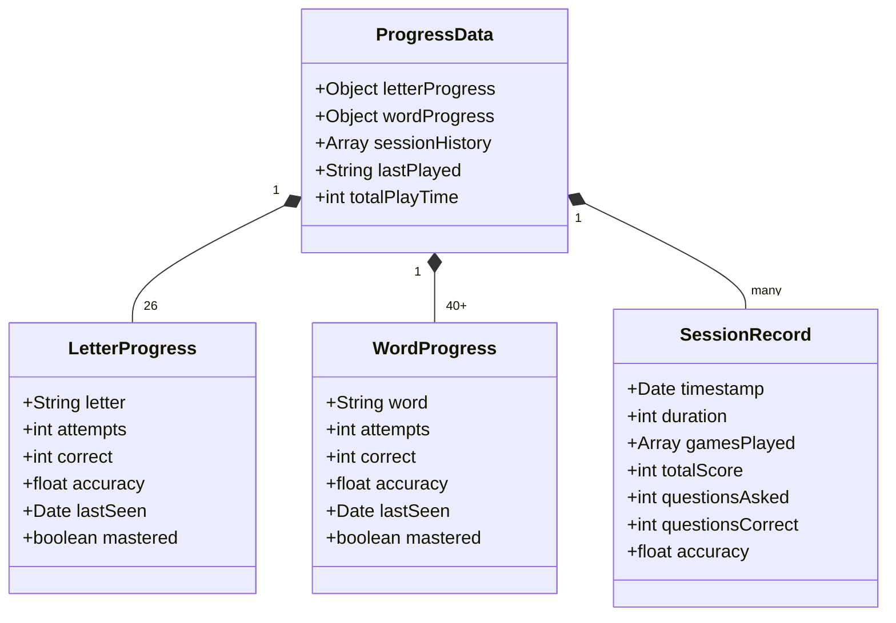

### Content Data Structure

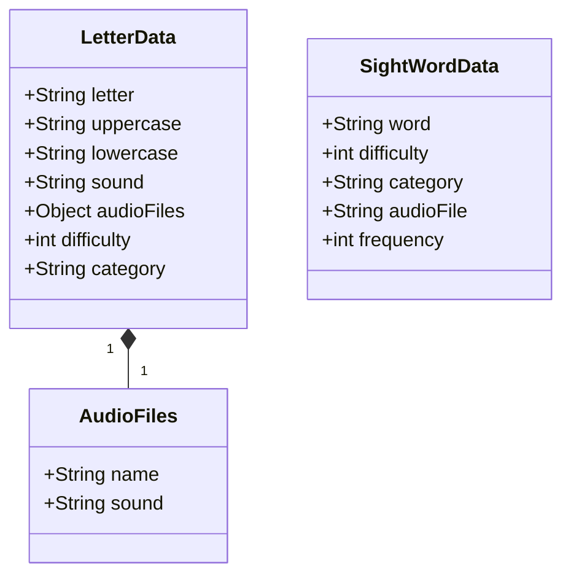

---

## Event Flow

### Game Event System

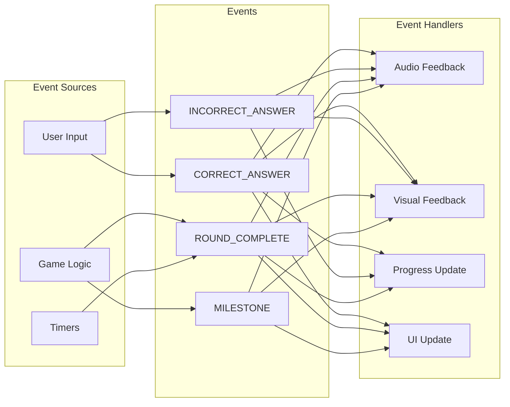

---

## Deployment Architecture

```mermaid
graph TB
    subgraph "Development"
        Source[Source Files]
        Assets[Asset Files]
    end

    subgraph "Static File Structure"
        Index[index.html]
        SrcDir[/src]
        AssetsDir[/assets]
        ConfigFile[config.js]
    end

    subgraph "Browser Runtime"
        HTML5[HTML5 Canvas]
        WebAudio[Web Audio API]
        Storage[LocalStorage]
    end

    subgraph "Asset CDN/Local"
        PhaserCDN[Phaser 3 Library]
        AudioFiles[Audio Files]
        ImageFiles[Image Files]
        DataFiles[Data Files]
    end

    Source --> Index
    Source --> SrcDir
    Assets --> AssetsDir

    Index --> HTML5
    SrcDir --> HTML5

    PhaserCDN --> HTML5
    AudioFiles --> WebAudio
    ImageFiles --> HTML5
    DataFiles --> HTML5

    HTML5 --> Storage
```

---

## Design Patterns Used

### Pattern Overview

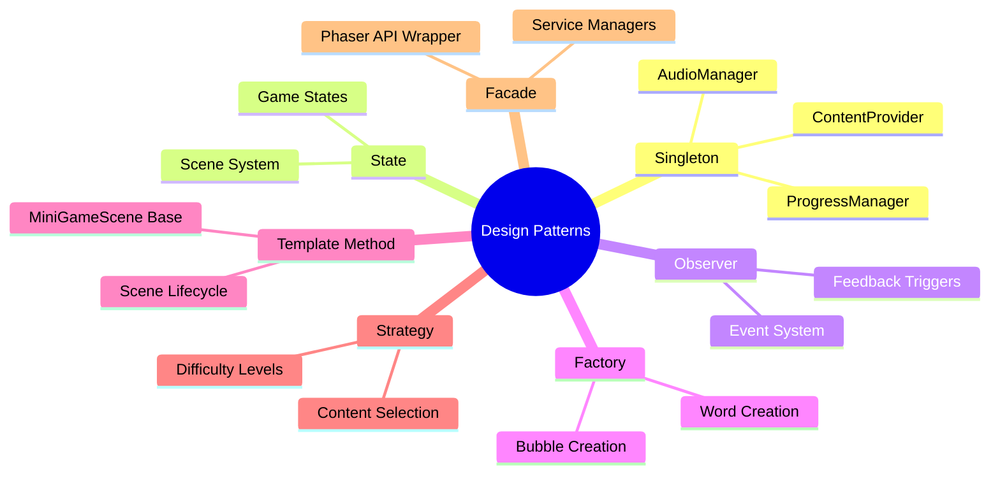

---

## Notes

### Why These Patterns?

**Singleton (Services)**
- One instance of each manager needed globally
- Prevents multiple audio managers conflicting
- Centralized progress tracking

**State Pattern (Scenes)**
- Phaser provides this out of the box
- Each scene is a distinct state
- Clean transitions between states

**Observer (Events)**
- Decouples game logic from feedback
- Multiple systems react to same event
- Easy to add new feedback types

**Template Method (Base Classes)**
- Common mini-game flow defined once
- Each game implements specific mechanics
- Reduces code duplication

**Composition Over Inheritance**
- Game objects use components
- Flexible assembly of features
- Easy to modify behavior

### Keeping It Simple

These diagrams show the full architecture, but remember:
- Not all systems exist from day one
- Build incrementally per phase plan
- Don't over-engineer early phases
- Refactor as patterns emerge naturally

Start simple. Add complexity only when needed.

Aurora's game comes first. Architecture supports that goal, not the other way around.
